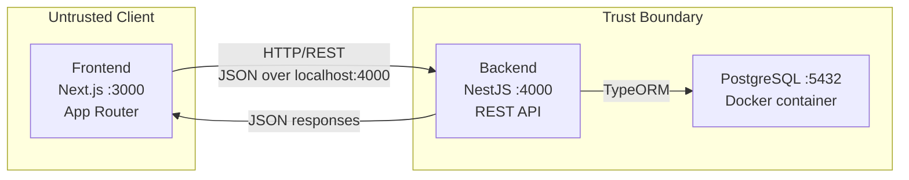
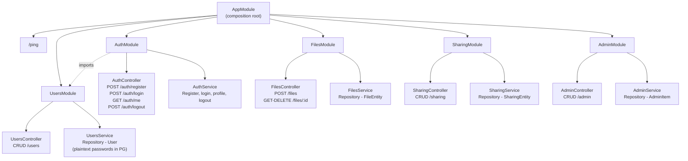
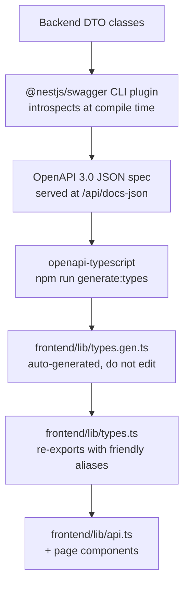
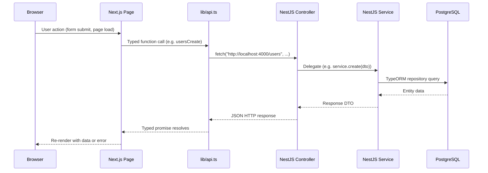
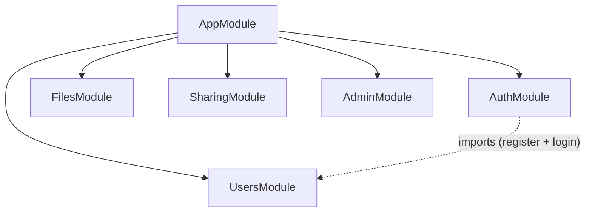

# KC-Project Architecture

This document describes the system architecture as of **v0.2.0** (persistence & database surface).

---

## System Overview

KC-Project is a three-process full-stack web application. Frontend and backend run natively; PostgreSQL runs in a Docker container.



- **Frontend** — Next.js 16 with App Router, Tailwind CSS, React 19. Runs on port 3000. All pages are client components (`'use client'`) that call the backend via fetch. Bearer token in Authorization header.
- **Backend** — NestJS 11 on Express. Runs on port 4000. Modular architecture with controllers, services, and DTOs. CORS enabled (intentionally permissive). TypeORM repositories backed by PostgreSQL.
- **Database** — PostgreSQL 16 in Docker (`infra/compose.yml`). Hardcoded credentials, `synchronize: true`, SQL logging. See [ADR-019](../decisions/ADR-019-typeorm-orm.md) and [ADR-020](../decisions/ADR-020-docker-db-only.md).
- **Communication** — Plain HTTP REST. JSON request/response bodies. No WebSockets, no GraphQL, no tRPC.
- **Persistence** — All data persisted in PostgreSQL via TypeORM. Survives process restarts.

---

## Backend Module Structure

The backend follows NestJS's module-based architecture. `AppModule` is the composition root; each domain feature is a self-contained module.



### Per-module pattern

Every module follows the same internal structure:

- **Controller** — Thin HTTP layer. Maps routes to service methods. Handles 404 on missing IDs. No business logic.
- **Service** — Business logic and data access via TypeORM repositories (PostgreSQL). Singleton per module via DI.
- **DTOs** — Request shapes (Create/Update) and response shapes. Classes (not interfaces) so NestJS can instantiate them and the Swagger plugin can introspect them.

---

## Frontend Structure

```
app/                          Next.js App Router pages
├── layout.tsx                Root layout (Header, PageContainer, Footer)
├── providers.tsx             Client wrapper for AuthProvider + ThemeProvider
├── globals.css               Design tokens (CSS variables), Tailwind, dark mode
├── page.tsx                  Landing / home page
├── auth/
│   └── page.tsx              Tabbed Register + Sign In form
├── users/                    Users CRUD pages
├── files/                    Upload + view metadata
├── admin/                    Admin CRUD pages
└── sharing/                  Sharing CRUD pages

app/components/               Layout-level components
├── header.tsx                Nav bar + auth toggle + theme toggle
├── footer.tsx                Site footer
└── page-container.tsx        Content wrapper (max-width, padding)

app/components/ui/            Reusable UI primitives
├── form-input.tsx            Label + input + validation error
├── submit-button.tsx         Button with loading state
├── error-banner.tsx          Error message block
└── success-banner.tsx        Success message block

lib/
├── api.ts                    Typed fetch wrappers for all backend routes
├── auth-context.tsx          Auth state (token, userId) + localStorage persistence
├── theme-context.tsx         Theme state (light/dark/system) + class-based toggle
├── types.gen.ts              Auto-generated from OpenAPI spec
└── types.ts                  Re-export layer with friendly aliases
```

All pages are `'use client'` components. They call `lib/api.ts` functions which return typed promises. Auth state is managed via `AuthContext` (persisted to localStorage). The layout uses a shared app shell (Header, Footer, PageContainer) with design tokens defined as CSS variables in `globals.css`.

---

## API Design

### RESTful resources

Resources follow standard REST conventions — the HTTP method carries the verb:

| Method | Path pattern | Meaning |
|--------|-------------|---------|
| POST   | /resource   | Create  |
| GET    | /resource   | List    |
| GET    | /resource/:id | Read one |
| PUT    | /resource/:id | Update |
| DELETE | /resource/:id | Delete |

Applied to: `/users`, `/files`, `/sharing`, `/admin`

### Action endpoints

Non-CRUD operations use verb paths:

- `POST /auth/register` — Register a new user
- `POST /auth/login` — Authenticate
- `GET /ping` — Infrastructure reachability check

### OpenAPI spec

The backend auto-generates an OpenAPI 3.0 spec via `@nestjs/swagger` with the CLI plugin (no manual `@ApiProperty()` decorators needed). Available at:

- **Swagger UI:** `http://localhost:4000/api/docs`
- **JSON spec:** `http://localhost:4000/api/docs-json`

---

## Type Flow

Types flow from backend to frontend through code generation:



This replaced the manual DTO mirroring from v0.0.7. If a backend DTO changes, regenerating types surfaces the difference immediately.

---

## Request Lifecycle

A typical request flows through these layers:



As of v0.2.0, JwtAuthGuard protects `/auth/me` and `/auth/logout`. No middleware, no validation pipe. Basic field validation exists in `AuthService` (throws 400/401/409). All data access goes through TypeORM repositories to PostgreSQL.

---

## Module Dependencies

As of v0.2.0, `AuthModule` imports `UsersModule` to access user data during registration and login. All other modules remain independent. `TypeOrmModule` is imported by `AppModule` (global config) and each feature module (entity registration).



**Current cross-module dependencies:**

- `AuthModule -> UsersModule` — `AuthService` uses `UsersService.findByEmail()`, `UsersService.findEntityByEmail()`, and `UsersService.create()` for registration and login. Passwords are stored and compared as plaintext (intentional).

**Future dependencies (not yet implemented):**

- **v0.3.x** — SharingModule will depend on FilesModule (to reference file records)
- **v0.4.x** — AdminModule will depend on UsersModule (to manage roles)

---

## Trust Boundaries

The frontend is an **untrusted client**. This is a stated architectural principle, partially enforced as of v0.2.0.

As of v0.2.0:
- **Authentication exists but is intentionally weak** — real HS256 JWTs with hardcoded secret (`'kc-secret'`), no expiration (CWE-347, CWE-613)
- **JwtAuthGuard protects** `/auth/me` and `/auth/logout` — all other routes unprotected
- **No authorization** — no RBAC, no ownership checks
- **Passwords are plaintext** — stored and compared without hashing, now persisted in PostgreSQL (CWE-256)
- **CORS allows all origins** — intentionally permissive (CWE-942)
- **Basic input validation** — required field checks and duplicate email detection on registration
- **No rate limiting** — unlimited auth attempts (CWE-307)
- **DB credentials hardcoded** — in source code (CWE-798)
- **All data persisted** — PostgreSQL via TypeORM, survives restarts

These weaknesses are intentional. The security surface grows incrementally per the roadmap. See [auth-flow.md](./auth-flow.md) for a detailed security surface table. Enforcement matures through v0.4.x (authorization).

---

## Technology Stack

| Layer | Technology | Version |
|-------|-----------|---------|
| Backend framework | NestJS | 11.x |
| Backend runtime | Node.js | 20+ |
| Database | PostgreSQL | 16.x |
| ORM | TypeORM | latest |
| Frontend framework | Next.js (App Router) | 16.x |
| UI library | React | 19.x |
| Styling | Tailwind CSS | 4.x |
| Language | TypeScript (strict) | 5.x |
| API docs | @nestjs/swagger | latest |
| Type codegen | openapi-typescript | 7.x |
| Linting | ESLint 9 (flat config) | per-project |
| Formatting | Prettier 3 | shared root config |

---

## What This Architecture Does Not Include (Yet)

- File storage — real file I/O (v0.3.x)
- Authorization / RBAC (v0.4.x)
- App containers / deployment (v0.5.x) — only PG is containerised
- CI/CD pipelines
- Environment configuration (credentials still hardcoded)
