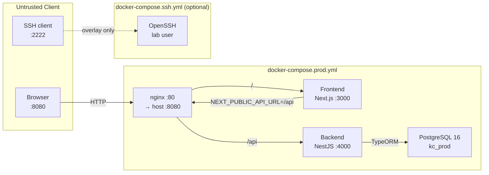
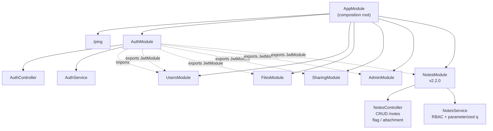
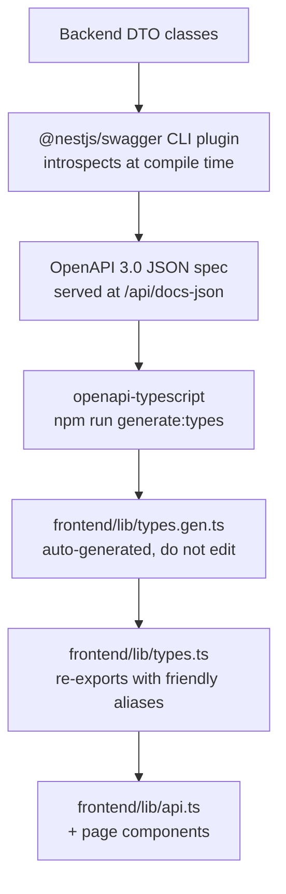
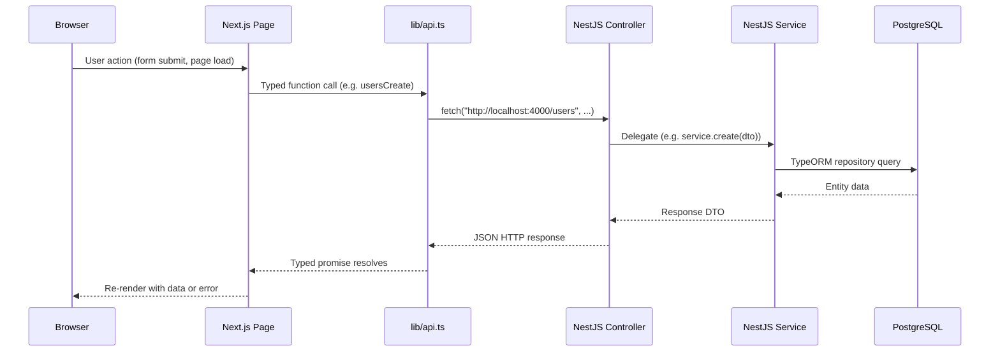
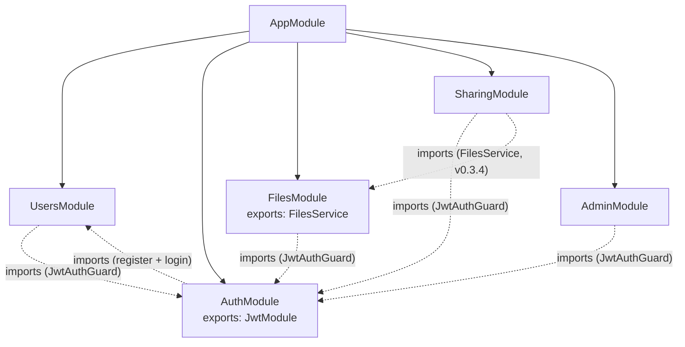

# KC-Project Architecture

This document started as the **v1.0.0** insecure MVP snapshot (ternary RBAC, product UI + dev explorers, Docker prod stack). Cycle-4 added a sixth domain (**Notes**); secure tip keeps Notes without XSS sinks or default SSH ([ADR-033](../decisions/ADR-033-cycle-4-softdev-version-pair.md)).

| Tip | Meaning |
|-----|---------|
| Product tip on `main` | Secure **`v2.2.0`** — Notes plain text; no default SSH · [Cycle-4](../security/Cycle-4/README.md) |
| Insecure replay | Tag/`ctf/v1.2.0` — Notes XSS + SSH foothold overlay |

Ground truth (Cycle-1): [v1.0.0-ground-truth.md](../security/Cycle-1/Dev/v1.0.0-ground-truth.md). Cycle docs: [ADR-031](../decisions/ADR-031-security-cycle-docs.md).

---

## System Overview

### Production / pentest (primary)

Full stack in Docker (`infra/docker-compose.prod.yml`). nginx reverse proxy at `:8080` routes `/` → frontend, `/api` → backend. PostgreSQL internal (not published). Cycle-4 SSH overlay (`docker-compose.ssh.yml` → host `:2222`) is for **`v1.2.0` / `ctf/v1.2.0` replay only**.


```mermaid
flowchart LR
    subgraph client [Untrusted Client]
        Browser["Browser\n:8080"]
        SshClient["SSH client\n:2222"]
    end
    subgraph compose [docker-compose.prod.yml]
        Nginx["nginx :80\n→ host :8080"]
        Frontend["Frontend\nNext.js :3000"]
        Backend["Backend\nNestJS :4000"]
        PG["PostgreSQL 16\nkc_prod"]
    end
    subgraph sshOverlay ["docker-compose.ssh.yml (optional)"]
        Ssh["OpenSSH\nlab user"]
    end
    Browser -- "HTTP" --> Nginx
    Nginx -- "/" --> Frontend
    Nginx -- "/api" --> Backend
    Frontend -- "NEXT_PUBLIC_API_URL=/api" --> Nginx
    Backend -- "TypeORM" --> PG
    SshClient -.->|"overlay only"| Ssh
```

Deploy web: `docker compose -f infra/docker-compose.prod.yml up -d --build` → `http://localhost:8080`  
Full chain: add `-f infra/docker-compose.ssh.yml` · path diagram: [notes-ssh-path.md](../diagrams/notes-ssh-path.md)

### Dev (native)

Backend and frontend run natively; PostgreSQL in Docker (`infra/compose.yml`, `kc_dev` on `:5432`).

- **Frontend** — Next.js 16 App Router, Tailwind CSS, React 19. Product UI (`/files`, `/notes`, `/moderator`, `/admin`) + gated `/dev/*`. Access JWT in memory (v2.0.0+); Notes body is React-escaped plain text (`v2.2.0`).
- **Backend** — NestJS 11 on Express. Domain modules (Users, Auth, Files, Sharing, Admin, **Notes**) + audit. TypeORM + PostgreSQL.
- **Database** — PostgreSQL 16. Migrations with `migrationsRun` gated per env.
- **Communication** — Plain HTTP REST. JSON (or multipart for uploads / note attachments).
- **File Storage** — Multer under `uploads/` (files + `uploads/notes/` for SoftDev attachments).

---

## Backend Module Structure

The backend follows NestJS's module-based architecture. `AppModule` is the composition root; each domain feature is a self-contained module.


```mermaid
graph TD
    AppModule["AppModule\n(composition root)"]
    AppController["/ping"]
    AuthModule["AuthModule"]
    UsersModule["UsersModule"]
    FilesModule["FilesModule"]
    SharingModule["SharingModule"]
    AdminModule["AdminModule"]
    NotesModule["NotesModule\nv2.2.0"]

    AppModule --> AppController
    AppModule --> AuthModule
    AppModule --> UsersModule
    AppModule --> FilesModule
    AppModule --> SharingModule
    AppModule --> AdminModule
    AppModule --> NotesModule

    AuthModule --> AuthController["AuthController"]
    AuthModule --> AuthService["AuthService"]
    AuthModule -.->|imports| UsersModule
    AuthModule -.->|"exports JwtModule"| UsersModule
    AuthModule -.->|"exports JwtModule"| FilesModule
    AuthModule -.->|"exports JwtModule"| SharingModule
    AuthModule -.->|"exports JwtModule"| AdminModule
    AuthModule -.->|"exports JwtModule"| NotesModule

    NotesModule --> NotesController["NotesController\nCRUD /notes\nflag / attachment"]
    NotesModule --> NotesService["NotesService\nRBAC + parameterized q"]
```

### Notes (sixth domain — tip `v2.2.0`)

| Piece | Behavior on insecure tip |
|-------|--------------------------|
| API | Owner CRUD; mod/admin list+get; mod flag; admin delete-any; `GET /notes?q=` parameterized `ILIKE` |
| Attachment | Optional multipart; SVG/HTML allowed; inline `Content-Disposition` for XSS candy |
| UI | `/notes`, `/notes/[id]` — HTML `dangerouslySetInnerHTML` + unsafe markdown |
| Lab depth | Seeded admin ops note → SSH `lab` @ `:2222` (overlay) → `user.txt` |

Secure tip **`v2.2.0`**: escape Notes render, MIME lockdown, force attachment download, no default SSH. Insecure render/plants: tag/`ctf/v1.2.0` only.

**Also retained:** Users, Auth, Files, Sharing, Admin (hardened since `v2.1.0`). SoftDev tip did not re-break those Critical remediations.

### Per-module pattern

Every module follows the same internal structure:

- **Controller** — Thin HTTP layer. SoftDev Notes uses `JwtAuthGuard` + `HasRoleGuard` (DB role). Cycle-1 insecure tip had intentional guard gaps (CWE-862 / CWE-639) — see Cycle-1 docs.
- **Service** — Business logic via TypeORM. Notes ownership mirrors Files (owner / mod read / admin delete).
- **DTOs** — Request/response shapes; Notes uses class-validator on create/update/query.

---

## Frontend Structure

```
app/                          Next.js App Router pages
├── layout.tsx                Root layout (Header, PageContainer, Footer)
├── providers.tsx             Client wrapper for AuthProvider + ThemeProvider
├── globals.css               Design tokens (CSS variables), Tailwind, dark mode
├── page.tsx                  Landing / home
├── auth/page.tsx             Register + Sign In (demo quick-fill)
├── files/                    Product UI — own files
├── files/[id]/               File detail
├── notes/                    SoftDev Notes list + create/search
├── notes/[id]/               Note detail (HTML + unsafe MD XSS sinks)
├── sharing/                  Product UI — own shares
├── share/[token]/            Public share landing (unauthenticated)
├── moderator/                Review queue (RequireRole mod+admin)
├── admin/                    Dashboard: users, stats, audit, all files
├── dev/                      API explorer hub → /dev/files, /dev/users, /dev/sharing
└── users/                    Redirect → /dev/users

app/components/               Layout-level components
├── header.tsx                Nav bar + auth toggle + theme toggle
├── footer.tsx                Site footer
└── page-container.tsx        Content wrapper (max-width, padding)

app/components/ui/            Reusable UI primitives
├── form-input.tsx            Label + input + validation error
├── submit-button.tsx         Button with loading state
├── error-banner.tsx          Error message block
└── success-banner.tsx        Success message block

lib/
├── api.ts                    Typed fetch wrappers (files, notes, auth, …)
├── auth-context.tsx          Auth state (in-memory access JWT)
├── theme-context.tsx         Theme state (light/dark/system)
├── types.gen.ts              Auto-generated from OpenAPI spec
└── types.ts                  Re-export layer with friendly aliases
```

All product pages are `'use client'` components. They call `lib/api.ts` functions which return typed promises. Auth state is managed via `AuthContext` (access JWT in memory; refresh httpOnly cookie on hardened path).

---

## API Design

### RESTful resources

Resources follow standard REST conventions — the HTTP method carries the verb:

| Method | Path pattern | Meaning |
|--------|-------------|---------|
| POST   | /resource   | Create  |
| GET    | /resource   | List    |
| GET    | /resource/:id | Read one |
| PUT    | /resource/:id | Update |
| DELETE | /resource/:id | Delete |

Applied to: `/users`, `/files`, `/sharing`, `/admin`

Additional routes:

- `GET /files/:id/download` -- Stream file from disk (v0.3.2)
- `GET /sharing/public/:token` -- Unauthenticated file download via share token (v0.3.4)
- `GET /admin/crash-test` -- Deliberate unhandled error (v0.2.4)

### Action endpoints

Non-CRUD operations use verb paths:

- `POST /auth/register` -- Register a new user
- `POST /auth/login` -- Authenticate
- `GET /ping` -- Infrastructure reachability check

### OpenAPI spec

The backend auto-generates an OpenAPI 3.0 spec via `@nestjs/swagger` with the CLI plugin (no manual `@ApiProperty()` decorators needed). Available at:

- **Swagger UI:** `http://localhost:8080/api/docs` (prod) or `http://localhost:4000/api/docs` (dev)
- **JSON spec:** `/api/docs-json`

---

## Type Flow

Types flow from backend to frontend through code generation:


```mermaid
flowchart TD
    DTOs["Backend DTO classes"]
    SwaggerPlugin["@nestjs/swagger CLI plugin\nintrospects at compile time"]
    OpenAPISpec["OpenAPI 3.0 JSON spec\nserved at /api/docs-json"]
    Codegen["openapi-typescript\nnpm run generate:types"]
    TypesGen["frontend/lib/types.gen.ts\nauto-generated, do not edit"]
    Types["frontend/lib/types.ts\nre-exports with friendly aliases"]
    Consumers["frontend/lib/api.ts\n+ page components"]

    DTOs --> SwaggerPlugin --> OpenAPISpec --> Codegen --> TypesGen --> Types --> Consumers
```

This replaced the manual DTO mirroring from v0.0.7. If a backend DTO changes, regenerating types surfaces the difference immediately.

---

## Request Lifecycle

A typical request flows through these layers:


```mermaid
sequenceDiagram
    participant Browser
    participant Page as Next.js Page
    participant API as lib/api.ts
    participant Controller as NestJS Controller
    participant Service as NestJS Service
    participant PG as PostgreSQL

    Browser->>Page: User action (form submit, page load)
    Page->>API: Typed function call (e.g. usersCreate)
    API->>Controller: fetch("http://localhost:4000/users", ...)
    Controller->>Service: Delegate (e.g. service.create(dto))
    Service->>PG: TypeORM repository query
    PG-->>Service: Entity data
    Service-->>Controller: Response DTO
    Controller-->>API: JSON HTTP response
    API-->>Page: Typed promise resolves
    Page-->>Browser: Re-render with data or error
```

JwtAuthGuard protects most endpoints. `@HasRole()` checks JWT `role` without DB re-validation (CWE-639). **Guard inconsistencies** (high value): `DELETE /admin/users/:id` and `GET /admin/audit-logs` lack `@HasRole`. Product UI uses `RequireRole` from localStorage (CWE-345) — forge JWT to see admin/mod links. API is the security boundary; UI client-filters files/shares. Global ValidationPipe (v0.5.0), pagination, unified errors, request logging, persistent audit logs (v0.6.0). 150 e2e tests via `e2e-docker.sh`.

---

## Module Dependencies

As of v0.3.4, `AuthModule` imports `UsersModule` and **exports `JwtModule`**. All four resource modules import `AuthModule` for `JwtAuthGuard`. `SharingModule` also imports `FilesModule` for public file streaming. `FilesModule` exports `FilesService`.


```mermaid
graph TD
    AppModule["AppModule"]
    UsersModule["UsersModule"]
    AuthModule["AuthModule\nexports: JwtModule"]
    FilesModule["FilesModule\nexports: FilesService"]
    SharingModule["SharingModule"]
    AdminModule["AdminModule"]

    AppModule --> UsersModule
    AppModule --> AuthModule
    AppModule --> FilesModule
    AppModule --> SharingModule
    AppModule --> AdminModule

    AuthModule -.->|"imports (register + login)"| UsersModule
    UsersModule -.->|"imports (JwtAuthGuard)"| AuthModule
    FilesModule -.->|"imports (JwtAuthGuard)"| AuthModule
    SharingModule -.->|"imports (JwtAuthGuard)"| AuthModule
    SharingModule -.->|"imports (FilesService, v0.3.4)"| FilesModule
    AdminModule -.->|"imports (JwtAuthGuard)"| AuthModule
```

**Current cross-module dependencies:**

- `AuthModule -> UsersModule` -- `AuthService` uses `UsersService.findByEmail()`, `UsersService.findEntityByEmail()`, and `UsersService.create()` for registration and login. Passwords are stored and compared as plaintext (intentional).
- `UsersModule -> AuthModule` (v0.2.2) -- `forwardRef` circular import for JwtAuthGuard on UsersController.
- `FilesModule -> AuthModule` (v0.2.2) -- JwtAuthGuard on FilesController.
- `SharingModule -> AuthModule` (v0.2.2) -- JwtAuthGuard on SharingController (per-method since v0.3.4).
- `SharingModule -> FilesModule` (v0.3.4) -- `FilesService` used to stream files for public share downloads.
- `AdminModule -> AuthModule` (v0.2.2) -- JwtAuthGuard on AdminController.

**Future dependencies (not yet implemented):**

- **v0.4.x** -- AdminModule will depend on UsersModule (to manage roles)

---

## Trust Boundaries

The frontend is an **untrusted client**. This is a stated architectural principle, partially enforced as of v0.2.2.

As of v0.3.5:
- **Authentication exists but is intentionally weak** -- real HS256 JWTs with hardcoded secret (`'kc-secret'`), no expiration (CWE-347, CWE-613)
- **JwtAuthGuard protects most endpoints** -- auth, users, files, sharing CRUD, admin (v0.2.2). Exception: `GET /sharing/public/:token` is unauthenticated (v0.3.4, CWE-285).
- **No authorization** -- authentication without authorization. Any authenticated user can access any resource by ID (CWE-639 IDOR, CWE-862 missing authorization). ownerId recorded on files/shares but never enforced.
- **Passwords are plaintext** -- stored and compared without hashing, persisted in PostgreSQL (CWE-256)
- **File uploads unsanitised** -- client-supplied filenames used as disk filenames (CWE-22), client MIME type trusted (CWE-434), no upload size limit (CWE-400). Storage path exposed in API responses (CWE-200).
- **Public shares use predictable tokens** -- sequential "share-N" tokens (CWE-330), expiry not enforced (CWE-613)
- **CORS allows all origins** -- intentionally permissive (CWE-942)
- **No input validation** -- no ValidationPipe, malformed input passes through unchecked (CWE-209, A10:2025)
- **No rate limiting** -- unlimited auth attempts (CWE-307)
- **DB credentials hardcoded** -- in source code (CWE-798)
- **All data persisted** -- PostgreSQL via TypeORM migrations (replaced synchronize:true in v0.2.5)
- **Crash-test endpoint** -- `GET /admin/crash-test` deliberately throws unhandled Error (CWE-209, A10:2025)
- **No global exception filter** -- stack traces leak to stdout (ADR-023)

These weaknesses are intentional. The security surface grows incrementally per the roadmap. See [auth-flow.md](./auth-flow.md) for a detailed security surface table. Enforcement matures through v0.4.x (authorization).

---

## Technology Stack

| Layer | Technology | Version |
|-------|-----------|---------|
| Backend framework | NestJS | 11.x |
| Backend runtime | Node.js | 20+ |
| Database | PostgreSQL | 16.x |
| ORM | TypeORM | latest |
| Frontend framework | Next.js (App Router) | 16.x |
| UI library | React | 19.x |
| Styling | Tailwind CSS | 4.x |
| Language | TypeScript (strict) | 5.x |
| API docs | @nestjs/swagger | latest |
| Type codegen | openapi-typescript | 7.x |
| Linting | ESLint 9 (flat config) | per-project |
| Formatting | Prettier 3 | shared root config |

---

## v1.0.0 Intentional Gaps (v2.0.0 targets)

See [security-baseline.md](../spec/security-baseline.md) and [cwe-inventory.md](../security/cwe-inventory.md) (59 instances / 38 IDs).

- Database-backed authorization — JWT role trusted (CWE-639)
- Consistent guards — DELETE users, audit-logs missing HasRole (CWE-862, CWE-284)
- Server-side ownership — API IDOR on files/users/sharing (CWE-639)
- TLS, rate limiting, bcrypt, RS256 — v2.0.0 transport and auth hardening
- CI/CD pipelines — not yet implemented
