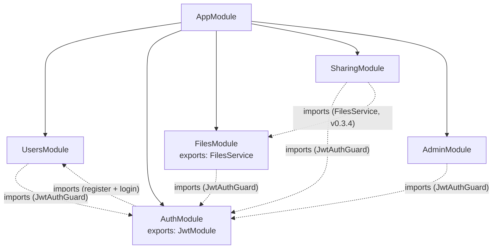

# KC-Project Architecture

This document describes the system architecture as of **v0.3.5** (file handling surface complete -- multipart uploads, filesystem storage, download/streaming, public sharing).

---

## System Overview

KC-Project is a three-process full-stack web application. Frontend and backend run natively; PostgreSQL runs in a Docker container.


- **Frontend** — Next.js 16 with App Router, Tailwind CSS, React 19. Runs on port 3000. All pages are client components (`'use client'`) that call the backend via fetch. Bearer token in Authorization header.
- **Backend** — NestJS 11 on Express. Runs on port 4000. Modular architecture with controllers, services, and DTOs. CORS enabled (intentionally permissive). TypeORM repositories backed by PostgreSQL.
- **Database** — PostgreSQL 16 in Docker (`infra/compose.yml`). Hardcoded credentials, TypeORM migrations with `migrationsRun: true` (replaced `synchronize: true` in v0.2.5), SQL logging. See [ADR-019](../decisions/ADR-019-typeorm-orm.md), [ADR-020](../decisions/ADR-020-docker-db-only.md), [ADR-022](../decisions/ADR-022-typeorm-migrations.md).
- **Communication** — Plain HTTP REST. JSON request/response bodies. No WebSockets, no GraphQL, no tRPC.
- **Persistence** — All data persisted in PostgreSQL via TypeORM. Survives process restarts.
- **File Storage** — Uploaded files stored on local filesystem in `backend/uploads/` via Multer `diskStorage`. Client-supplied filenames used as disk filenames with no sanitisation. See [ADR-024](../decisions/ADR-024-file-storage-strategy.md).

---

## Backend Module Structure

The backend follows NestJS's module-based architecture. `AppModule` is the composition root; each domain feature is a self-contained module.

```mermaid
graph TD
    AppModule["AppModule\n(composition root)"]
    AppController["/ping"]
    AuthModule["AuthModule"]
    UsersModule["UsersModule"]
    FilesModule["FilesModule"]
    SharingModule["SharingModule"]
    AdminModule["AdminModule"]

    AppModule --> AppController
    AppModule --> AuthModule
    AppModule --> UsersModule
    AppModule --> FilesModule
    AppModule --> SharingModule
    AppModule --> AdminModule

    AuthModule --> AuthController["AuthController\nPOST /auth/register\nPOST /auth/login\nGET /auth/me\nPOST /auth/logout"]
    AuthModule --> AuthService["AuthService\nRegister, login, profile, logout"]
    AuthModule -.->|imports| UsersModule
    AuthModule -.->|"exports JwtModule (v0.2.2)"| UsersModule
    AuthModule -.->|"exports JwtModule"| FilesModule
    AuthModule -.->|"exports JwtModule"| SharingModule
    AuthModule -.->|"exports JwtModule"| AdminModule

    UsersModule --> UsersController["UsersController\n🔒 JwtAuthGuard\nCRUD /users"]
    UsersModule --> UsersService["UsersService\nRepository - User\n(plaintext passwords in PG)"]

    FilesModule --> FilesController["FilesController\n🔒 JwtAuthGuard\nPOST /files (multipart upload)\nGET /files/:id/download\nDELETE /files/:id (disk + DB)"]
    FilesModule --> FilesService["FilesService\nRepository - FileEntity\nMulter diskStorage\n(ownerId stored, never checked)"]
    FilesModule -.->|"exports FilesService (v0.3.4)"| SharingModule

    SharingModule --> SharingController["SharingController\nPer-method JwtAuthGuard\nCRUD /sharing\nGET /sharing/public/:token (NO auth)"]
    SharingModule --> SharingService["SharingService\nRepository - SharingEntity\npredictable publicToken"]
    SharingModule -.->|"imports (FilesService)"| FilesModule

    AdminModule --> AdminController["AdminController\n🔒 JwtAuthGuard\nCRUD /admin"]
    AdminModule --> AdminService["AdminService\nRepository - AdminItem"]
```



### Per-module pattern

Every module follows the same internal structure:

- **Controller** — Thin HTTP layer. Maps routes to service methods. Handles 404 on missing IDs. No business logic. As of v0.2.2, most resource controllers use `@UseGuards(JwtAuthGuard)` at the class level -- authentication is enforced but no authorization/ownership checks exist (CWE-862). Exception: SharingController uses per-method guards (v0.3.4) because `GET /sharing/public/:token` is unauthenticated.
- **Service** — Business logic and data access via TypeORM repositories (PostgreSQL). Singleton per module via DI.
- **DTOs** — Request shapes (Create/Update) and response shapes. Classes (not interfaces) so NestJS can instantiate them and the Swagger plugin can introspect them.

---

## Frontend Structure

```
app/                          Next.js App Router pages
├── layout.tsx                Root layout (Header, PageContainer, Footer)
├── providers.tsx             Client wrapper for AuthProvider + ThemeProvider
├── globals.css               Design tokens (CSS variables), Tailwind, dark mode
├── page.tsx                  Landing / home page
├── auth/
│   └── page.tsx              Tabbed Register + Sign In form
├── users/                    Users CRUD pages
├── files/                    Upload + view metadata
├── admin/                    Admin CRUD pages
└── sharing/                  Sharing CRUD pages

app/components/               Layout-level components
├── header.tsx                Nav bar + auth toggle + theme toggle
├── footer.tsx                Site footer
└── page-container.tsx        Content wrapper (max-width, padding)

app/components/ui/            Reusable UI primitives
├── form-input.tsx            Label + input + validation error
├── submit-button.tsx         Button with loading state
├── error-banner.tsx          Error message block
└── success-banner.tsx        Success message block

lib/
├── api.ts                    Typed fetch wrappers for all backend routes
├── auth-context.tsx          Auth state (token, userId) + localStorage persistence
├── theme-context.tsx         Theme state (light/dark/system) + class-based toggle
├── types.gen.ts              Auto-generated from OpenAPI spec
└── types.ts                  Re-export layer with friendly aliases
```

All pages are `'use client'` components. They call `lib/api.ts` functions which return typed promises. Auth state is managed via `AuthContext` (persisted to localStorage). The layout uses a shared app shell (Header, Footer, PageContainer) with design tokens defined as CSS variables in `globals.css`.

---

## API Design

### RESTful resources

Resources follow standard REST conventions — the HTTP method carries the verb:

| Method | Path pattern | Meaning |
|--------|-------------|---------|
| POST   | /resource   | Create  |
| GET    | /resource   | List    |
| GET    | /resource/:id | Read one |
| PUT    | /resource/:id | Update |
| DELETE | /resource/:id | Delete |

Applied to: `/users`, `/files`, `/sharing`, `/admin`

Additional routes:

- `GET /files/:id/download` -- Stream file from disk (v0.3.2)
- `GET /sharing/public/:token` -- Unauthenticated file download via share token (v0.3.4)
- `GET /admin/crash-test` -- Deliberate unhandled error (v0.2.4)

### Action endpoints

Non-CRUD operations use verb paths:

- `POST /auth/register` -- Register a new user
- `POST /auth/login` -- Authenticate
- `GET /ping` -- Infrastructure reachability check

### OpenAPI spec

The backend auto-generates an OpenAPI 3.0 spec via `@nestjs/swagger` with the CLI plugin (no manual `@ApiProperty()` decorators needed). Available at:

- **Swagger UI:** `http://localhost:4000/api/docs`
- **JSON spec:** `http://localhost:4000/api/docs-json`

---

## Type Flow

Types flow from backend to frontend through code generation:


This replaced the manual DTO mirroring from v0.0.7. If a backend DTO changes, regenerating types surfaces the difference immediately.

---

## Request Lifecycle

A typical request flows through these layers:


As of v0.2.2, JwtAuthGuard protects **all** endpoints (auth, users, files, sharing, admin). Authentication is enforced everywhere, but no authorization or ownership checks exist — any authenticated user can access any resource (CWE-639, CWE-862). No middleware, no validation pipe. Basic field validation exists in `AuthService` (throws 400/401/409). All data access goes through TypeORM repositories to PostgreSQL.

---

## Module Dependencies

As of v0.3.4, `AuthModule` imports `UsersModule` and **exports `JwtModule`**. All four resource modules import `AuthModule` for `JwtAuthGuard`. `SharingModule` also imports `FilesModule` for public file streaming. `FilesModule` exports `FilesService`.



**Current cross-module dependencies:**

- `AuthModule -> UsersModule` -- `AuthService` uses `UsersService.findByEmail()`, `UsersService.findEntityByEmail()`, and `UsersService.create()` for registration and login. Passwords are stored and compared as plaintext (intentional).
- `UsersModule -> AuthModule` (v0.2.2) -- `forwardRef` circular import for JwtAuthGuard on UsersController.
- `FilesModule -> AuthModule` (v0.2.2) -- JwtAuthGuard on FilesController.
- `SharingModule -> AuthModule` (v0.2.2) -- JwtAuthGuard on SharingController (per-method since v0.3.4).
- `SharingModule -> FilesModule` (v0.3.4) -- `FilesService` used to stream files for public share downloads.
- `AdminModule -> AuthModule` (v0.2.2) -- JwtAuthGuard on AdminController.

**Future dependencies (not yet implemented):**

- **v0.4.x** -- AdminModule will depend on UsersModule (to manage roles)

---

## Trust Boundaries

The frontend is an **untrusted client**. This is a stated architectural principle, partially enforced as of v0.2.2.

As of v0.3.5:
- **Authentication exists but is intentionally weak** -- real HS256 JWTs with hardcoded secret (`'kc-secret'`), no expiration (CWE-347, CWE-613)
- **JwtAuthGuard protects most endpoints** -- auth, users, files, sharing CRUD, admin (v0.2.2). Exception: `GET /sharing/public/:token` is unauthenticated (v0.3.4, CWE-285).
- **No authorization** -- authentication without authorization. Any authenticated user can access any resource by ID (CWE-639 IDOR, CWE-862 missing authorization). ownerId recorded on files/shares but never enforced.
- **Passwords are plaintext** -- stored and compared without hashing, persisted in PostgreSQL (CWE-256)
- **File uploads unsanitised** -- client-supplied filenames used as disk filenames (CWE-22), client MIME type trusted (CWE-434), no upload size limit (CWE-400). Storage path exposed in API responses (CWE-200).
- **Public shares use predictable tokens** -- sequential "share-N" tokens (CWE-330), expiry not enforced (CWE-613)
- **CORS allows all origins** -- intentionally permissive (CWE-942)
- **No input validation** -- no ValidationPipe, malformed input passes through unchecked (CWE-209, A10:2025)
- **No rate limiting** -- unlimited auth attempts (CWE-307)
- **DB credentials hardcoded** -- in source code (CWE-798)
- **All data persisted** -- PostgreSQL via TypeORM migrations (replaced synchronize:true in v0.2.5)
- **Crash-test endpoint** -- `GET /admin/crash-test` deliberately throws unhandled Error (CWE-209, A10:2025)
- **No global exception filter** -- stack traces leak to stdout (ADR-023)

These weaknesses are intentional. The security surface grows incrementally per the roadmap. See [auth-flow.md](./auth-flow.md) for a detailed security surface table. Enforcement matures through v0.4.x (authorization).

---

## Technology Stack

| Layer | Technology | Version |
|-------|-----------|---------|
| Backend framework | NestJS | 11.x |
| Backend runtime | Node.js | 20+ |
| Database | PostgreSQL | 16.x |
| ORM | TypeORM | latest |
| Frontend framework | Next.js (App Router) | 16.x |
| UI library | React | 19.x |
| Styling | Tailwind CSS | 4.x |
| Language | TypeScript (strict) | 5.x |
| API docs | @nestjs/swagger | latest |
| Type codegen | openapi-typescript | 7.x |
| Linting | ESLint 9 (flat config) | per-project |
| Formatting | Prettier 3 | shared root config |

---

## What This Architecture Does Not Include (Yet)

- Authorization / ownership enforcement -- ownerId exists but is never checked (v0.4.x)
- Pagination / query limits -- all list endpoints are unbounded (CWE-400)
- File upload sanitisation -- filenames, MIME types, and size limits are not validated (v0.3.x intentional)
- RBAC / role-based access (v0.4.x)
- App containers / deployment (v0.5.x) — only PG is containerised
- CI/CD pipelines
- Environment configuration (credentials still hardcoded)
- Swagger auth protection — spec is publicly accessible (CWE-200)
- Response header hardening — X-Powered-By not disabled (CWE-200)
- Global exception filter / error sanitisation — stack traces leak to logs (A10:2025, ADR-023)
- Input validation pipeline — no ValidationPipe registered (CWE-209)
- Migration review gate — migrationsRun:true auto-executes any migration file (CWE-1188 partial)
