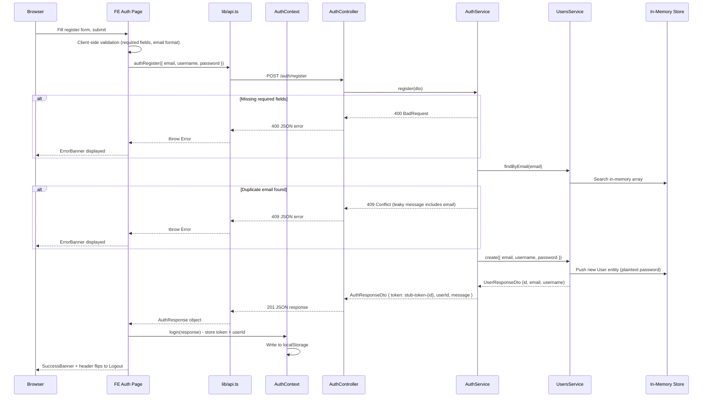
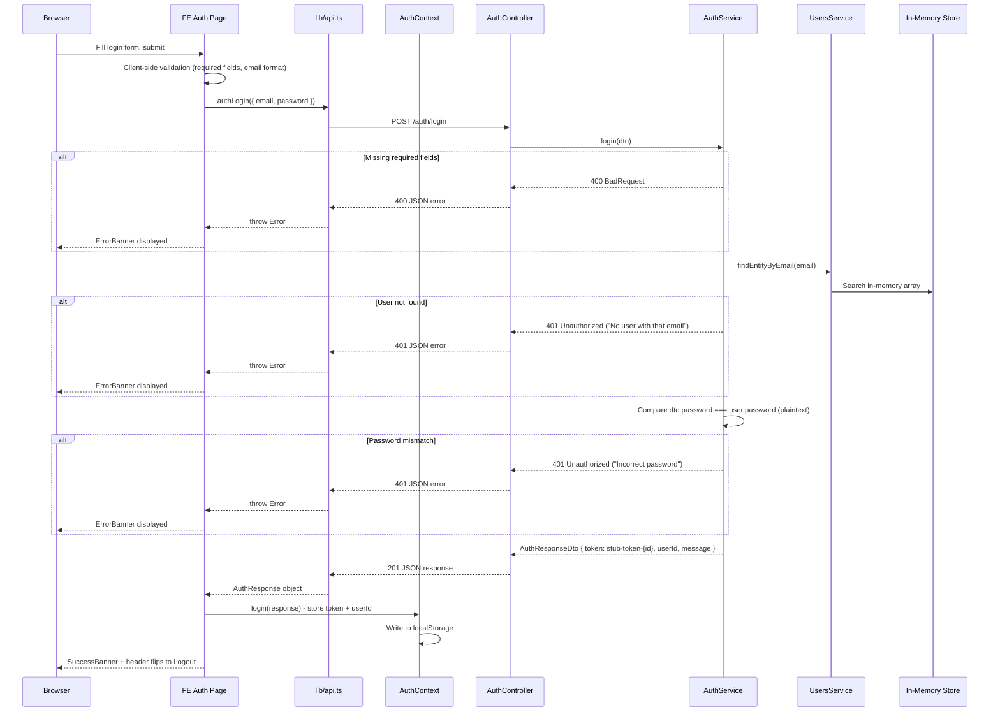
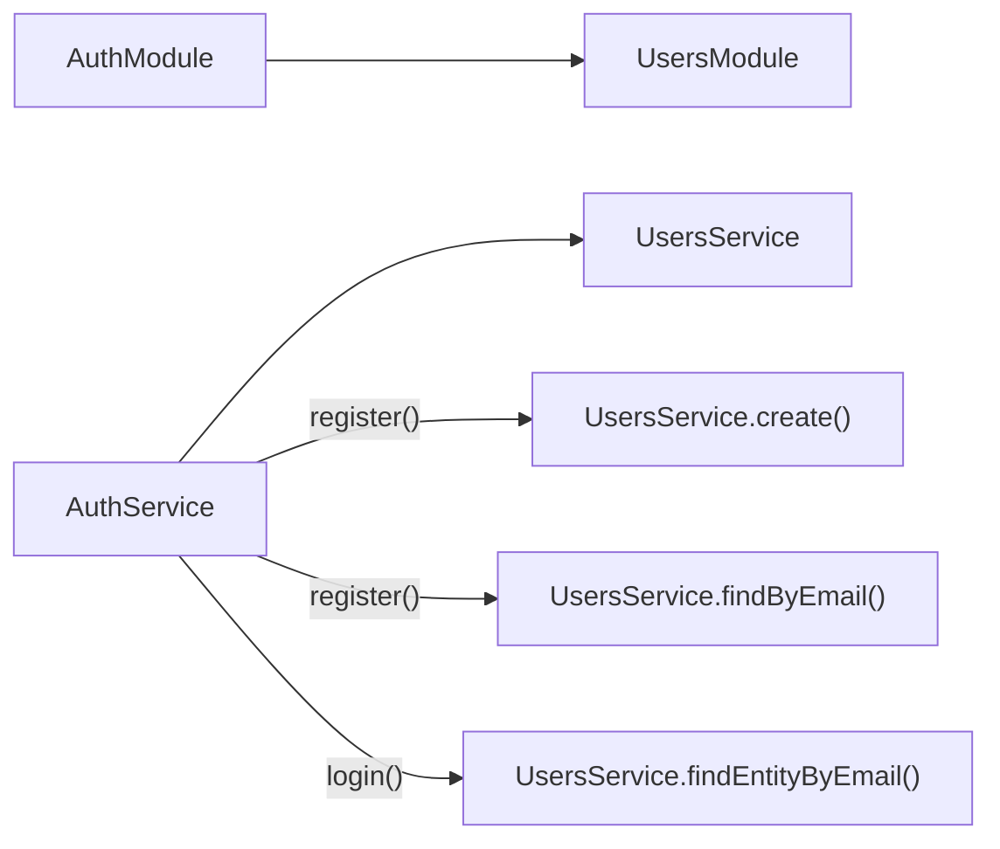
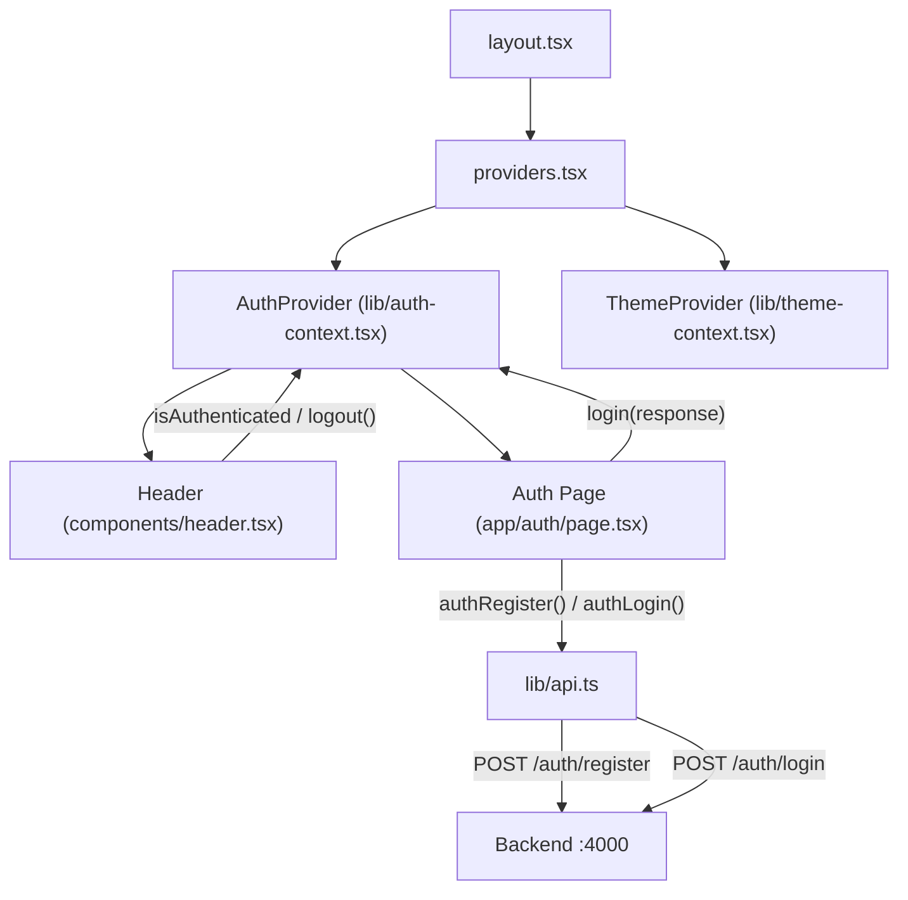

# v0.1.x Authentication Flow

This document describes the authentication flows introduced during the v0.1.x identity surface. Each version adds behaviour incrementally. Intentional security weaknesses are documented as they appear.

---

## Registration Flow (v0.1.1)

User creation with minimal validation and weak duplicate handling.



### Key details

- Password is stored as **plaintext** in the in-memory `User` entity
- Token is a meaningless string (`stub-token-{id}`) with no cryptographic value
- User IDs are sequential strings (`"1"`, `"2"`, ...) - predictable by design
- The 409 error message includes the email address ("User with email X already exists") - intentionally leaky

---

## Login Flow (v0.1.2)

Login logic with plaintext password comparison.



### Key details

- Password comparison is **plaintext equality** (`===`) - no hashing
- Error messages are **distinct**: "No user with that email" vs "Incorrect password" - enables user enumeration
- Uses `findEntityByEmail()` which returns the raw `User` entity (including password), unlike `findByEmail()` which strips it

---

## Session / Token Lifecycle (v0.1.3 - future)

Not yet implemented. Current state and planned changes:

- **Current**: tokens are `stub-token-{id}` strings with no cryptographic meaning. They are not verified by any backend middleware.
- **Planned**: JWT or session tokens will be introduced. Tokens will be generated on register/login and required for protected routes.
- **Client storage**: `localStorage` via `AuthContext` (no `httpOnly` cookie, no secure flag - intentionally insecure)
- **Expiration**: none planned for v0.1.3 (no expiration enforcement per roadmap)

---

## Logout Flow (v0.1.4 - future)

Not yet implemented on the backend. Current client-side behaviour:

- `AuthContext.logout()` clears `token` and `userId` from React state and `localStorage`
- Header toggles from "Logout" back to "Sign In"
- **No server-side invalidation** - the token (once real) remains valid after client-side logout
- Tokens will be reusable after logout (intentional per roadmap)

---

## Module Dependencies

`AuthModule` imports `UsersModule` to access user data during registration and login.



---

## Frontend Auth Architecture



### Auth Context State

```
{
  token: string | null       // stub-token-{id} or null
  userId: string | null      // user ID from AuthResponseDto or null
  isAuthenticated: boolean   // derived: !!token
  login(response): void      // stores token + userId in state + localStorage
  logout(): void             // clears state + localStorage
}
```

Persisted to `localStorage` under key `kc_auth`. Hydrated on mount via `useEffect`.

---

## Security Surface Summary

Intentional weaknesses introduced at each v0.1.x version:

| Version | Weakness | Type | Detail |
|---------|----------|------|--------|
| v0.1.1 | Plaintext password storage | CWE-256 | Passwords stored as-is in User entity |
| v0.1.1 | Leaky duplicate error | Information disclosure | 409 message includes the email address |
| v0.1.1 | Sequential user IDs | CWE-330 | IDs are predictable ("1", "2", "3"...) |
| v0.1.2 | Plaintext password comparison | CWE-256 | `===` comparison, no hashing |
| v0.1.2 | Distinct auth errors | User enumeration | "No user with that email" vs "Incorrect password" |
| v0.1.3 | No token expiration | CWE-613 | Tokens never expire (planned) |
| v0.1.3 | localStorage token storage | CWE-922 | Accessible to XSS, no httpOnly (planned) |
| v0.1.4 | No session invalidation | CWE-613 | Server doesn't track or revoke tokens (planned) |
| v0.1.5 | No rate limiting | CWE-307 | Unlimited login attempts (planned) |
| v0.1.5 | Error-based enumeration | CWE-204 | Distinct responses reveal valid accounts (planned) |
