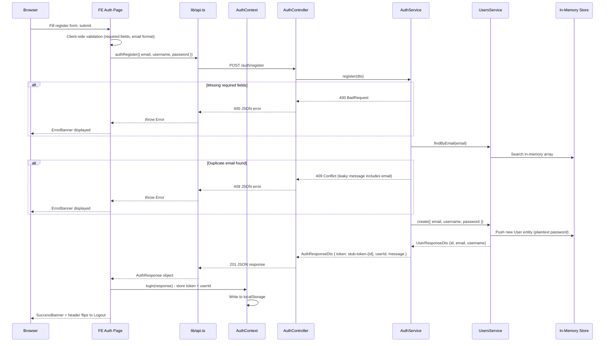
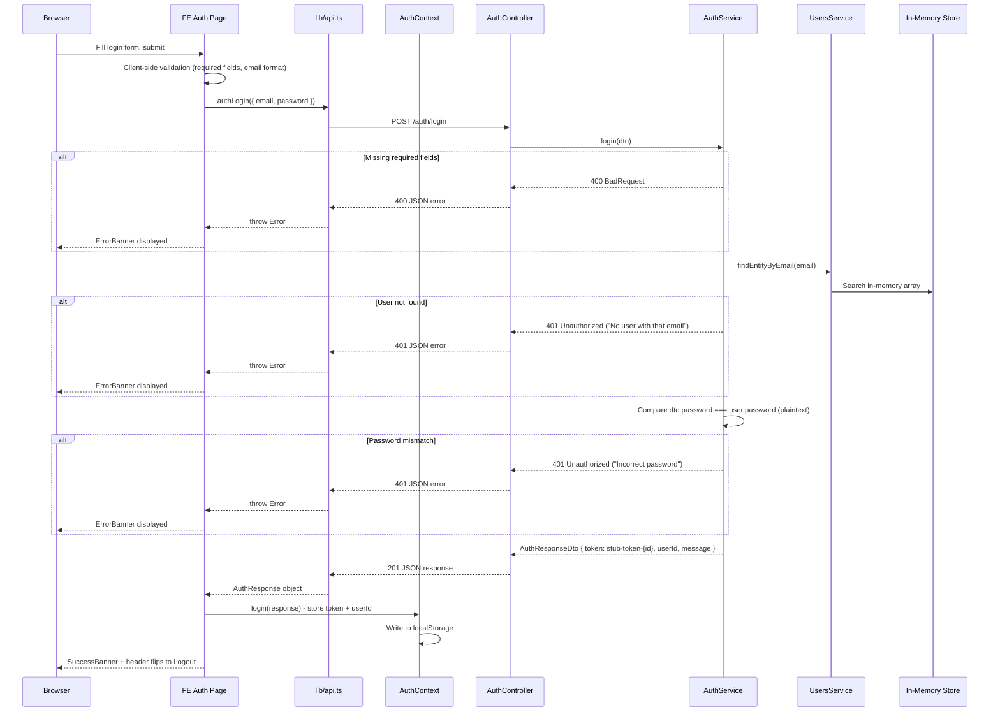
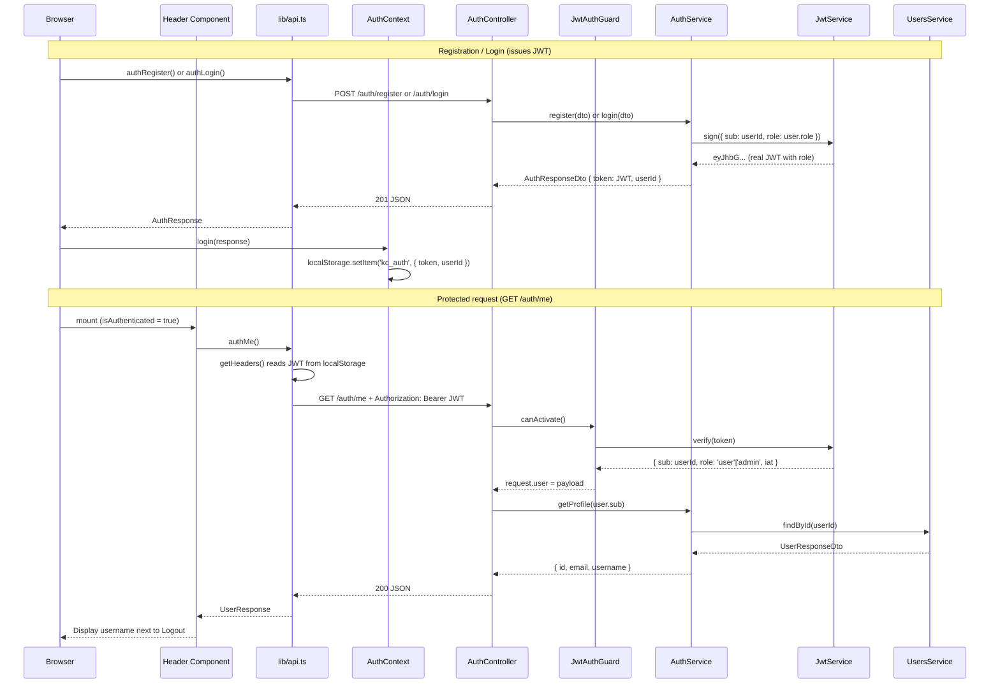
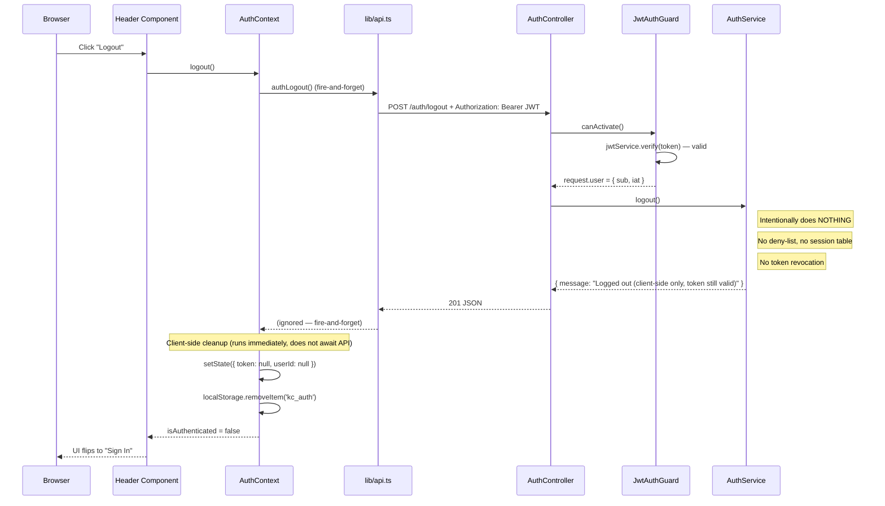
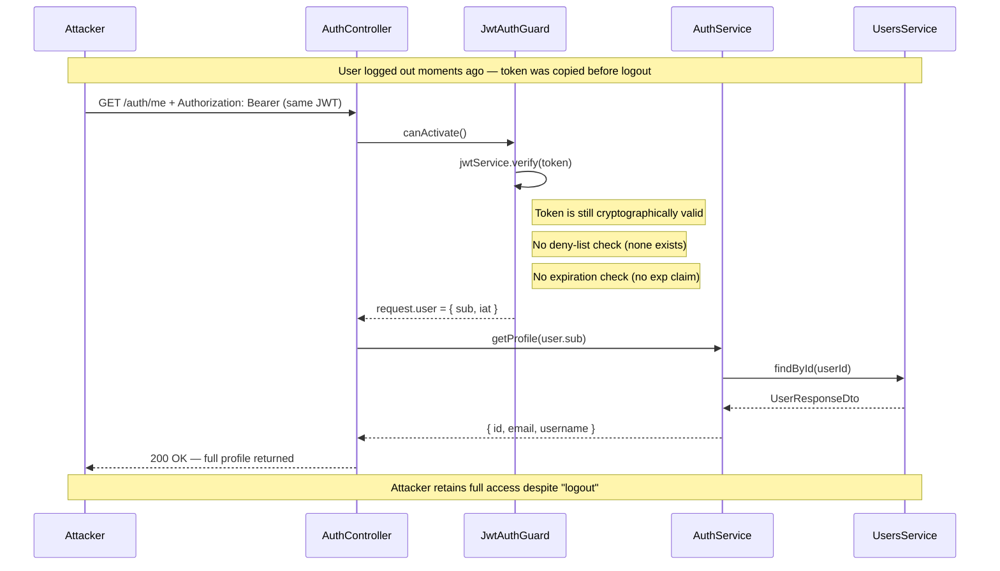
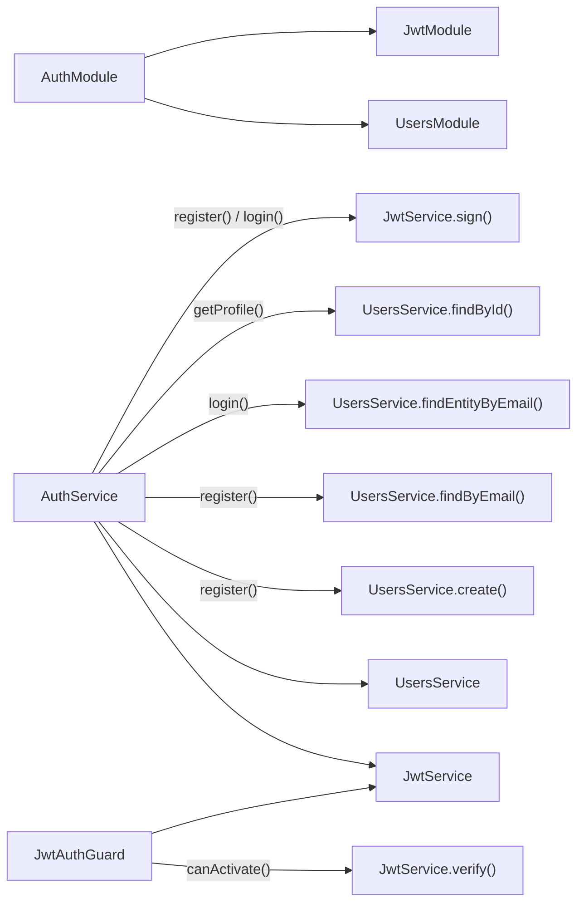
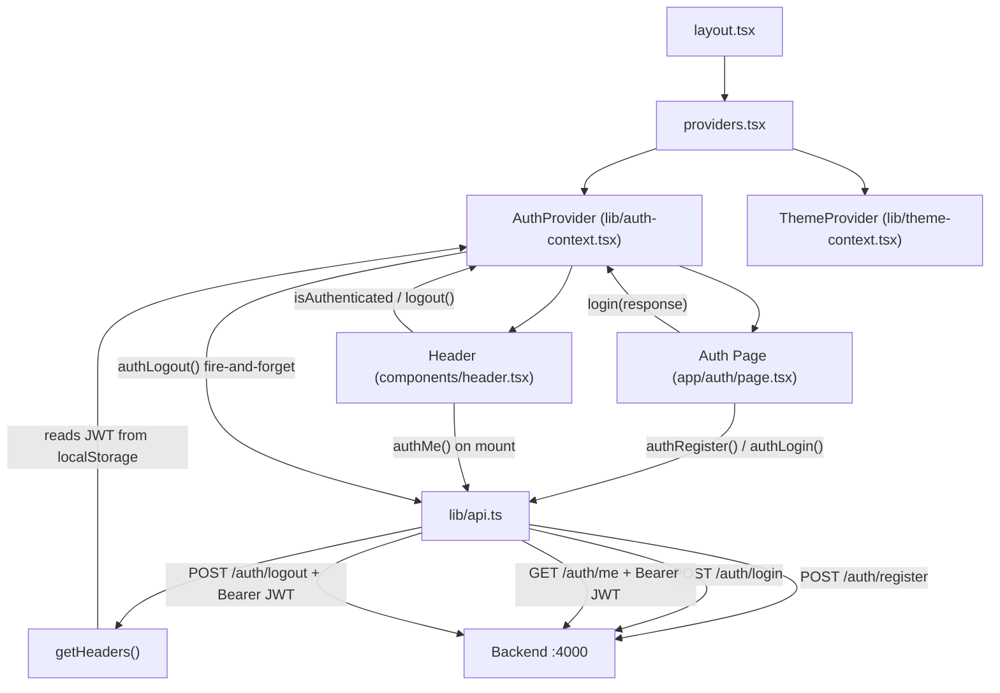
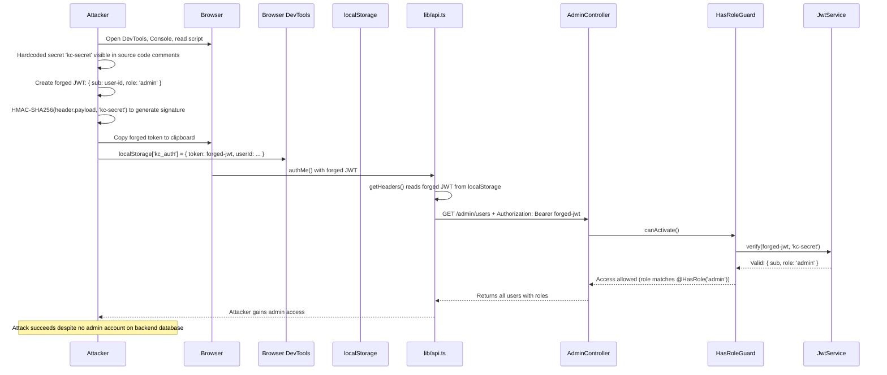

# Authentication & Authorization Flow (v0.1.x – v0.4.x)

This document describes authentication and authorization flows across the v0.1.x identity surface (registration, login, sessions) and v0.4.x authorization surface (binary RBAC, ternary roles, escalation chains, missing authorization checks).

Each version adds behaviour incrementally. Intentional security weaknesses are highlighted and mapped to OWASP/CWE identifiers.

---

## Core Identity Flows (v0.1.x)

### Registration Flow (v0.1.1)

User creation with minimal validation and weak duplicate handling.



### Key details

- Password is stored as **plaintext** in the in-memory `User` entity
- Token is a meaningless string (`stub-token-{id}`) with no cryptographic value
- User IDs are sequential strings (`"1"`, `"2"`, ...) - predictable by design
- The 409 error message includes the email address ("User with email X already exists") - intentionally leaky

---

## Login Flow (v0.1.2)

Login logic with plaintext password comparison.



### Key details

- Password comparison is **plaintext equality** (`===`) - no hashing
- Error messages are **distinct**: "No user with that email" vs "Incorrect password" - enables user enumeration
- Uses `findEntityByEmail()` which returns the raw `User` entity (including password), unlike `findByEmail()` which strips it

---

## Session / Token Lifecycle (v0.1.3)

Real JWTs replace stub tokens. Tokens are signed with HS256 using a hardcoded weak secret (`'kc-secret'`), have no expiration claim, and are stored in `localStorage`. The first protected endpoint (`GET /auth/me`) proves the flow works.

### JWT Configuration

- **Algorithm**: HS256 (symmetric — same key signs and verifies)
- **Secret**: `'kc-secret'` (hardcoded in `JwtModule.register()`)
- **Payload**: `{ sub: userId, role: 'user' | 'admin' }` — includes role as of v0.4.0, but role is never re-validated (CWE-639)
- **Expiration**: none (`exp` claim is absent — tokens live forever)
- **Storage**: `localStorage` under key `kc_auth` (XSS-accessible, includes role as of v0.4.0)

### Token Flow



### Key details

- Stub tokens (`stub-token-{id}`) are fully replaced — register and login now return real JWTs
- `getHeaders()` in `api.ts` reads the token from `localStorage` and attaches it as `Authorization: Bearer` on every request
- `JwtAuthGuard` verifies the signature but does NOT check that the user still exists (CWE-613)
- `@CurrentUser()` decorator extracts the decoded payload from `request.user`
- `AuthService.getProfile()` looks up the user by ID — throws 404 if the user no longer exists

---

## Logout Flow (v0.1.4)

Backend logout endpoint exists but is intentionally cosmetic. The server does NOT invalidate, deny-list, or track the JWT in any way. The response says "logged out" but the token remains cryptographically valid and replayable.

### Logout Sequence



### Token Replay After Logout

This sequence proves CWE-613: the JWT works after logout.



### Key details

- `POST /auth/logout` requires a valid JWT (JwtAuthGuard protects it)
- `AuthService.logout()` is intentionally empty — returns a message and does nothing else
- The frontend calls `authLogout()` fire-and-forget then immediately clears localStorage
- The user sees "Sign In" — they believe they are logged out
- Any copy of the JWT (DevTools, XSS exfiltration, network interception) remains valid indefinitely
- e2e test `'token remains valid after logout — CWE-613 token replay'` proves this

---

## Authentication Edge Cases (v0.1.5)

v0.1.5 closes the identity surface by explicitly documenting and testing three categories of auth edge cases that were implicit in earlier versions.

### User Enumeration (CWE-204 / CWE-209)

Two distinct enumeration vectors exist:

1. **Login error messages (CWE-204)**: `POST /auth/login` returns "No user with that email" for unregistered emails vs "Incorrect password" for registered emails with wrong password. An attacker can probe any email address to determine registration status.

2. **Registration duplicate error (CWE-209)**: `POST /auth/register` returns `409 "User with email X already exists"` — the error message includes the email address, confirming it's registered.

Both vectors exist since v0.1.1/v0.1.2. v0.1.5 adds an explicit enumeration e2e test that frames the full attack: probe with unknown email, register it, probe again — different error messages confirm the attack.

### No Rate Limiting (CWE-307)

There is no rate limiting anywhere in the stack:
- No nginx reverse proxy (not deployed yet)
- No `@nestjs/throttler` or application-level throttle
- No per-IP or per-account request limits

An attacker can send unlimited requests to any endpoint. Combined with weak passwords (CWE-521), brute-force attacks are trivial. The e2e test sends 10 rapid wrong-password attempts — all return 401, none are blocked.

### No Account Lockout (CWE-307)

After any number of failed login attempts, the correct password still works. There is no lockout threshold, no exponential backoff, no temporary suspension. The e2e test proves this: 10 failed attempts followed by the correct password → 201 success.

### Weak Password Requirements (CWE-521)

No password strength validation exists anywhere:
- **Backend**: `AuthService.register()` only checks `if (!password)` — any non-empty string passes. No `class-validator` decorators, no `ValidationPipe`.
- **Frontend**: No password strength meter, no minimum length check, no complexity rules. Client-side validation only checks email format (UX only, bypassable).

The e2e test registers and logs in with password `"a"` — both succeed.

### Key details

- All four e2e tests are in the `Authentication Edge Cases (v0.1.5)` describe block
- These weaknesses complete the v0.1.x identity surface — 18 CWE entries total across v0.1.0–v0.1.5
- Next: v0.2.x introduces persistence, making these weaknesses permanent and exploitable against a real database

---

## Module Dependencies

`AuthModule` imports `UsersModule` (user data access) and `JwtModule` (token signing/verification).



---

## Frontend Auth Architecture



### Auth Context State

```
{
  token: string | null       // real JWT (HS256, 'kc-secret') or null
  userId: string | null      // user ID from AuthResponseDto or null
  isAuthenticated: boolean   // derived: !!token (presence check only, no validation)
  login(response): void      // stores token + userId in state + localStorage
  logout(): void             // fire-and-forget POST /auth/logout, then clears state + localStorage
}
```

Persisted to `localStorage` under key `kc_auth`. Hydrated on mount via `useEffect`.

Note: `isAuthenticated` only checks that a token string exists — it does NOT validate the JWT signature, check expiration, or confirm the user still exists. A fabricated or expired token in `localStorage` will show the authenticated UI until the next API call fails with 401.

---

## Authorization Surface (v0.4.x)

Starting v0.4.0, a `role` column is added to `User`. Role claims appear in JWT payloads and are used by `HasRoleGuard` to control access. Intentional authorization weaknesses are stacked across v0.4.0–v0.4.5.

### Binary RBAC (v0.4.0–v0.4.2)

#### Role Model

```
role: 'user' | 'admin'
```

- `'user'` — Regular user. Can create/read/update files. Cannot access admin endpoints.
- `'admin'` — Administrative user. Can list users, change user roles, approve files. No explicit hierarchy defined.

#### HasRole Guard Behaviour

```typescript
@Get('admin/users')
@HasRole('admin')
async getAllUsers() { ... }

@Put('admin/users/:id/role')
@HasRole('admin')
async updateUserRole(@Param('id') userId) { ... }
```

The `@HasRole('admin')` decorator stores required roles in metadata. `HasRoleGuard` retrieves them and compares against `request.user.role` from the JWT payload. If no `@HasRole` metadata exists, access is allowed (implicit public).

#### JWT Role Claim (v0.4.0)

Role is added to JWT payload:

```json
{
  "sub": "user-id-here",
  "role": "user" | "admin",
  "iat": 1708619400
}
```

**No expiration claim** — tokens valid forever. **No DB re-validation** — role is trusted as-is from JWT.

#### Admin Endpoints (v0.4.1)

Two admin endpoints introduced:

1. **GET /admin/users** — List all users with id, email, username, role, createdAt, updatedAt. No pagination. Guarded by `@HasRole('admin')` + `JwtAuthGuard`.

2. **PUT /admin/users/:id/role** — Update a user's role. Only accepts `'user'` and `'admin'`. Guarded by `@HasRole('admin')` + `JwtAuthGuard`.

No audit trail. Changes take effect immediately and persist to database.

#### CWE-639: Client-Controlled Authorization (v0.4.2)

**Vulnerability**: The JWT secret is hardcoded as `'kc-secret'`. An attacker who knows the secret can forge any JWT with any role claim.

##### JWT Forgery Attack Sequence



This is **CWE-639** (Client-Controlled Authorization): the role claim is trusted without DB re-validation.

#### e2e Test: JWT Forgery (v0.4.2)

The `rbac.e2e-spec.ts` test suite includes `'forge JWT with role=admin and gain access to admin endpoints'`:

1. Create two users: regular user + separate admin
2. Manually sign a JWT with forged role claim: `{ sub: userId-of-regular-user, role: 'admin' }`
3. Call GET /admin/users with forged JWT
4. **Result**: Regular user's forged JWT grants access to admin endpoint
5. e2e test assertion: `expect(response.status).toBe(200)` — admin endpoint returns data to non-admin

---

### Ternary Roles & Role Hierarchy Ambiguity (v0.4.3)

#### Role Model

```
role: 'user' | 'moderator' | 'admin'
```

A third role is introduced: `'moderator'`. This role is intentionally ambiguous in terms of hierarchy and permissions.

**Intended Permissions** (as documented, but not enforced):
- `'user'` → Can read/write own files, not others
- `'moderator'` → Can approve/reject user-uploaded files
- `'admin'` → Can do everything

**Actual Permissions** (enforcement gaps):
- `@HasRole(['moderator', 'admin'])` treats both roles as equals with no ranking
- File approval endpoint (`PUT /files/:id/approve`) requires `@HasRole(['moderator', 'admin'])`
- Admin endpoints inconsistently require `@HasRole('admin')` vs `@HasRole(['moderator', 'admin'])`
- No explicit precedence: Can moderator override admin decisions? Undefined.

**CWE-841**: This is role hierarchy ambiguity. The system has 3 roles but no explicit constants defining their rank (e.g., `ADMIN_RANK=3 > MODERATOR_RANK=2 > USER_RANK=1`). Permission checks don't validate hierarchy, so a moderator could be elevated to admin via a forged JWT.

#### New Endpoint: PUT /files/:id/approve (v0.4.3)

```
PUT /files/{fileId}/approve
{
  "status": "approved" | "rejected"
}
```

Guarded by `@HasRole(['moderator', 'admin'])`. Moderators can approve or reject files. Admins can do the same.

**Vulnerability**: HasRoleGuard trusts JWT role without DB re-validation (CWE-639). A user who forges a moderator JWT can approve files.

#### Role Selector UI (v0.4.3 Frontend)

Update admin page to show ternary role selector dropdown (user/moderator/admin) instead of binary toggle. Users can be promoted to moderator or admin via UI.

---

### Privilege Escalation & Cascading Promotions (v0.4.4)

#### New Endpoint: PUT /admin/users/:id/role/escalate (v0.4.4)

```
PUT /admin/users/{userId}/role/escalate
(no request body)
```

Promotes a user to moderator role (if currently user). Guarded by `@HasRole(['moderator', 'admin'])`.

**Design Flaw** (CWE-269): A moderator can promote any user to moderator. Newly promoted moderators can immediately promote other users.

**Escalation Chain Example**:

1. Admin creates User A (regular user role)
2. Admin promotes User A → moderator
3. User A (now moderator) authenticates with new JWT: `{ sub: A, role: 'moderator' }`
4. User A calls PUT /admin/users/B/role/escalate
5. User B is promoted → moderator
6. User B can immediately promote User C
7. Chain continues indefinitely → exponential moderator creation

Called **CWE-269** (Improper Access Control) in v0.4.x, but the root cause is CWE-639 (role trusted without DB validation) combined with CWE-862 (no additional checks on which user can be promoted).

---

### Missing Authorization on DELETE (v0.4.5)

#### New Endpoint: DELETE /admin/users/:id (v0.4.5)

```
DELETE /admin/users/{userId}
(no body, returns 204 No Content)
```

**Intentional Vulnerability**: Only guarded by `JwtAuthGuard`, **missing** `@HasRole('admin')`.

The `HasRoleGuard` allows access if no `@HasRole` metadata is found on the endpoint. Because `DELETE /admin/users/:id` lacks the decorator, any authenticated user (regular user, moderator, or admin) can call it.

**Exploitation**:

1. Regular user authenticates (any role)
2. Regular user calls DELETE /admin/users/target-admin-id
3. Admin user is deleted from database
4. Files orphaned (file records still reference deleted userId)

This demonstrates **CWE-862** (Improper Access Control — Missing Authorization) at scale. It shows how developers forget to add necessary guards on some endpoints while adding them correctly on others.

#### Authorization Inconsistency Table

Comparing admin endpoints shows the inconsistency:

| Endpoint | Guards | Status |
|----------|--------|--------|
| GET /admin/users | `JwtAuthGuard` + `@HasRole('admin')` | ✓ Secure — 403 for non-admin |
| PUT /admin/users/:id/role | `JwtAuthGuard` + `@HasRole('admin')` | ✓ Secure — 403 for non-admin |
| PUT /admin/users/:id/role/escalate | `JwtAuthGuard` + `@HasRole(['moderator','admin'])` | ✓ Secure — 403 for user |
| **DELETE /admin/users/:id** | **Only `JwtAuthGuard`** | **✗ VULNERABLE — Any auth user allowed** |

The DELETE endpoint is unguarded, demonstrating a realistic authorization bypass scenario.

---

### Placeholder: GET /admin/audit-logs (v0.4.4)

```
GET /admin/audit-logs
(returns empty array)
```

Returns empty array. Placeholder for future audit trail implementation. No persistent logging of role changes, escalations, or deletions exists. All admin modifications are logged to stdout only (lost on restart).

**CWE-532**: Insertion of Sensitive Information Into Log Files (or lack thereof — no audit trail at all).

---

## Module Dependencies & Guard Stacking

### Guard Order

Controllers apply guards in order:

```typescript
@Controller('admin')
@UseGuards(JwtAuthGuard, HasRoleGuard)
export class AdminController {
  @Get('users')
  @HasRole('admin')
  async getAllUsers() { ... }

  @Delete('users/:id')
  // No @HasRole → HasRoleGuard bypassed
  async deleteUser(@Param('id') userId) { ... }
}
```

1. **JwtAuthGuard** — Verifies JWT signature (without checking expiration or user existence)
2. **HasRoleGuard** — Checks `@HasRole` metadata and compares against JWT role claim

If JwtAuthGuard passes, the request reaches HasRoleGuard. If HasRoleGuard finds no metadata, it allows access.

---

## Security Surface Summary (v0.1.x – v0.4.x)

Intentional weaknesses introduced at each version:

| Version | Weakness | CWE | Detail |
|---------|----------|-----|--------|
| v0.1.1 | Plaintext password storage | CWE-256 | Passwords stored as-is in User entity |
| v0.1.1 | Leaky duplicate error | CWE-209 | 409 message includes the email address |
| v0.1.1 | Sequential user IDs | CWE-330 | IDs are predictable ("1", "2", "3"...) |
| v0.1.2 | Plaintext password comparison | CWE-256 | `===` comparison, no hashing |
| v0.1.2 | Distinct auth errors | CWE-204 | "No user with that email" vs "Incorrect password" |
| v0.1.3 | Weak JWT secret | CWE-798 | Hardcoded `'kc-secret'`, HS256 symmetric — trivially forged |
| v0.1.3 | No token expiration | CWE-613 | JWTs have no `exp` claim — valid forever |
| v0.1.3 | localStorage token storage | CWE-922 | Accessible to XSS, no httpOnly cookie |
| v0.1.3 | No user-existence check in guard | CWE-613 | Deleted user's JWT still passes verification |
| v0.1.3 | Missing authorization on /auth/me | CWE-862 | Any valid token gets full profile — no scope/role check |
| v0.1.3 | Permissive CORS | CWE-942 | `enableCors()` with no options — all origins allowed |
| v0.1.3 | Cleartext transport | CWE-319 | HTTP only — tokens and passwords sent unencrypted |
| v0.1.3 | Source code comments in CSR bundle | CWE-615 | Frontend comments (VULN annotations) visible in DevTools |
| v0.1.4 | Cosmetic logout (no server-side invalidation) | CWE-613 | POST /auth/logout returns success but does not revoke token |
| v0.1.4 | Token replay after logout | CWE-613 | Same JWT works on /auth/me after logout — proven by e2e test |
| v0.1.5 | No rate limiting on auth endpoints | CWE-307 | Unlimited login/register attempts — brute-force viable |
| v0.1.5 | No account lockout | CWE-307 | Correct password works after any number of failed attempts |
| v0.1.5 | Weak password requirements | CWE-521 | No minimum length or complexity — "a" is a valid password |
| v0.2.2 | IDOR — any authenticated user can access any resource by ID | CWE-639 | ownerId stored but never checked on read/update/delete |
| v0.2.2 | Missing authorization on all resource endpoints | CWE-862 | JwtAuthGuard only, no ownership or role checks |
| v0.2.3 | Unbounded list endpoints — full table dumps | CWE-200 | GET /users, /files, /sharing, /admin return all records |
| v0.2.3 | Existence oracle — 200/404 with sequential IDs | CWE-203 | GET /users/:id returns 200 or 404 — enables enumeration |
| v0.2.3 | Uncontrolled resource consumption | CWE-400 | No pagination, no query limits, no rate limiting |
| v0.2.3 | Swagger spec publicly accessible | CWE-200 | /api/docs and /api/docs-json require no authentication |
| v0.2.3 | X-Powered-By header leaks framework | CWE-200 | Express sends `X-Powered-By: Express` by default |
| v0.2.4 | Runtime error stack trace leakage | CWE-209 | Unhandled exceptions log stack traces to stdout |
| v0.2.4 | No ValidationPipe — malformed input accepted | CWE-209 | Wrong types pass through to services unchecked |
| v0.2.4 | NestJS 404 error shape leakage | CWE-200 | Routes return `{"statusCode":404,"message":"Cannot GET /..."}` |
| v0.2.4 | SQL logging with plaintext passwords | CWE-532 | TypeORM `logging: true` prints INSERT with passwords |
| v0.2.5 | Auto-run migrations | CWE-1188 | Any migration file auto-executes on start |
| v0.3.0 | Path traversal in file uploads | CWE-22 | Client-supplied filename used as disk filename with no sanitisation |
| v0.3.0 | MIME type confusion | CWE-434 | Client Content-Type stored without validation |
| v0.3.0 | No upload size limit | CWE-400 | Multer has no limits.fileSize — disk exhaustion possible |
| v0.3.0 | Filesystem path disclosure | CWE-200 | storagePath (absolute disk path) exposed in API responses |
| v0.3.2 | No ownership check on download | CWE-639 | Any authenticated user can download any file by ID |
| v0.3.3 | No path validation before unlink | CWE-22 | DELETE uses storagePath with no validation before fs.unlink |
| v0.3.4 | Predictable share tokens | CWE-330 | Sequential "share-N" tokens, trivially guessable |
| v0.3.4 | Unauthenticated public endpoint | CWE-285 | GET /sharing/public/:token requires no auth |
| v0.3.4 | Share expiry not enforced | CWE-613 | expiresAt stored but never checked on access |
| v0.4.0–v0.4.2 | Client-controlled authorization | CWE-639 | JWT role trusted without DB re-validation — forged role claims accepted |
| v0.4.0–v0.4.2 | Missing authorization on admin endpoints | CWE-862 | HasRole guard only checks JWT, not database |
| v0.4.3 | Role hierarchy ambiguity | CWE-841 | Three roles (user/moderator/admin) with no explicit ranking |
| v0.4.3 | Ternary role confusion | CWE-841 | @HasRole(['moderator','admin']) treats roles as equals |
| v0.4.4 | Privilege escalation via role delegation | CWE-269 | Moderators can promote users to moderators indefinitely |
| v0.4.4 | Escalation chains (cascading promotions) | CWE-269 | Exponential moderator creation via chain attacks |
| v0.4.4 | No audit trail for role changes | CWE-532 | Role changes logged to stdout only, lost on restart |
| v0.4.5 | Missing authorization on DELETE | CWE-862 | DELETE /admin/users/:id has no @HasRole guard — any auth user can delete |
| v0.4.5 | Authorization inconsistency across endpoints | CWE-862 | Some admin endpoints guarded, others not — designer oversight |


Intentional weaknesses introduced at each v0.1.x version:

| Version | Weakness | Type | Detail |
|---------|----------|------|--------|
| v0.1.1 | Plaintext password storage | CWE-256 | Passwords stored as-is in User entity |
| v0.1.1 | Leaky duplicate error | CWE-209 | 409 message includes the email address |
| v0.1.1 | Sequential user IDs | CWE-330 | IDs are predictable ("1", "2", "3"...) |
| v0.1.2 | Plaintext password comparison | CWE-256 | `===` comparison, no hashing |
| v0.1.2 | Distinct auth errors | CWE-204 | "No user with that email" vs "Incorrect password" |
| v0.1.3 | Weak JWT secret | CWE-347 / CWE-798 | Hardcoded `'kc-secret'`, HS256 symmetric — trivially forged |
| v0.1.3 | No token expiration | CWE-613 | JWTs have no `exp` claim — valid forever |
| v0.1.3 | localStorage token storage | CWE-922 | Accessible to XSS, no httpOnly cookie |
| v0.1.3 | No user-existence check in guard | CWE-613 | Deleted user's JWT still passes verification |
| v0.1.3 | Missing authorization on /auth/me | CWE-862 | Any valid token gets full profile — no scope/role check |
| v0.1.3 | Permissive CORS | CWE-942 | `enableCors()` with no options — all origins allowed |
| v0.1.3 | Cleartext transport | CWE-319 | HTTP only — tokens and passwords sent unencrypted |
| v0.1.3 | Source code comments in CSR bundle | CWE-615 | Frontend comments (VULN annotations, API structure) visible in DevTools |
| v0.1.4 | Cosmetic logout (no server-side invalidation) | CWE-613 | POST /auth/logout returns success but does not revoke token |
| v0.1.4 | Token replay after logout | CWE-613 | Same JWT works on /auth/me after logout — proven by e2e test |
| v0.1.5 | No rate limiting on auth endpoints | CWE-307 | Unlimited login/register attempts — brute-force viable |
| v0.1.5 | No account lockout | CWE-307 | Correct password works after any number of failed attempts |
| v0.1.5 | Weak password requirements | CWE-521 | No minimum length or complexity — "a" is a valid password |
| v0.2.2 | IDOR — any authenticated user can access any resource by ID | CWE-639 | ownerId stored but never checked on read/update/delete. Sequential IDs make enumeration trivial. |
| v0.2.2 | Missing authorization on all resource endpoints | CWE-862 | JwtAuthGuard on all controllers but no ownership or role checks. Admin endpoints accessible to any user. |
| v0.2.3 | Unbounded list endpoints — full table dumps | CWE-200 | GET /users, /files, /sharing, /admin return all records to any authenticated user. No pagination or ownership filter. |
| v0.2.3 | Existence oracle via 200/404 + sequential IDs | CWE-203 | GET /users/:id returns 200 or 404 — combined with sequential IDs, enables full enumeration. |
| v0.2.3 | Uncontrolled resource consumption | CWE-400 | No pagination, no query limits, no rate limiting on list endpoints. |
| v0.2.3 | Swagger spec publicly accessible | CWE-200 | /api/docs and /api/docs-json require no authentication — full API reconnaissance. |
| v0.2.3 | X-Powered-By header leaks framework | CWE-200 | Express sends `X-Powered-By: Express` by default — not disabled. |
| v0.2.4 | Runtime error stack trace leakage | CWE-209 | Unhandled exceptions log full stack traces (file paths, line numbers) to stdout. Crash-test endpoint demonstrates this. A10:2025. |
| v0.2.4 | No ValidationPipe — malformed input accepted | CWE-209 | Wrong types in request bodies pass through to services unchecked. A10:2025. |
| v0.2.4 | NestJS 404 error shape leakage | CWE-200 | Non-existent routes return `{"statusCode":404,"message":"Cannot GET /..."}` — reveals NestJS error format. |
| v0.2.4 | SQL logging with plaintext passwords | CWE-532 | TypeORM `logging: true` prints INSERT with plaintext password values to stdout. |
| v0.2.5 | Auto-run migrations (migrationsRun) | CWE-1188 | Partial remediation: synchronize:true replaced, but any migration file auto-executes on start. |
| v0.3.0 | Path traversal in file uploads | CWE-22 | Client-supplied filename used as disk filename with no sanitisation. |
| v0.3.0 | MIME type confusion | CWE-434 | Client Content-Type stored without magic-byte validation. |
| v0.3.0 | No upload size limit | CWE-400 | Multer has no limits.fileSize. Disk exhaustion possible. |
| v0.3.0 | Filesystem path disclosure | CWE-200 | storagePath (absolute disk path) exposed in API responses. |
| v0.3.2 | No ownership check on download | CWE-639 | Any authenticated user can download any file by ID. |
| v0.3.3 | No path validation before unlink | CWE-22 | DELETE uses storagePath with no validation before fs.unlink. |
| v0.3.4 | Predictable share tokens | CWE-330 | Sequential "share-N" tokens, trivially guessable. |
| v0.3.4 | Unauthenticated public endpoint | CWE-285 | GET /sharing/public/:token requires no auth. |
| v0.3.4 | Share expiry not enforced | CWE-613 | expiresAt stored but never checked on access. |
