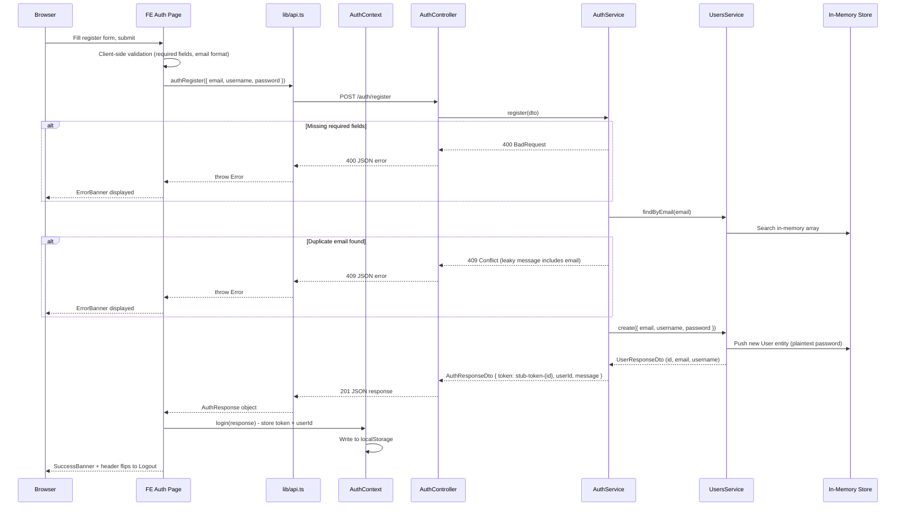
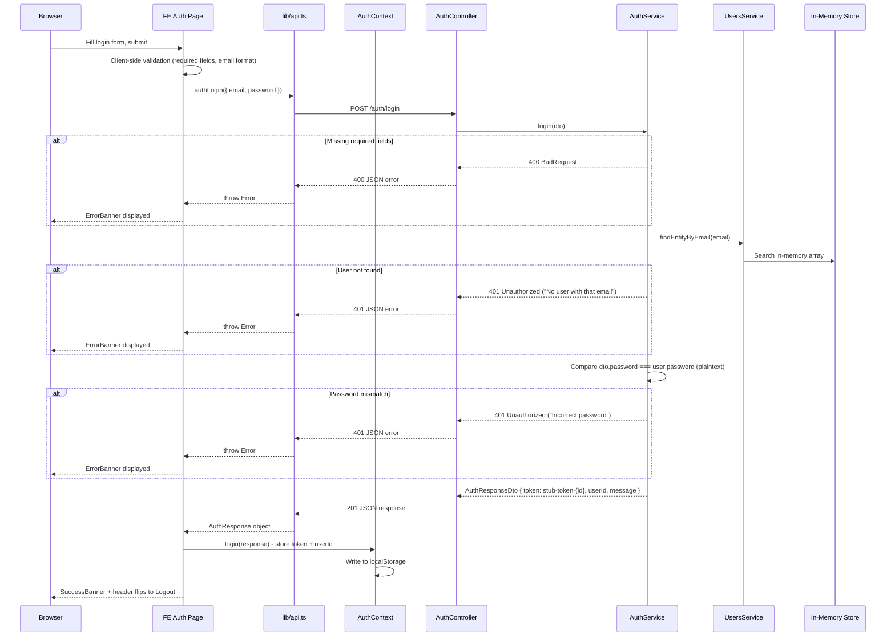
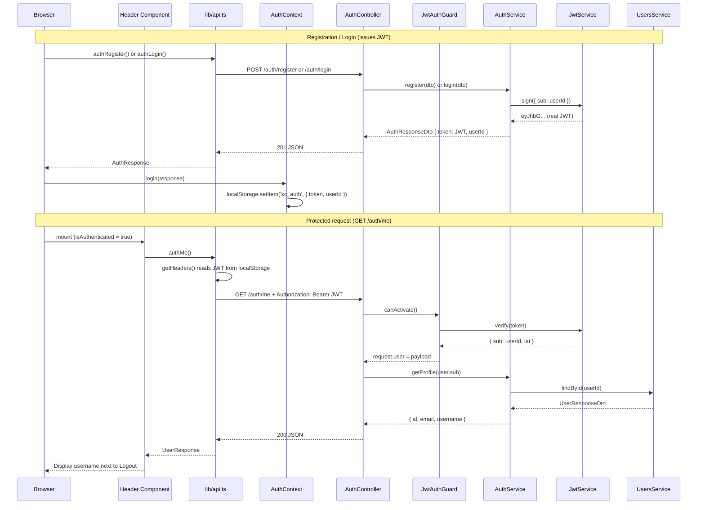
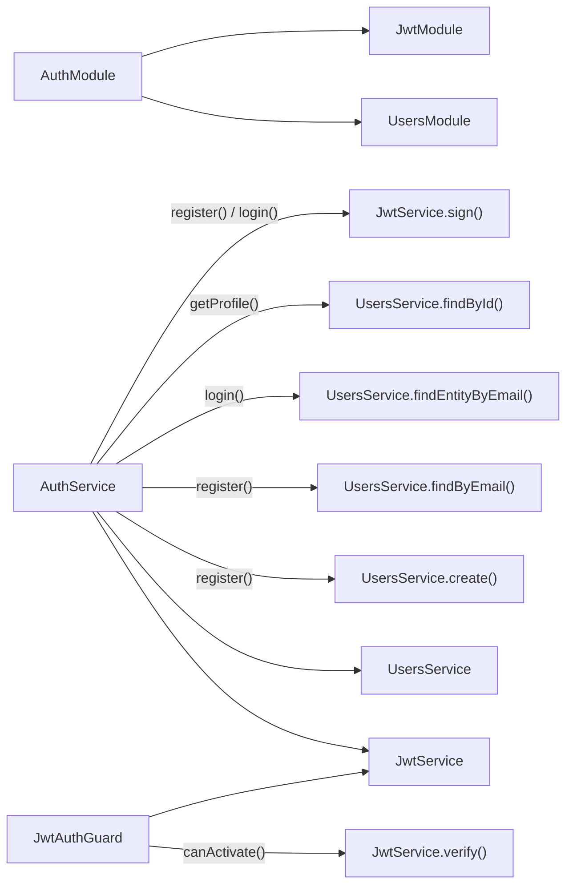
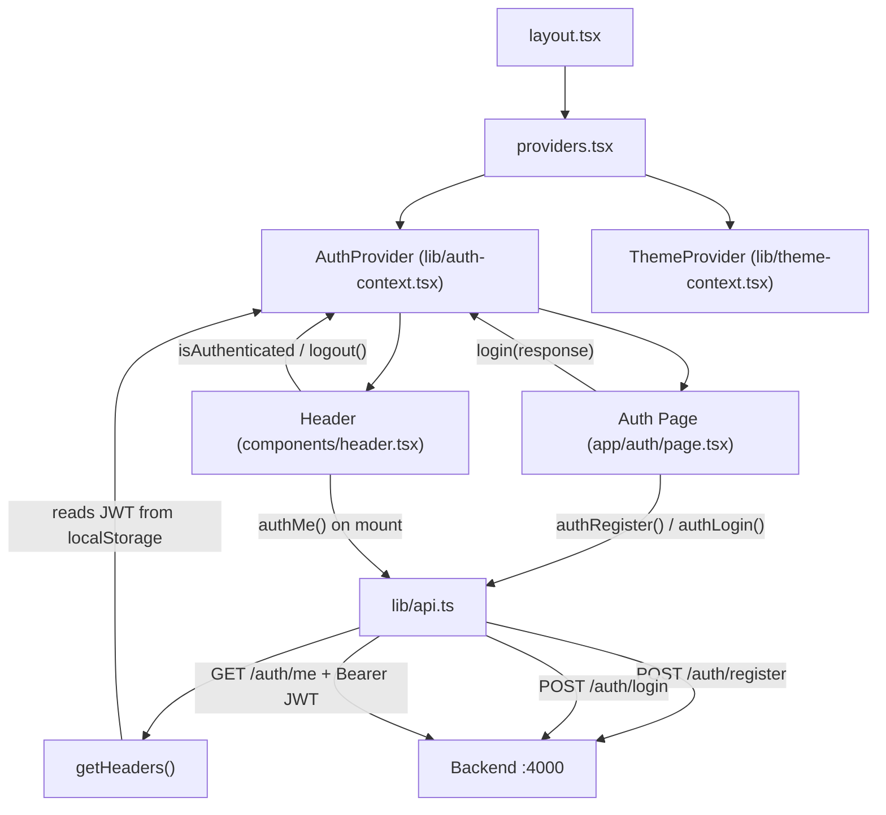

# v0.1.x Authentication Flow

This document describes the authentication flows introduced during the v0.1.x identity surface. Each version adds behaviour incrementally. Intentional security weaknesses are documented as they appear.

---

## Registration Flow (v0.1.1)

User creation with minimal validation and weak duplicate handling.



### Key details

- Password is stored as **plaintext** in the in-memory `User` entity
- Token is a meaningless string (`stub-token-{id}`) with no cryptographic value
- User IDs are sequential strings (`"1"`, `"2"`, ...) - predictable by design
- The 409 error message includes the email address ("User with email X already exists") - intentionally leaky

---

## Login Flow (v0.1.2)

Login logic with plaintext password comparison.



### Key details

- Password comparison is **plaintext equality** (`===`) - no hashing
- Error messages are **distinct**: "No user with that email" vs "Incorrect password" - enables user enumeration
- Uses `findEntityByEmail()` which returns the raw `User` entity (including password), unlike `findByEmail()` which strips it

---

## Session / Token Lifecycle (v0.1.3)

Real JWTs replace stub tokens. Tokens are signed with HS256 using a hardcoded weak secret (`'kc-secret'`), have no expiration claim, and are stored in `localStorage`. The first protected endpoint (`GET /auth/me`) proves the flow works.

### JWT Configuration

- **Algorithm**: HS256 (symmetric — same key signs and verifies)
- **Secret**: `'kc-secret'` (hardcoded in `JwtModule.register()`)
- **Payload**: `{ sub: userId }` — minimal, no role/scope/email
- **Expiration**: none (`exp` claim is absent — tokens live forever)
- **Storage**: `localStorage` under key `kc_auth` (XSS-accessible)

### Token Flow



### Key details

- Stub tokens (`stub-token-{id}`) are fully replaced — register and login now return real JWTs
- `getHeaders()` in `api.ts` reads the token from `localStorage` and attaches it as `Authorization: Bearer` on every request
- `JwtAuthGuard` verifies the signature but does NOT check that the user still exists (CWE-613)
- `@CurrentUser()` decorator extracts the decoded payload from `request.user`
- `AuthService.getProfile()` looks up the user by ID — throws 404 if the user no longer exists

---

## Logout Flow (v0.1.4 - future)

Not yet implemented on the backend. Current client-side behaviour:

- `AuthContext.logout()` clears `token` and `userId` from React state and `localStorage`
- Header toggles from "Logout" back to "Sign In"
- **No server-side invalidation** - the token (once real) remains valid after client-side logout
- Tokens will be reusable after logout (intentional per roadmap)

---

## Module Dependencies

`AuthModule` imports `UsersModule` (user data access) and `JwtModule` (token signing/verification).



---

## Frontend Auth Architecture



### Auth Context State

```
{
  token: string | null       // real JWT (HS256, 'kc-secret') or null
  userId: string | null      // user ID from AuthResponseDto or null
  isAuthenticated: boolean   // derived: !!token (presence check only, no validation)
  login(response): void      // stores token + userId in state + localStorage
  logout(): void             // clears state + localStorage (client-side only)
}
```

Persisted to `localStorage` under key `kc_auth`. Hydrated on mount via `useEffect`.

Note: `isAuthenticated` only checks that a token string exists — it does NOT validate the JWT signature, check expiration, or confirm the user still exists. A fabricated or expired token in `localStorage` will show the authenticated UI until the next API call fails with 401.

---

## Security Surface Summary

Intentional weaknesses introduced at each v0.1.x version:

| Version | Weakness | Type | Detail |
|---------|----------|------|--------|
| v0.1.1 | Plaintext password storage | CWE-256 | Passwords stored as-is in User entity |
| v0.1.1 | Leaky duplicate error | CWE-209 | 409 message includes the email address |
| v0.1.1 | Sequential user IDs | CWE-330 | IDs are predictable ("1", "2", "3"...) |
| v0.1.2 | Plaintext password comparison | CWE-256 | `===` comparison, no hashing |
| v0.1.2 | Distinct auth errors | CWE-204 | "No user with that email" vs "Incorrect password" |
| v0.1.3 | Weak JWT secret | CWE-347 / CWE-798 | Hardcoded `'kc-secret'`, HS256 symmetric — trivially forged |
| v0.1.3 | No token expiration | CWE-613 | JWTs have no `exp` claim — valid forever |
| v0.1.3 | localStorage token storage | CWE-922 | Accessible to XSS, no httpOnly cookie |
| v0.1.3 | No user-existence check in guard | CWE-613 | Deleted user's JWT still passes verification |
| v0.1.3 | Missing authorization on /auth/me | CWE-862 | Any valid token gets full profile — no scope/role check |
| v0.1.3 | Permissive CORS | CWE-942 | `enableCors()` with no options — all origins allowed |
| v0.1.3 | Cleartext transport | CWE-319 | HTTP only — tokens and passwords sent unencrypted |
| v0.1.3 | Source code comments in CSR bundle | CWE-615 | Frontend comments (VULN annotations, API structure) visible in DevTools |
| v0.1.4 | No session invalidation | CWE-613 | Server doesn't track or revoke tokens (planned) |
| v0.1.5 | No rate limiting | CWE-307 | Unlimited login attempts (planned) |
