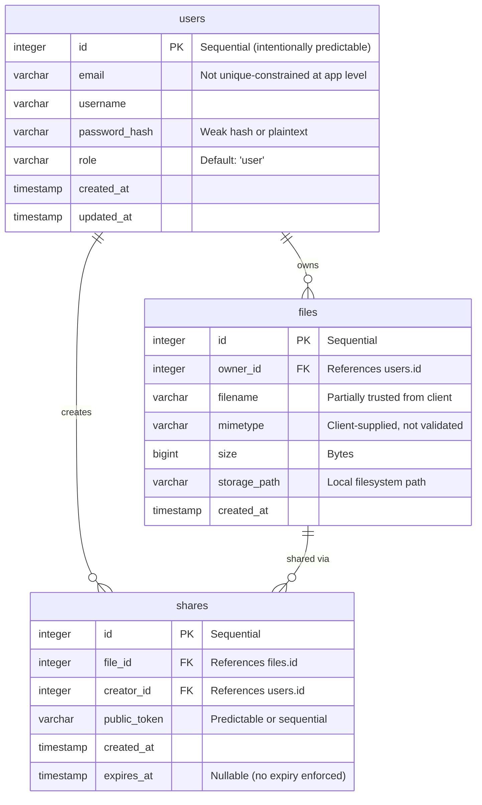
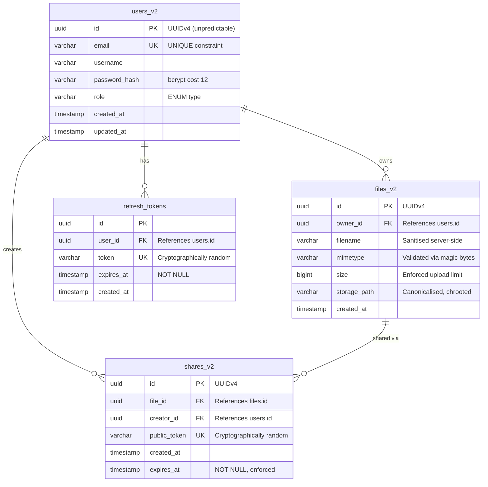

# Data Model

Entity definitions and relationships for KC-Project. Describes the v0.3.5 PostgreSQL schema (current, managed via TypeORM migrations), the v1.0.0 target schema, and the v2.0.0 hardened schema.

---

## Current State (v0.3.5) -- PostgreSQL

PostgreSQL 16 via Docker Compose. TypeORM with migrations (replaced `synchronize: true` in v0.2.5, see [ADR-022](../decisions/ADR-022-typeorm-migrations.md)). File storage on local filesystem via Multer (see [ADR-024](../decisions/ADR-024-file-storage-strategy.md)). See also [ADR-019](../decisions/ADR-019-typeorm-orm.md) and [ADR-020](../decisions/ADR-020-docker-db-only.md).

### Tables

| Table | Entity Class | Notes |
|-------|-------------|-------|
| `user` | `User` | Auth + identity. Plaintext password column (CWE-256). |
| `file_entity` | `FileEntity` | Real file metadata from Multer uploads. `mimetype` + `storagePath` (v0.3.0), `description` (v0.2.5). Files stored on disk. |
| `sharing_entity` | `SharingEntity` | No FK to files. `publicToken` (v0.3.4) for unauthenticated access. `ownerId` (v0.2.2, never enforced). |
| `admin_item` | `AdminItem` | Placeholder admin records. |

All tables use `@PrimaryColumn()` with manually assigned sequential string IDs (`"1"`, `"2"`, ...) — intentionally predictable (CWE-330). No unique constraints, no foreign keys, no indices beyond primary keys. Schema weaknesses are intentional per [ADR-006](../decisions/ADR-006-insecure-by-design.md).

### User Entity (v0.2.0)

```typescript
@Entity()
class User {
  @PrimaryColumn()
  id: string;          // Sequential string ("1", "2", "3"...)
  @Column()
  email: string;       // No unique constraint
  @Column()
  username: string;
  @Column()
  password: string;    // Plaintext in DB (CWE-256)
  @Column()
  createdAt: string;   // ISO 8601
  @Column()
  updatedAt: string;   // ISO 8601
}
```

### FileEntity (v0.3.0)

```typescript
@Entity()
class FileEntity {
  @PrimaryColumn()
  id: string;              // Sequential string
  @Column({ nullable: true })
  ownerId: string;         // User ID from JWT -- stored but never checked (CWE-639)
  @Column()
  filename: string;        // Client-supplied originalname, no sanitisation (CWE-22)
  @Column({ nullable: true })
  mimetype?: string;       // Client-supplied Content-Type, no validation (CWE-434)
  @Column({ nullable: true })
  storagePath?: string;    // Absolute disk path, exposed in API (CWE-200)
  @Column({ nullable: true })
  description?: string;    // Added via migration in v0.2.5
  @Column({ type: 'int', default: 0 })
  size: number;            // Actual file size from Multer, no limit (CWE-400)
  @Column()
  uploadedAt: string;      // ISO 8601
}
```

### SharingEntity (v0.3.4)

```typescript
@Entity()
class SharingEntity {
  @PrimaryColumn()
  id: string;              // Sequential string
  @Column({ nullable: true })
  ownerId: string;         // User ID from JWT -- stored but never checked (CWE-639)
  @Column({ nullable: true })
  fileId: string;          // No FK constraint (CWE-1188)
  @Column({ nullable: true })
  publicToken?: string;    // Sequential "share-N" -- predictable (CWE-330)
  @Column({ default: false })
  public: boolean;
  @Column()
  createdAt: string;
  @Column({ nullable: true })
  expiresAt: string;       // Stored but never checked on access (CWE-613)
}
```

### Previous State (v0.0.x–v0.1.x)

No database. Entities were plain TypeScript classes stored in service-level arrays. Data reset on restart. See [ADR-008](../decisions/ADR-008-in-memory-before-persistence.md).

---

## v1.0.0 -- Database Schema (PostgreSQL)

The target schema at the insecure MVP. Builds on v0.2.0 with additional columns, relationships, and file storage.

### Entity Relationship Diagram



### Entity Details

#### users

| Column | Type | Constraints | Notes |
|--------|------|-------------|-------|
| id | integer | PRIMARY KEY, auto-increment | Sequential -- CWE-330 (predictable) |
| email | varchar(255) | NOT NULL | No unique constraint at app level in v1.0.0 |
| username | varchar(100) | NOT NULL | |
| password_hash | varchar(255) | NOT NULL | Weak hash or plaintext in v1.0.0 -- CWE-256 |
| role | varchar(20) | NOT NULL, DEFAULT 'user' | 'user' or 'admin'. Stored as string, not enum |
| created_at | timestamp | NOT NULL, DEFAULT NOW() | |
| updated_at | timestamp | NOT NULL, DEFAULT NOW() | |

#### files

| Column | Type | Constraints | Notes |
|--------|------|-------------|-------|
| id | integer | PRIMARY KEY, auto-increment | Sequential -- CWE-330 |
| owner_id | integer | NOT NULL, FK -> users.id | No ownership check at app level in v1.0.0 -- CWE-639 |
| filename | varchar(255) | NOT NULL | Client-supplied, not sanitised -- CWE-22 |
| mimetype | varchar(100) | | Client-supplied Content-Type, not validated -- CWE-434 |
| size | bigint | | No upload size limit enforced -- CWE-400 |
| storage_path | varchar(500) | NOT NULL | Local filesystem path. No path validation -- CWE-22 |
| created_at | timestamp | NOT NULL, DEFAULT NOW() | |

#### shares

| Column | Type | Constraints | Notes |
|--------|------|-------------|-------|
| id | integer | PRIMARY KEY, auto-increment | Sequential -- CWE-330 |
| file_id | integer | NOT NULL, FK -> files.id | |
| creator_id | integer | NOT NULL, FK -> users.id | |
| public_token | varchar(100) | NOT NULL | Predictable or sequential -- CWE-330 |
| created_at | timestamp | NOT NULL, DEFAULT NOW() | |
| expires_at | timestamp | NULL | No expiry enforced when NULL -- CWE-613 |

---

## Intentional Weaknesses at the Data Layer

| Weakness | CWE | OWASP | Affected Entity | Detail |
|----------|-----|-------|-----------------|--------|
| Sequential integer IDs | CWE-330 | A01:2025 | All | IDs are predictable: 1, 2, 3... Enables enumeration. |
| No unique constraint on email | CWE-289 | A07:2025 | users | Duplicate check is in application code only. Race condition possible. |
| Weak/plaintext password storage | CWE-256 | A07:2025 | users | `password_hash` may contain plaintext or weak hash. |
| No ownership enforcement at DB level | CWE-639 | A01:2025 | files, shares | FK exists but application doesn't always filter by owner. |
| Client-supplied filename stored directly | CWE-22 | A01:2025 | files | No path sanitisation on `filename` or `storage_path`. |
| Client-supplied MIME type trusted | CWE-434 | A06:2025 | files | `mimetype` comes from request, not validated against file content. |
| No upload size limit | CWE-400 | A06:2025 | files | `size` recorded but not enforced. |
| Predictable sharing tokens | CWE-330 | A01:2025 | shares | `public_token` is sequential or easily guessable. |
| No share expiry enforcement | CWE-613 | A07:2025 | shares | `expires_at` can be NULL, and the app doesn't check it. |
| SQL error messages exposed | CWE-209 | A02:2025 | All | Raw database errors returned to client. |
| ownerId stored but never enforced | CWE-639 | A01:2025 | file_entity, sharing_entity | ownerId column populated on creation but no WHERE clause checks it on read/update/delete. Any authenticated user can access any resource (IDOR). |
| No FK on ownerId | CWE-1188 | A02:2025 | file_entity, sharing_entity | ownerId references user by convention, no DB constraint. Can reference deleted users. |
| Authentication without authorization | CWE-862 | A01:2025 | All | JwtAuthGuard on all controllers but no ownership or role checks. |
| Unbounded list endpoints | CWE-200 | A01:2025 | All | GET endpoints return all records to any authenticated user — no pagination, no ownership filter. Full table dumps. |
| Existence oracle (200/404) | CWE-203 | A01:2025 | All | Sequential IDs + 200/404 status codes allow resource existence probing. |
| Uncontrolled resource consumption | CWE-400 | A06:2025 | All | No pagination, no rate limiting, no query limits on list endpoints. |
| Runtime error info leak (v0.2.4) | CWE-209 | A10:2025 | All | Unhandled exceptions log full stack traces with file paths and DB details to stdout. Crash-test endpoint demonstrates this. |
| No input validation (v0.2.4) | CWE-209 | A10:2025 | All | No ValidationPipe — malformed input passes to services unchecked. |
| SQL logging with sensitive data | CWE-532 | A09:2025 | All | TypeORM `logging: true` prints INSERT with plaintext passwords. |
| Auto-run migrations (v0.2.5) | CWE-1188 | A02:2025 | All | `migrationsRun: true` — any migration file in the repo executes on app start. Partial remediation of synchronize:true. |

---

## v2.0.0 -- Hardened Schema

Same functional shape, every weakness addressed.



### Key changes

| v1.0.0 | v2.0.0 | CWE Remediated |
|--------|--------|----------------|
| Sequential integer IDs | UUIDv4 on all tables | CWE-330 |
| No email unique constraint | `UNIQUE` constraint on `users.email` | CWE-289 |
| Plaintext/weak passwords | bcrypt cost 12 | CWE-256 |
| No ownership filtering | `WHERE owner_id = $1` on every query | CWE-639 |
| Client-supplied filenames | Server-side sanitisation (strip path chars, null bytes) | CWE-22 |
| Client MIME type trusted | Magic byte validation | CWE-434 |
| No size limit | Multer enforced (10 MB) | CWE-400 |
| Predictable share tokens | `crypto.randomBytes(32).toString('hex')` | CWE-330 |
| Nullable expires_at | `NOT NULL`, enforced by app | CWE-613 |
| Raw SQL errors to client | Global exception filter | CWE-209 |
| No refresh token table | `refresh_tokens` table with rotation and revocation | CWE-613 |
