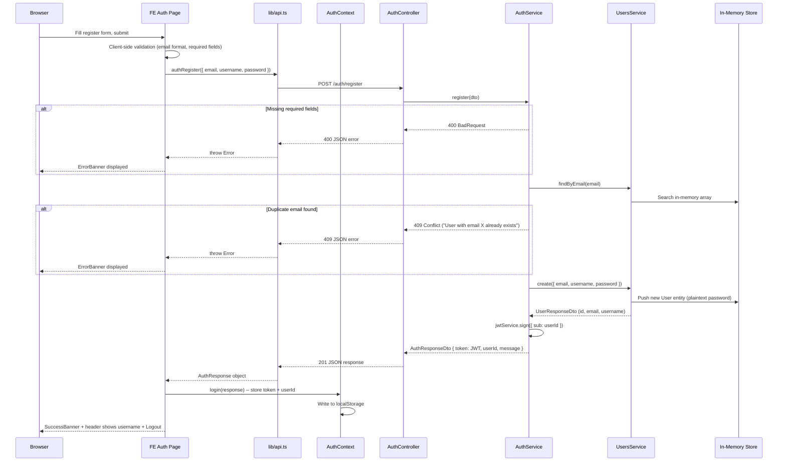
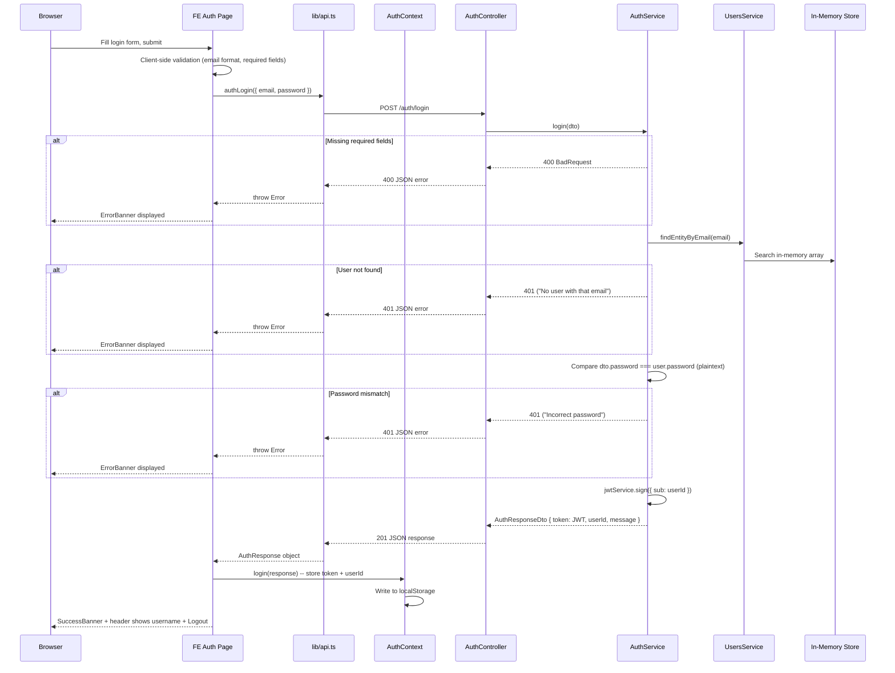
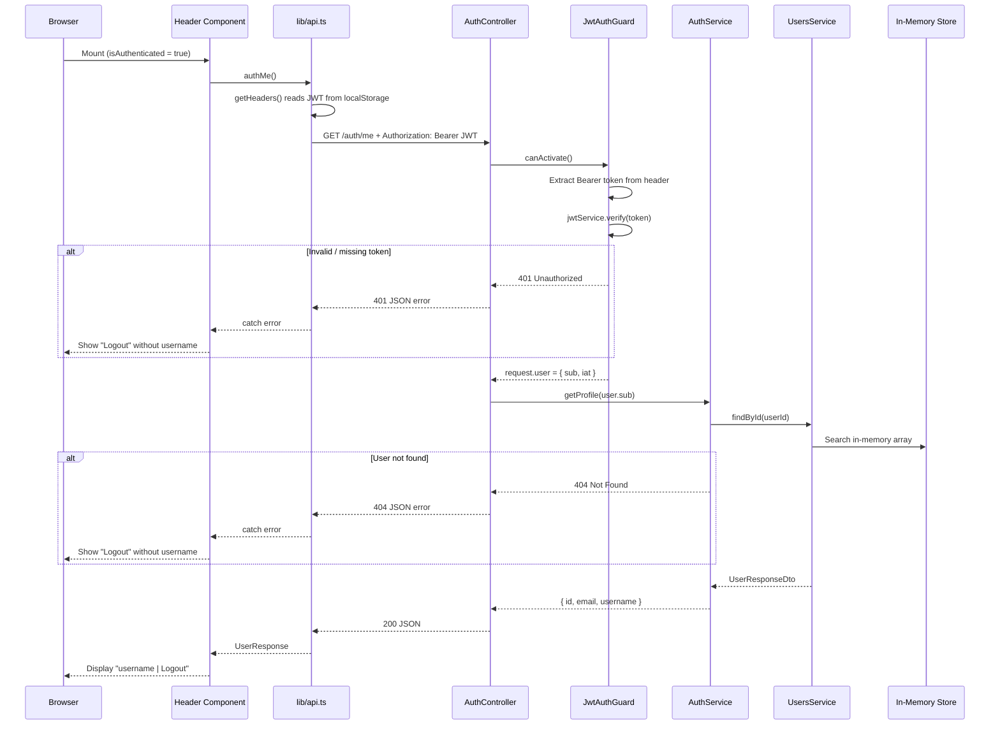

# Authentication Flow

Authentication flows across the project lifecycle. Each section shows how the auth surface evolves, with intentional weaknesses documented and classified.

---

## Current State (v0.1.x) -- JWT Sessions

Registration, login, and the first protected endpoint (`GET /auth/me`) are functional. Real JWTs (HS256, `'kc-secret'`, no expiry) replaced the stub tokens as of v0.1.3. The frontend attaches the JWT as a Bearer header on every request.

### Registration (v0.1.1)

### Login (v0.1.2 + v0.1.3 JWT)

### Protected Request: GET /auth/me (v0.1.3)

### Current weaknesses (v0.1.x)

| Weakness | CWE | OWASP Top 10 | Introduced |
|----------|-----|-------------|------------|
| Plaintext password storage | CWE-256 | A07:2021 Identification and Authentication Failures | v0.1.1 |
| Plaintext password comparison | CWE-256 | A07:2021 Identification and Authentication Failures | v0.1.2 |
| Leaky duplicate error (email in message) | CWE-209 | A07:2021 Identification and Authentication Failures | v0.1.1 |
| Distinct auth errors enable enumeration | CWE-204 | A07:2021 Identification and Authentication Failures | v0.1.2 |
| Sequential predictable user IDs | CWE-330 | A01:2021 Broken Access Control | v0.1.0 |
| Weak JWT secret (hardcoded `'kc-secret'`) | CWE-798 | A02:2021 Cryptographic Failures | v0.1.3 |
| JWT signed with weak HS256 algorithm | CWE-347 | A02:2021 Cryptographic Failures | v0.1.3 |
| No token expiration (no `exp` claim) | CWE-613 | A07:2021 Identification and Authentication Failures | v0.1.3 |
| Guard does not check user still exists | CWE-613 | A07:2021 Identification and Authentication Failures | v0.1.3 |
| Token stored in localStorage (XSS-accessible) | CWE-922 | A07:2021 Identification and Authentication Failures | v0.1.1 |
| Missing authorization on /auth/me | CWE-862 | A01:2021 Broken Access Control | v0.1.3 |
| Permissive CORS (all origins) | CWE-942 | A05:2021 Security Misconfiguration | v0.0.5 |
| Cleartext transport (HTTP, no TLS) | CWE-319 | A02:2021 Cryptographic Failures | v0.0.5 |
| Source code comments in CSR bundle | CWE-615 | A05:2021 Security Misconfiguration | v0.1.3 |

---

## v1.0.0 -- Insecure MVP (Full Session Lifecycle)

JWT introduced with a weak hardcoded secret. No expiration. No server-side revocation. Logout is client-side only. The token works forever and survives logout.

### Complete Auth Lifecycle

```mermaid
sequenceDiagram
  participant Client as Browser
  participant FE as Frontend
  participant BE as NestJS Backend
  participant DB as PostgreSQL

  rect rgb(40, 40, 60)
    Note over Client, DB: Registration
    Client->>FE: Fill register form
    FE->>BE: POST /auth/register { email, username, password }
    Note right of BE: Password transmitted over HTTP (plaintext)
    BE->>DB: INSERT INTO users (email, username, password_hash)
    Note right of DB: Weak hash or plaintext stored
    DB-->>BE: user record
    BE->>BE: jwt.sign({ sub: user.id }, "weak-secret")
    Note right of BE: No expiry claim set
    BE-->>FE: { token: JWT, userId }
    FE->>FE: localStorage.setItem("kc_auth", { token, userId })
    Note right of FE: XSS can read this
  end

  rect rgb(40, 60, 40)
    Note over Client, DB: Authenticated Request
    Client->>FE: Navigate to protected page
    FE->>BE: GET /auth/me (Authorization: Bearer JWT)
    BE->>BE: jwt.verify(token, "weak-secret")
    Note right of BE: No check that user still exists in DB
    Note right of BE: No expiry validation (none set)
    BE-->>FE: { userId, email, username }
    FE-->>Client: Display user profile
  end

  rect rgb(60, 40, 40)
    Note over Client, DB: Logout (client-side only)
    Client->>FE: Click "Logout"
    FE->>BE: POST /auth/logout
    BE-->>FE: 200 OK
    Note right of BE: Token NOT added to deny-list
    Note right of BE: No server-side session destroyed
    FE->>FE: localStorage.removeItem("kc_auth")
    FE-->>Client: Redirect to login
  end

  rect rgb(80, 40, 40)
    Note over Client, DB: Token Replay (post-logout)
    Client->>BE: GET /auth/me (same JWT from before logout)
    BE->>BE: jwt.verify(token, "weak-secret") -- still valid
    BE-->>Client: 200 OK -- user profile returned
    Note over Client, DB: Attacker with stolen JWT has indefinite access
  end
```

### Token Details

| Property | v1.0.0 Value | Weakness |
|----------|-------------|----------|
| Algorithm | HS256 | Symmetric -- anyone with the secret can forge tokens |
| Secret | Hardcoded string (e.g. `"kc-secret"`) | CWE-798 / A02:2021 |
| Expiration | None | CWE-613 / A07:2021 |
| Payload | `{ sub: userId }` | Minimal, but userId is sequential |
| Storage | localStorage | CWE-922 / A07:2021 -- accessible to XSS |
| Revocation | None (no server-side tracking) | CWE-613 / A07:2021 |
| Transport | HTTP (no TLS) | CWE-319 / A02:2021 |

### v1.0.0 Auth Weaknesses

| Weakness | CWE | OWASP Top 10 | Detail |
|----------|-----|-------------|--------|
| Weak/plaintext password storage | CWE-256 | A07:2021 | Passwords stored with weak hash or plaintext in PostgreSQL |
| Weak JWT secret | CWE-347 | A02:2021 Cryptographic Failures | Hardcoded symmetric secret, trivially brute-forced |
| No token expiration | CWE-613 | A07:2021 | JWT has no `exp` claim -- valid forever |
| No session revocation | CWE-613 | A07:2021 | No deny-list, no session table -- logout is cosmetic |
| localStorage token storage | CWE-922 | A07:2021 | Any XSS payload can steal the JWT |
| Distinct error messages | CWE-204 | A07:2021 | "No user with that email" vs "Incorrect password" |
| No rate limiting | CWE-307 | A07:2021 | Unlimited login attempts, brute-force viable |
| Plaintext transport | CWE-319 | A02:2021 | No TLS -- credentials and tokens sent in cleartext |
| Sequential user IDs in JWT | CWE-330 | A01:2021 Broken Access Control | `sub` claim is predictable ("1", "2", "3"...) |

---

## v2.0.0 -- Secure Parallel (Hardened Auth)

Every v1.0.0 auth weakness remediated. The functional surface is identical -- register, login, authenticated requests, logout -- but the implementation is secure.

### Secure Auth Lifecycle

```mermaid
sequenceDiagram
  participant Client as Browser
  participant Nginx as nginx (TLS)
  participant FE as Frontend
  participant BE as NestJS Backend
  participant DB as PostgreSQL

  rect rgb(40, 40, 60)
    Note over Client, DB: Registration
    Client->>Nginx: HTTPS POST /auth/register
    Nginx->>BE: proxy_pass (internal)
    Note right of Nginx: TLS terminates here, rate limiting applied
    BE->>BE: Validate input (length, format, strength)
    BE->>DB: SELECT ... WHERE email = $1 (parameterised)
    alt Duplicate
      BE-->>Nginx: 409 "Registration failed" (generic message)
    end
    BE->>BE: bcrypt.hash(password, 12)
    BE->>DB: INSERT INTO users (email, username, password_hash)
    BE->>BE: jwt.sign({ sub: uuid }, RS256, { expiresIn: "15m" })
    BE->>DB: INSERT INTO refresh_tokens (user_id, token, expires_at)
    BE-->>Nginx: Set-Cookie: refreshToken (httpOnly, secure, sameSite)
    Nginx-->>Client: { accessToken, userId } + httpOnly cookie
  end

  rect rgb(40, 60, 40)
    Note over Client, DB: Authenticated Request
    Client->>Nginx: HTTPS GET /auth/me (Authorization: Bearer accessToken)
    Nginx->>BE: proxy_pass
    BE->>BE: jwt.verify(token, publicKey, { algorithms: ["RS256"] })
    BE->>DB: SELECT ... WHERE id = $1 (verify user still exists)
    BE-->>Nginx: { userId, email, username }
    Nginx-->>Client: 200 OK
  end

  rect rgb(40, 40, 60)
    Note over Client, DB: Token Refresh
    Client->>Nginx: HTTPS POST /auth/refresh (httpOnly cookie sent automatically)
    Nginx->>BE: proxy_pass
    BE->>DB: SELECT ... FROM refresh_tokens WHERE token = $1 AND expires_at > NOW()
    BE->>DB: DELETE FROM refresh_tokens WHERE token = $1 (rotate)
    BE->>BE: jwt.sign({ sub: uuid }, RS256, { expiresIn: "15m" })
    BE->>DB: INSERT INTO refresh_tokens (user_id, new_token, expires_at)
    BE-->>Nginx: Set-Cookie: refreshToken (new, rotated)
    Nginx-->>Client: { accessToken }
  end

  rect rgb(60, 40, 40)
    Note over Client, DB: Logout
    Client->>Nginx: HTTPS POST /auth/logout (httpOnly cookie sent)
    Nginx->>BE: proxy_pass
    BE->>DB: DELETE FROM refresh_tokens WHERE user_id = $1
    BE-->>Nginx: Set-Cookie: refreshToken (cleared, maxAge=0)
    Nginx-->>Client: 200 OK
  end

  rect rgb(60, 60, 40)
    Note over Client, DB: Post-Logout Replay Attempt
    Client->>Nginx: GET /auth/me (old access token)
    Nginx->>BE: proxy_pass
    BE->>BE: jwt.verify -- token expired (15m TTL)
    BE-->>Nginx: 401 Unauthorized
    Client->>Nginx: POST /auth/refresh (old refresh token cookie)
    Nginx->>BE: proxy_pass
    BE->>DB: SELECT ... WHERE token = $1 -- not found (deleted on logout)
    BE-->>Nginx: 401 Unauthorized
    Nginx-->>Client: 401 -- session fully revoked
  end
```

### Remediation Map

| v1.0.0 Weakness | v2.0.0 Control | CWE | OWASP |
|------------------|---------------|-----|-------|
| Plaintext/weak password storage | bcrypt cost 12 | CWE-256 | A07:2021 |
| Weak JWT secret (HS256, hardcoded) | RS256 asymmetric keys, rotated | CWE-347 | A02:2021 |
| No token expiration | 15-minute access token TTL | CWE-613 | A07:2021 |
| No session revocation | Refresh token table, deleted on logout | CWE-613 | A07:2021 |
| localStorage token storage | httpOnly secure sameSite cookie for refresh; short-lived access token in memory | CWE-922 | A07:2021 |
| Distinct error messages | Generic "Authentication failed" for all cases | CWE-204 | A07:2021 |
| No rate limiting | nginx rate limiting + per-IP throttle on /auth/* | CWE-307 | A07:2021 |
| Plaintext transport (HTTP) | TLS termination at nginx, HSTS header | CWE-319 | A02:2021 |
| Sequential user IDs | UUIDs (v4) for all identifiers | CWE-330 | A01:2021 |
| No input validation on auth | Length limits, password strength, email format | CWE-20 | A03:2021 |
