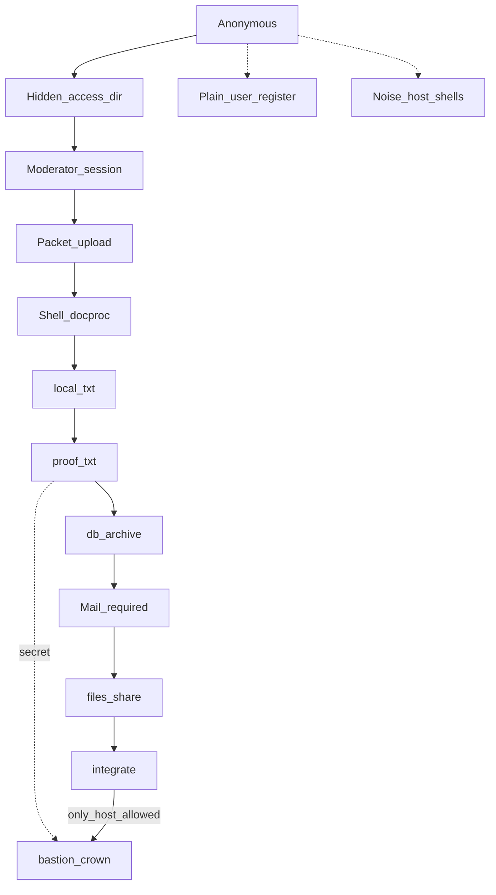

# Cycle-10 — `v1.10.0` attack graph

```mermaid
flowchart TD
  anon[Anonymous]
  hidden[Hidden_access_dir]
  mod[Moderator_session]
  up[Packet_upload]
  shell[Shell_docproc]
  local[local_txt]
  root[proof_txt]
  arch[db_archive]
  mail[Mail_required]
  files[files_share]
  integ[integrate]
  bast[bastion_crown]

  anon --> hidden --> mod --> up --> shell --> local --> root
  root --> arch --> mail
  mail --> files --> integ
  root -.->|secret| bast
  integ -->|only_host_allowed| bast

  noiseU[Plain_user_register]
  noiseH[Noise_host_shells]
  anon -.-> noiseU
  anon -.-> noiseH
```
