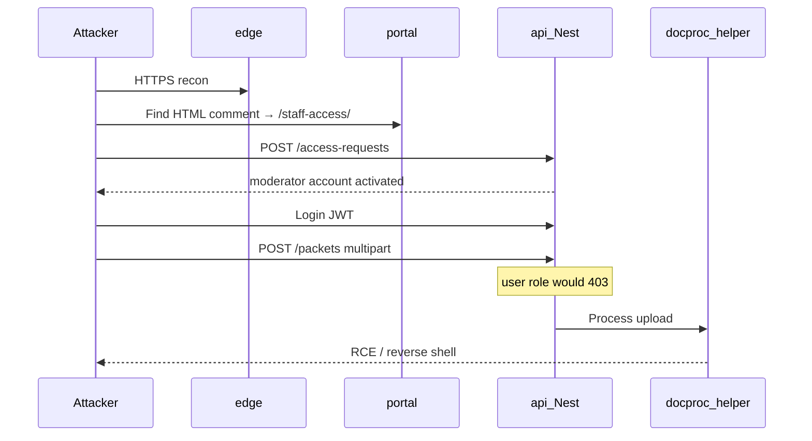

# Cycle-10 — `v1.10.0` auth / access flow

Narrative: [v1.10.0-auth-flow.md](../security/Cycle-10/Dev/v1.10.0-auth-flow.md)

```mermaid
sequenceDiagram
  participant A as Attacker
  participant E as edge
  participant P as portal
  participant API as api_Nest
  participant D as docproc_helper

  A->>E: HTTPS recon
  A->>P: Find HTML comment → /staff-access/
  A->>API: POST /access-requests
  API-->>A: moderator account activated
  A->>API: Login JWT
  A->>API: POST /packets multipart
  Note over API: user role would 403
  API->>D: Process upload
  D-->>A: RCE / reverse shell
```
