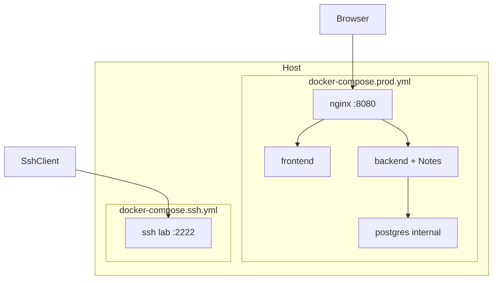
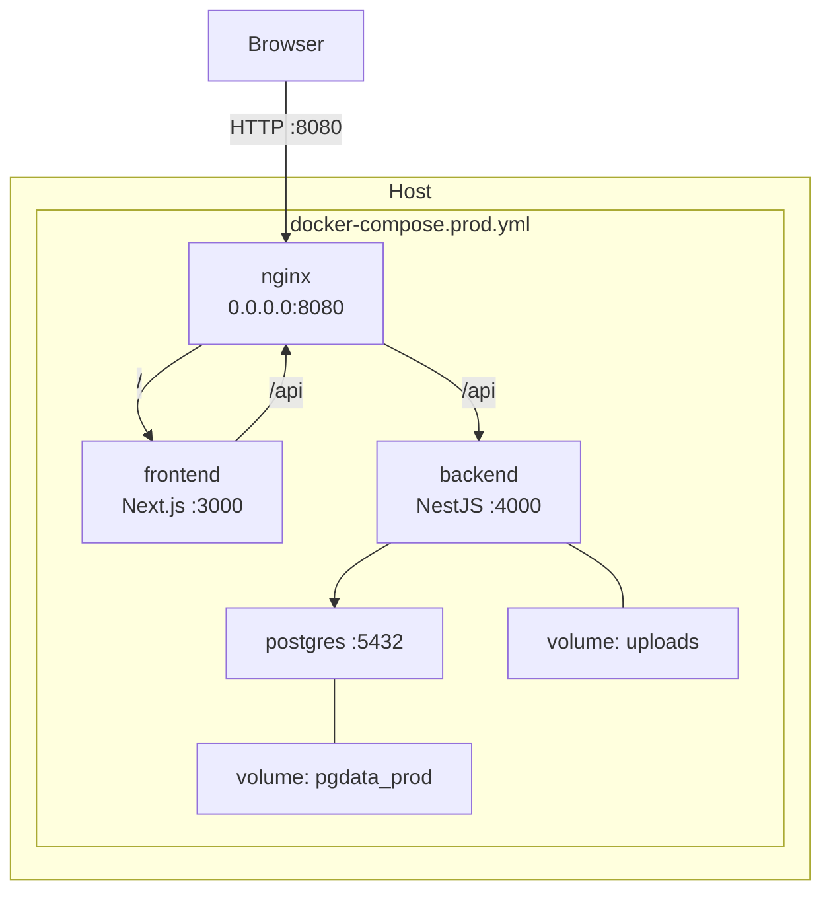
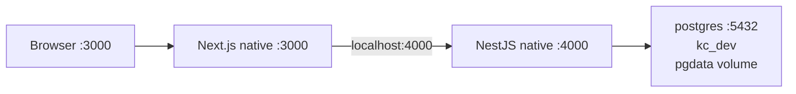
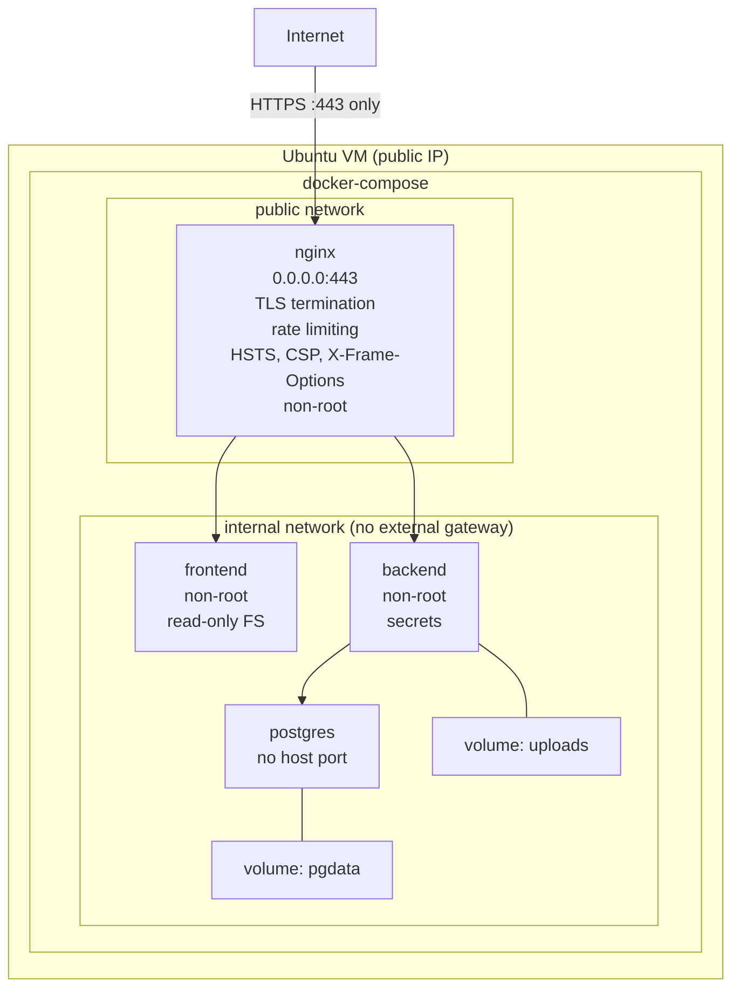

# Infrastructure

Deployment topology: secure tip prod (no SSH), SoftDev/CTF SSH replay overlay, historical Cycle-1 prod, e2e/TLS overlays.

---

## Prod tip + optional SSH (replay)

Default prod compose has **no** `:2222`. SoftDev/CTF full chain: add `docker-compose.ssh.yml` on tag/`ctf/v1.2.0` only.

```bash
# Web only (Postgres unpublished)
docker compose -f infra/docker-compose.prod.yml up -d --build
./infra/assert-pg-unpublished.sh

# Full chain (Notes → SSH foothold)
docker compose -f infra/docker-compose.prod.yml -f infra/docker-compose.ssh.yml up -d --build
./infra/assert-ssh-unpublished.sh   # prod alone must not publish :2222
./infra/cycle4-ssh-examiner.sh
```


```mermaid
flowchart TD
  subgraph host [Host]
    subgraph prod [docker-compose.prod.yml]
      Nginx[nginx :8080]
      FE[frontend]
      BE[backend + Notes]
      PG[postgres internal]
    end
    subgraph sshOv [docker-compose.ssh.yml]
      Ssh[ssh lab :2222]
    end
  end
  Browser --> Nginx
  Nginx --> FE
  Nginx --> BE
  BE --> PG
  SshClient --> Ssh
```

See [infra/README.md](../../infra/README.md) · [notes-ssh-path.md](notes-ssh-path.md).

---

## Historical — v1.0.0 Docker prod (`docker-compose.prod.yml`)

nginx at `:8080` proxies to internal frontend/backend. Cycle-1 tip published PostgreSQL on host `:5433` for e2e. Secure tip keeps PG unpublished on prod compose (`assert-pg-unpublished.sh`).

### Topology (Cycle-1 shape)


```mermaid
flowchart TD
  subgraph host ["Host"]
    subgraph prod ["docker-compose.prod.yml"]
      Nginx["nginx\n0.0.0.0:8080"]
      FE["frontend\nNext.js :3000"]
      BE["backend\nNestJS :4000"]
      PG["postgres :5432"]
      UploadsVol["volume: uploads"]
      PGDataVol["volume: pgdata_prod"]
    end
  end

  Browser["Browser"] -->|"HTTP :8080"| Nginx
  Nginx -->|"/"| FE
  Nginx -->|"/api"| BE
  FE -->|"/api"| Nginx
  BE --> PG
  BE --- UploadsVol
  PG --- PGDataVol
```

### Deploy

```bash
docker compose -f infra/docker-compose.prod.yml up -d --build
./infra/smoke-test.sh
./infra/journey-test.sh
```

Browser: `http://localhost:8080`

### Intentional misconfigurations (Cycle-1 tip)

| Misconfiguration | CWE | Impact |
|------------------|-----|--------|
| Default DB credentials | CWE-798 | Trivial DB access via published port |
| No TLS | CWE-319 | Plaintext tokens/passwords |
| JWT secret hardcoded | CWE-798 | Forge any role |
| Root containers | CWE-250 | Container escape risk |
| Permissive CORS | CWE-942 | Any origin can call API |

---

## Dev — PostgreSQL only (`compose.yml`)

Native development path. DB in Docker; backend/frontend via `npm run start:dev`.


```mermaid
flowchart LR
  DevBrowser["Browser :3000"]
  DevFE["Next.js native :3000"]
  DevBE["NestJS native :4000"]
  DevPG["postgres :5432\nkc_dev\npgdata volume"]

  DevBrowser --> DevFE
  DevFE -->|"localhost:4000"| DevBE
  DevBE --> DevPG
```

```bash
docker compose -f infra/compose.yml up -d   # kc_dev on :5432
# backend: npm run start:dev
# frontend: npm run start:dev
```

**Do not** use `pgdata` for prod — prod uses `pgdata_prod` in `docker-compose.prod.yml`.

---

## v2.0.0 — Hardened with nginx

nginx reverse proxy terminates TLS and is the only externally-facing service. Backend and database on internal network with no host port mappings.


```mermaid
flowchart TD
  subgraph vm ["Ubuntu VM (public IP)"]
    subgraph compose ["docker-compose"]
      subgraph public_net ["public network"]
        Nginx["nginx\n0.0.0.0:443\nTLS termination\nrate limiting\nHSTS, CSP, X-Frame-Options\nnon-root"]
      end
      subgraph internal_net ["internal network (no external gateway)"]
        FE["frontend\nnon-root\nread-only FS"]
        BE["backend\nnon-root\nsecrets"]
        PG["postgres\nno host port"]
        UploadsVol["volume: uploads"]
        PGDataVol["volume: pgdata"]
      end
    end
  end

  Internet["Internet"] -->|"HTTPS :443 only"| Nginx
  Nginx --> FE
  Nginx --> BE
  BE --> PG
  BE --- UploadsVol
  PG --- PGDataVol
```

---

## Delta Table (v1.0.0 prod → v2.0.0)

| Area | v1.0.0 prod | v2.0.0 hardened | CWE / OWASP |
|------|-------------|-----------------|-------------|
| External access | `:8080` nginx HTTP | `:443` nginx HTTPS only | CWE-668 / A02:2025 |
| DB access | `:5433` default creds | Internal only, Docker secrets | CWE-798, CWE-668 |
| JWT | Hardcoded `kc-secret` HS256 | RS256, env/secrets | CWE-347 / A04:2025 |
| Container user | root | Non-root (UID 1001) | CWE-250 / A02:2025 |
| CORS | Permissive | Strict origin whitelist | CWE-942 / A02:2025 |
| Logging | Sensitive data in logs | Redacted structured logs | CWE-532 / A09:2025 |
