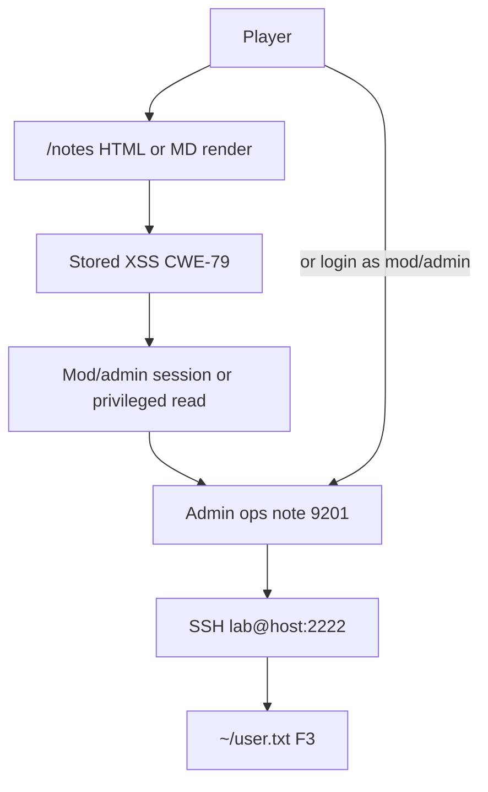

# Notes → SSH path (Cycle-4 SoftDev)

Intended SoftDev attack path on tip **`v1.2.0`** ([ADR-033](../decisions/ADR-033-cycle-4-softdev-version-pair.md)). Examiner detail: [v1.2.0-ground-truth.md](../security/Cycle-4/Dev/v1.2.0-ground-truth.md). Player brief (no spoilers): [v1.2.0-player-brief.md](../security/Cycle-4/Dev/v1.2.0-player-brief.md).

| Checkpoint | How |
|------------|-----|
| F1 | XSS / HTML render (seed note `9203` or attacker note) |
| F2 | Privileged ops note `9201` |
| F3 | SSH foothold — overlay only (`docker-compose.ssh.yml`) |

**Non-goals on this tip:** PrivEsc / `root.txt` (→ Cycle-5).
