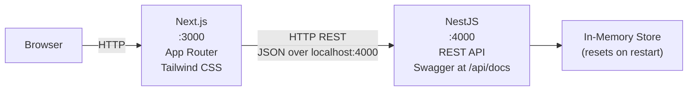
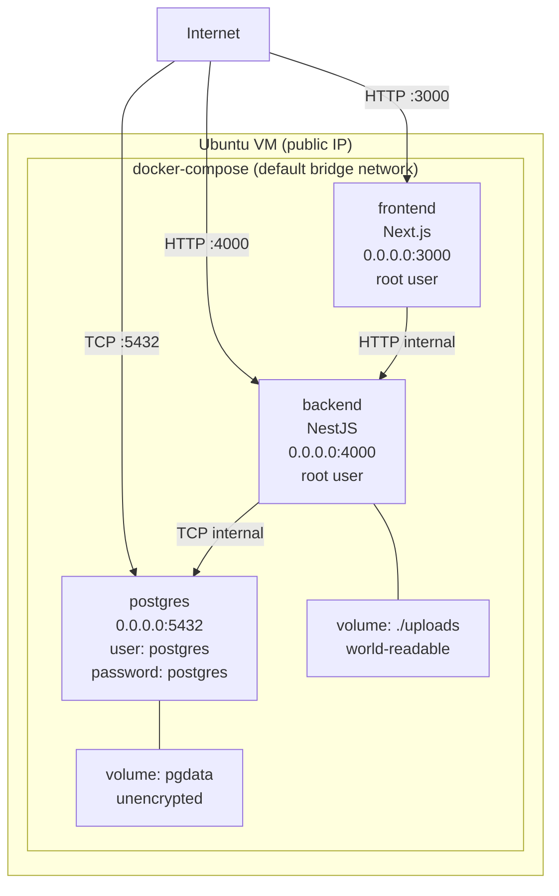
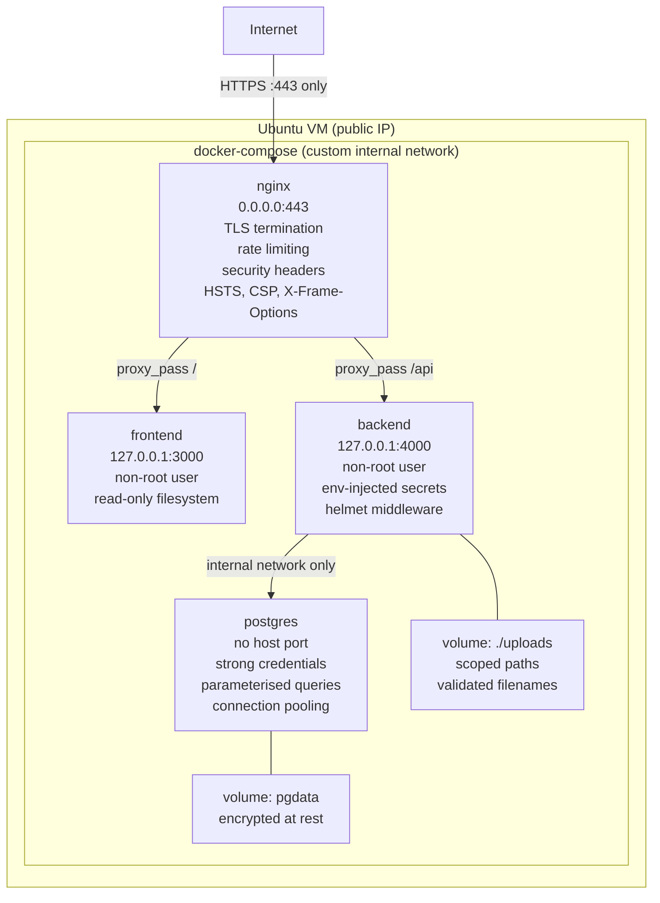

# System Architecture

System topology at three lifecycle stages. Each diagram shows how the components connect, what is exposed, and where the trust boundaries lie.

---

## Current State (v0.1.x)

Two bare processes running on the developer's machine. No database, no containers, no reverse proxy. All data lives in-memory and resets on restart.

### What exists

- **Frontend** -- Next.js 16, App Router, React 19, Tailwind CSS 4. Client components call backend via fetch. Auth state persisted to localStorage.
- **Backend** -- NestJS 11 on Express. Five domain modules (Auth, Users, Files, Sharing, Admin). CORS allows all origins. Swagger auto-generated.
- **Communication** -- Plain HTTP, JSON bodies, no auth headers sent yet (stub tokens only).
- **Storage** -- In-memory arrays in each service. No persistence.

### What does not exist yet

- Database / persistence
- Real tokens (JWT or sessions)
- File storage
- Containers or deployment config
- Reverse proxy, TLS, network segmentation

---

## v1.0.0 -- Insecure MVP

Full stack, containerised, deployed on an Ubuntu VM. All five domains functional with real persistence. Intentionally misconfigured: every service port exposed directly, no reverse proxy, no TLS, default credentials.

### Components

| Component | Technology | Port | Notes |
|-----------|-----------|------|-------|
| Frontend | Next.js 16 (containerised) | 3000 | Serves UI, calls backend API |
| Backend | NestJS 11 (containerised) | 4000 | REST API, JWT auth (weak), file handling |
| Database | PostgreSQL (containerised) | 5432 | User table, file metadata, sharing records |
| File storage | Docker volume (./uploads) | -- | Local filesystem, no validation |

### Intentional weaknesses at this layer

| Weakness | CWE | OWASP Top 10 |
|----------|-----|-------------|
| All ports exposed to internet | CWE-668 | A05:2021 Security Misconfiguration |
| No TLS (plaintext HTTP) | CWE-319 | A02:2021 Cryptographic Failures |
| Default database credentials | CWE-798 | A07:2021 Identification and Authentication Failures |
| Containers run as root | CWE-250 | A05:2021 Security Misconfiguration |
| No network segmentation | CWE-668 | A05:2021 Security Misconfiguration |
| Volumes world-readable | CWE-732 | A01:2021 Broken Access Control |
| No resource limits on containers | CWE-770 | A05:2021 Security Misconfiguration |
| No health checks | -- | Operational fragility |
| Sensitive data in logs | CWE-532 | A09:2021 Security Logging and Monitoring Failures |

---

## v2.0.0 -- Secure Parallel

Hardened counterpart to v1.0.0. Same functional surface, every weakness remediated. nginx reverse proxy terminates TLS and gates all external traffic. Internal services are not reachable from outside.

### What changed (v1.0.0 to v2.0.0)

| v1.0.0 (insecure) | v2.0.0 (hardened) | Remediation |
|--------------------|-------------------|-------------|
| All ports exposed (3000, 4000, 5432) | Only port 443 exposed via nginx | CWE-668 / A05:2021 |
| HTTP plaintext | HTTPS with TLS termination at nginx | CWE-319 / A02:2021 |
| No reverse proxy | nginx with rate limiting + security headers | CWE-16 / A05:2021 |
| Default DB credentials (postgres/postgres) | Strong credentials via Docker secrets | CWE-798 / A07:2021 |
| Root containers | Non-root users, read-only filesystems | CWE-250 / A05:2021 |
| Default bridge network | Custom internal network, no host ports for DB | CWE-668 / A05:2021 |
| World-readable volumes | Scoped paths, validated filenames | CWE-732 / A01:2021 |
| No resource limits | CPU/memory limits per container | CWE-770 / A05:2021 |
| Verbose logs with sensitive data | Structured logging, sensitive fields redacted | CWE-532 / A09:2021 |
| No health checks | Liveness and readiness probes | Operational resilience |

---

## Cross-Version Component Map

Summary of which components exist at each stage:

| Component | v0.1.x | v1.0.0 | v2.0.0 |
|-----------|--------|--------|--------|
| Next.js frontend | Bare process | Docker container (root) | Docker container (non-root, read-only) |
| NestJS backend | Bare process | Docker container (root) | Docker container (non-root, helmet) |
| PostgreSQL | -- | Docker container (exposed) | Docker container (internal only) |
| nginx reverse proxy | -- | -- | Docker container (TLS, rate limiting) |
| File storage | -- | Docker volume (world-readable) | Docker volume (scoped, validated) |
| docker-compose | -- | Default bridge network | Custom internal network |
| Ubuntu VM | -- | Host for containers | Host for containers |
| TLS certificates | -- | -- | Let's Encrypt or self-signed |
