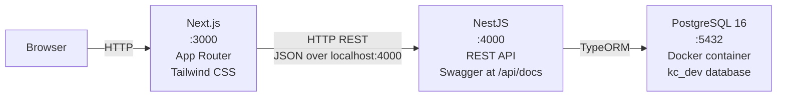
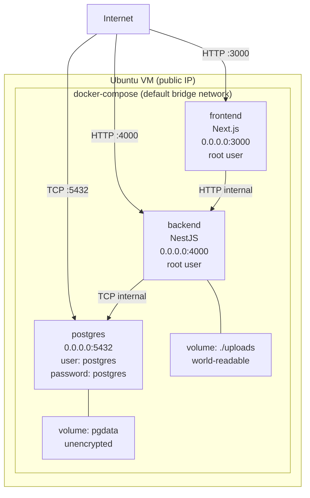
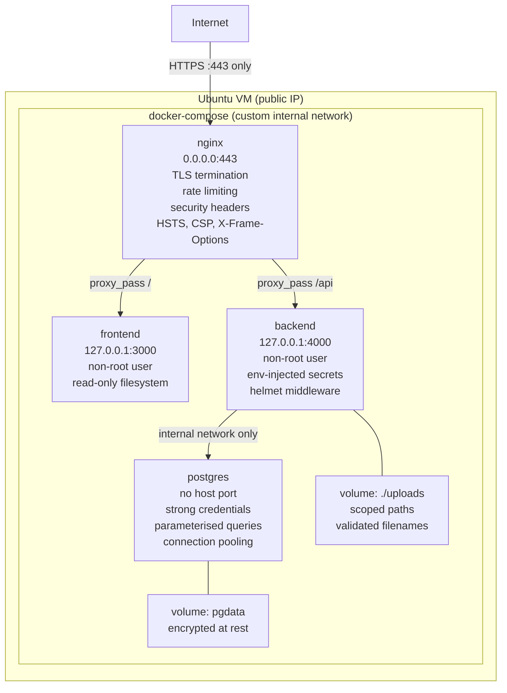

# System Architecture

System topology at three lifecycle stages. Each diagram shows how the components connect, what is exposed, and where the trust boundaries lie.

---

## Current State (v0.2.x)

Three processes: frontend and backend run natively on the developer's machine, PostgreSQL runs in a Docker container. Data persists across restarts.

### What exists

- **Frontend** -- Next.js 16, App Router, React 19, Tailwind CSS 4. Client components call backend via fetch. Auth state persisted to localStorage. Bearer token sent on all API calls.
- **Backend** -- NestJS 11 on Express. Five domain modules (Auth, Users, Files, Sharing, Admin). CORS allows all origins. Swagger auto-generated and **publicly accessible without auth** (CWE-200). `X-Powered-By: Express` header not disabled (CWE-200). Real HS256 JWTs (hardcoded secret, no expiry). **All resource endpoints protected by JwtAuthGuard** — authentication enforced but no authorization/ownership checks. ownerId tracked but never enforced (CWE-639, CWE-862). All list endpoints unbounded — full table dumps, no pagination (CWE-200, CWE-400). Sequential IDs enable 200/404 existence probing (CWE-203).
- **Database** -- PostgreSQL 16 in Docker (`infra/compose.yml`). TypeORM with `synchronize: true`. 4 tables: user, file_entity (with ownerId), sharing_entity (with ownerId), admin_item. Hardcoded credentials (CWE-798).
- **Communication** -- Plain HTTP, JSON bodies, Bearer token in Authorization header.
- **Storage** -- TypeORM repositories backed by PostgreSQL. Data persists across restarts.

### What does not exist yet

- Authorization / ownership checks (ownerId exists but is never enforced)
- Pagination / query limits (all list endpoints are unbounded)
- Swagger auth protection (spec is publicly accessible)
- Response header hardening (X-Powered-By not disabled)
- File storage (real file I/O)
- App containers (frontend/backend still run natively)
- Reverse proxy, TLS, network segmentation
- Input validation, rate limiting

---

## v1.0.0 -- Insecure MVP

Full stack, containerised, deployed on an Ubuntu VM. All five domains functional with real persistence. Intentionally misconfigured: every service port exposed directly, no reverse proxy, no TLS, default credentials.

### Components

| Component | Technology | Port | Notes |
|-----------|-----------|------|-------|
| Frontend | Next.js 16 (containerised) | 3000 | Serves UI, calls backend API |
| Backend | NestJS 11 (containerised) | 4000 | REST API, JWT auth (weak), file handling |
| Database | PostgreSQL (containerised) | 5432 | User table, file metadata, sharing records |
| File storage | Docker volume (./uploads) | -- | Local filesystem, no validation |

### Intentional weaknesses at this layer

| Weakness | CWE | OWASP Top 10 |
|----------|-----|-------------|
| All ports exposed to internet | CWE-668 | A02:2025 Security Misconfiguration |
| No TLS (plaintext HTTP) | CWE-319 | A04:2025 Cryptographic Failures |
| Default database credentials | CWE-798 | A07:2025 Identification and Authentication Failures |
| Containers run as root | CWE-250 | A02:2025 Security Misconfiguration |
| No network segmentation | CWE-668 | A02:2025 Security Misconfiguration |
| Volumes world-readable | CWE-732 | A01:2025 Broken Access Control |
| No resource limits on containers | CWE-770 | A02:2025 Security Misconfiguration |
| No health checks | -- | Operational fragility |
| Sensitive data in logs | CWE-532 | A09:2025 Security Logging and Monitoring Failures |

---

## v2.0.0 -- Secure Parallel

Hardened counterpart to v1.0.0. Same functional surface, every weakness remediated. nginx reverse proxy terminates TLS and gates all external traffic. Internal services are not reachable from outside.

### What changed (v1.0.0 to v2.0.0)

| v1.0.0 (insecure) | v2.0.0 (hardened) | Remediation |
|--------------------|-------------------|-------------|
| All ports exposed (3000, 4000, 5432) | Only port 443 exposed via nginx | CWE-668 / A02:2025 |
| HTTP plaintext | HTTPS with TLS termination at nginx | CWE-319 / A04:2025 |
| No reverse proxy | nginx with rate limiting + security headers | CWE-16 / A02:2025 |
| Default DB credentials (postgres/postgres) | Strong credentials via Docker secrets | CWE-798 / A07:2025 |
| Root containers | Non-root users, read-only filesystems | CWE-250 / A02:2025 |
| Default bridge network | Custom internal network, no host ports for DB | CWE-668 / A02:2025 |
| World-readable volumes | Scoped paths, validated filenames | CWE-732 / A01:2025 |
| No resource limits | CPU/memory limits per container | CWE-770 / A02:2025 |
| Verbose logs with sensitive data | Structured logging, sensitive fields redacted | CWE-532 / A09:2025 |
| No health checks | Liveness and readiness probes | Operational resilience |

---

## Cross-Version Component Map

Summary of which components exist at each stage:

| Component | v0.1.x | v1.0.0 | v2.0.0 |
|-----------|--------|--------|--------|
| Next.js frontend | Bare process | Docker container (root) | Docker container (non-root, read-only) |
| NestJS backend | Bare process | Docker container (root) | Docker container (non-root, helmet) |
| PostgreSQL | Docker container (v0.2.0+) | Docker container (exposed) | Docker container (internal only) |
| nginx reverse proxy | -- | -- | Docker container (TLS, rate limiting) |
| File storage | -- | Docker volume (world-readable) | Docker volume (scoped, validated) |
| docker-compose | DB only (v0.2.0+) | Full stack | Custom internal network |
| Ubuntu VM | -- | Host for containers | Host for containers |
| TLS certificates | -- | -- | Let's Encrypt or self-signed |
