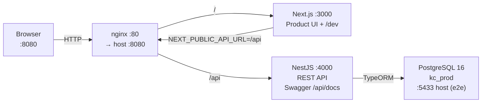
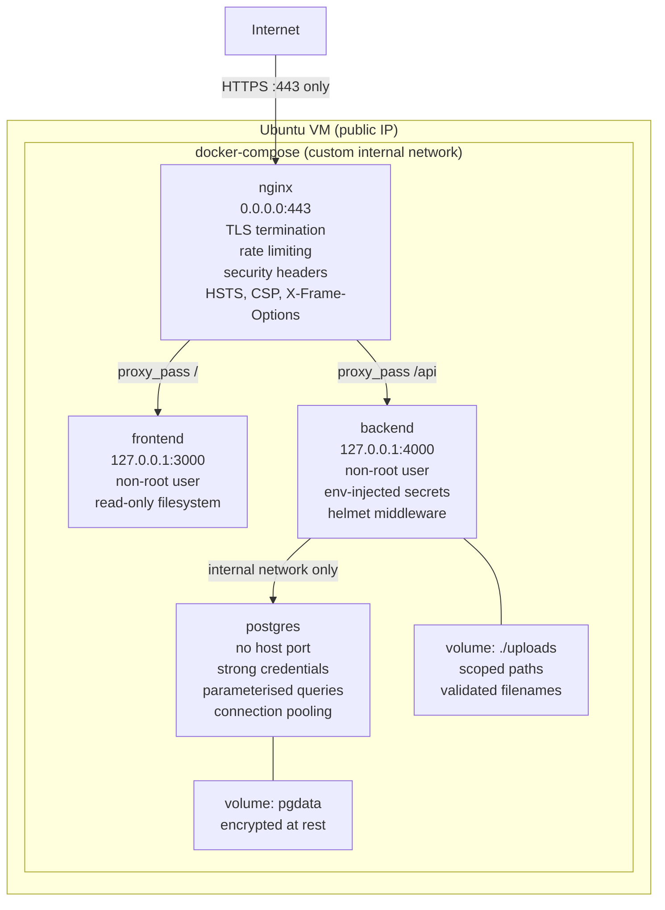

# System Architecture

System topology at three lifecycle stages. Each diagram shows how the components connect, what is exposed, and where the trust boundaries lie.

---

## Current State (v1.0.0) — Docker prod (primary)

Full stack in `infra/docker-compose.prod.yml`. nginx at `:8080` is the sole browser entry. Backend and frontend are internal; PostgreSQL exposed on `:5433` for e2e only.

```mermaid
flowchart LR
  Browser["Browser\n:8080"]
  Nginx["nginx :80\n→ host :8080"]
  Frontend["Next.js :3000\nProduct UI + /dev"]
  Backend["NestJS :4000\nREST API\nSwagger /api/docs"]
  PG["PostgreSQL 16\nkc_prod\n:5433 host (e2e)"]

  Browser -->|"HTTP"| Nginx
  Nginx -->|"/"| Frontend
  Nginx -->|"/api"| Backend
  Frontend -->|"NEXT_PUBLIC_API_URL=/api"| Nginx
  Backend -->|"TypeORM"| PG
```

### What exists

- **nginx** — Reverse proxy. Routes `/` → frontend, `/api` → backend. 1 MB body limit (accidental upload ceiling).
- **Frontend** — Next.js 16. Product UI (`/files`, `/moderator`, `/admin`) + dev explorers (`/dev/*`). Client-side file/share filtering; API IDOR preserved.
- **Backend** — NestJS 11. 28 live endpoints + health/ping/crash-test. Ternary RBAC. Persistent audit logs. Demo seeds (ADR-029, ADR-030).
- **Database** — PostgreSQL 16, `pgdata_prod` volume, `kc_prod` database.
- **Verification** — `smoke-test.sh`, `journey-test.sh`, `e2e-docker.sh` (150 tests).

### Dev path (secondary)

Native backend/frontend + `infra/compose.yml` (PostgreSQL `kc_dev` on `:5432` only).

---

## v1.0.0 — Insecure MVP (detail)

Same functional surface as above. Intentionally weak: no TLS, default DB creds, JWT role trusted, guard inconsistencies.

| Component | Technology | Exposure | Notes |
|-----------|-----------|----------|-------|
| nginx | nginx:alpine | `:8080` | Single browser entry |
| Frontend | Next.js 16 | internal :3000 | Product UI + `/dev` explorers |
| Backend | NestJS 11 | internal :4000 | 59/38 CWEs documented |
| Database | PostgreSQL 16 | `:5433` (e2e) | `postgres`/`postgres` default |
| File storage | Docker volume `uploads` | internal | No path/MIME validation |

---

## v2.0.0 — Secure Parallel

Hardened counterpart to v1.0.0. nginx terminates TLS on `:443`. Internal services not reachable from outside.

```mermaid
flowchart TD
  subgraph vm ["Ubuntu VM (public IP)"]
    subgraph compose ["docker-compose (custom internal network)"]
      Nginx["nginx\n0.0.0.0:443\nTLS termination\nrate limiting\nsecurity headers\nHSTS, CSP, X-Frame-Options"]
      FE["frontend\n127.0.0.1:3000\nnon-root user\nread-only filesystem"]
      BE["backend\n127.0.0.1:4000\nnon-root user\nenv-injected secrets\nhelmet middleware"]
      PG["postgres\nno host port\nstrong credentials\nparameterised queries\nconnection pooling"]
      UploadsVol["volume: ./uploads\nscoped paths\nvalidated filenames"]
      PGDataVol["volume: pgdata\nencrypted at rest"]
    end
  end

  Internet["Internet"] -->|"HTTPS :443 only"| Nginx
  Nginx -->|"proxy_pass /"| FE
  Nginx -->|"proxy_pass /api"| BE
  BE -->|"internal network only"| PG
  BE --- UploadsVol
  PG --- PGDataVol
```

---

## Cross-Version Component Map

| Component | Dev (native) | v1.0.0 prod | v2.0.0 |
|-----------|--------------|-------------|--------|
| Next.js frontend | Bare :3000 | Docker (internal) | Docker (non-root, read-only) |
| NestJS backend | Bare :4000 | Docker (internal) | Docker (non-root, helmet) |
| PostgreSQL | compose.yml :5432 | prod :5433 (e2e) | Internal only |
| nginx | — | :8080 entry | :443 TLS |
| docker-compose | DB only | `docker-compose.prod.yml` | Custom internal network |
