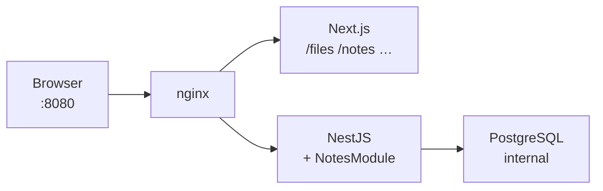
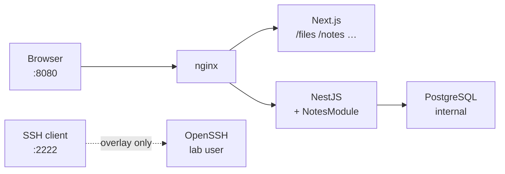
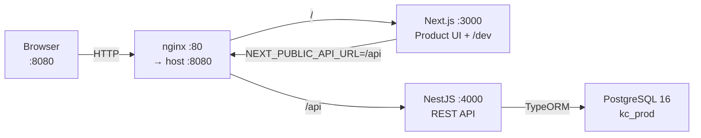
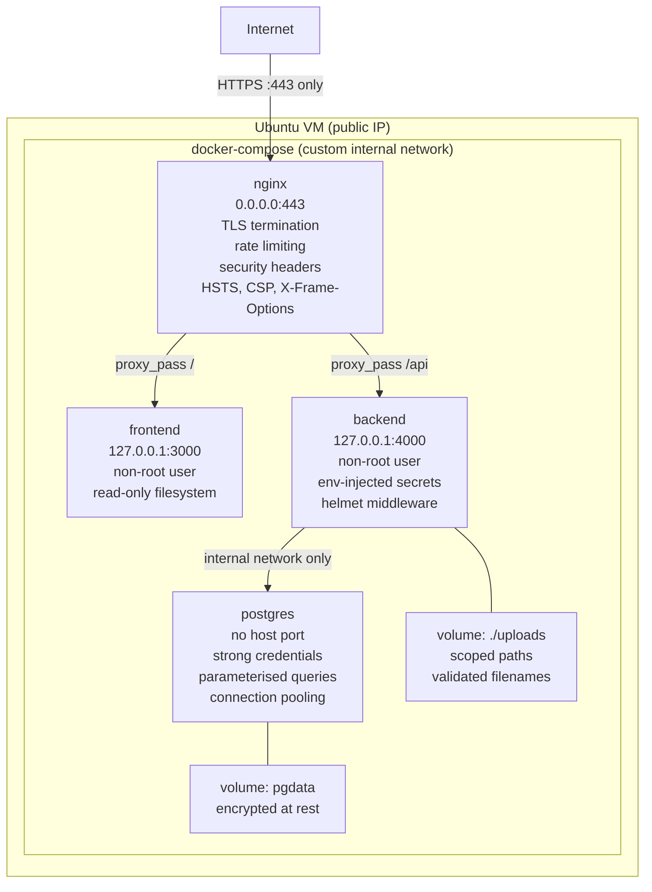

# System Architecture

System topology across lifecycle stages. Product tip **`v2.2.0`** keeps Notes without default SSH; SoftDev replay adds SSH overlay ([ADR-033](../decisions/ADR-033-cycle-4-softdev-version-pair.md)).

---

## Product tip (`v2.2.0`) — Notes, no default SSH

Web stack: `infra/docker-compose.prod.yml` (Postgres **not** published). SSH overlay is **not** part of day-to-day secure demos.

```mermaid
flowchart LR
  Browser["Browser\n:8080"]
  Nginx["nginx"]
  Frontend["Next.js\n/files /notes …"]
  Backend["NestJS\n+ NotesModule"]
  PG["PostgreSQL\ninternal"]

  Browser --> Nginx
  Nginx --> Frontend
  Nginx --> Backend
  Backend --> PG
```

Hardened demos: pin **`v2.2.0`**. Replay Notes→SSH: [notes-ssh-path.md](notes-ssh-path.md) on tag/`ctf/v1.2.0` + `docker-compose.ssh.yml`.

---

## SoftDev replay (`v1.2.0`) — Notes + optional SSH

Web stack: `infra/docker-compose.prod.yml` (Postgres **not** published). Full chain: add `infra/docker-compose.ssh.yml`.

```mermaid
flowchart LR
  Browser["Browser\n:8080"]
  SshClient["SSH client\n:2222"]
  Nginx["nginx"]
  Frontend["Next.js\n/files /notes …"]
  Backend["NestJS\n+ NotesModule"]
  PG["PostgreSQL\ninternal"]
  Ssh["OpenSSH\nlab user"]

  Browser --> Nginx
  Nginx --> Frontend
  Nginx --> Backend
  Backend --> PG
  SshClient -.->|"overlay only"| Ssh
```

Path diagram: [notes-ssh-path.md](notes-ssh-path.md).

---

## Historical — v1.0.0 Docker prod

Full stack in `infra/docker-compose.prod.yml`. nginx at `:8080`. On Cycle-1 tip, PostgreSQL was published for e2e (`:5433`); secure tip keeps PG unpublished on prod compose.

```mermaid
flowchart LR
  Browser["Browser\n:8080"]
  Nginx["nginx :80\n→ host :8080"]
  Frontend["Next.js :3000\nProduct UI + /dev"]
  Backend["NestJS :4000\nREST API"]
  PG["PostgreSQL 16\nkc_prod"]

  Browser -->|"HTTP"| Nginx
  Nginx -->|"/"| Frontend
  Nginx -->|"/api"| Backend
  Frontend -->|"NEXT_PUBLIC_API_URL=/api"| Nginx
  Backend -->|"TypeORM"| PG
```

### What exists (then / now)

- **nginx** — Reverse proxy `/` → frontend, `/api` → backend.
- **Frontend** — Product UI including SoftDev `/notes`; gated `/dev/*`.
- **Backend** — Domain modules including **Notes**.
- **Database** — PostgreSQL 16, `pgdata_prod` / `kc_prod`.
- **SSH (lab replay)** — Optional overlay only (`v1.2.0`); assert with `assert-ssh-unpublished.sh`.

### Dev path (secondary)

Native backend/frontend + `infra/compose.yml` (PostgreSQL `kc_dev` on `:5432` only).

---

## v1.0.0 — Insecure MVP (detail)

Same functional Files/Sharing/Admin surface. Intentionally weak: no TLS, default DB creds, JWT role trusted, guard inconsistencies.

| Component | Technology | Exposure | Notes |
|-----------|-----------|----------|-------|
| nginx | nginx:alpine | `:8080` | Single browser entry |
| Frontend | Next.js 16 | internal :3000 | Product UI + `/dev` explorers |
| Backend | NestJS 11 | internal :4000 | 59/38 CWEs documented |
| Database | PostgreSQL 16 | `:5433` (e2e historical) | Weak defaults on Cycle-1 tip |
| File storage | Docker volume `uploads` | internal | Hardened on later tags |

---

## v2.0.0 — Secure Parallel

Hardened counterpart to v1.0.0. nginx terminates TLS on `:443`. Internal services not reachable from outside.

```mermaid
flowchart TD
  subgraph vm ["Ubuntu VM (public IP)"]
    subgraph compose ["docker-compose (custom internal network)"]
      Nginx["nginx\n0.0.0.0:443\nTLS termination\nrate limiting\nsecurity headers\nHSTS, CSP, X-Frame-Options"]
      FE["frontend\n127.0.0.1:3000\nnon-root user\nread-only filesystem"]
      BE["backend\n127.0.0.1:4000\nnon-root user\nenv-injected secrets\nhelmet middleware"]
      PG["postgres\nno host port\nstrong credentials\nparameterised queries\nconnection pooling"]
      UploadsVol["volume: ./uploads\nscoped paths\nvalidated filenames"]
      PGDataVol["volume: pgdata\nencrypted at rest"]
    end
  end

  Internet["Internet"] -->|"HTTPS :443 only"| Nginx
  Nginx -->|"proxy_pass /"| FE
  Nginx -->|"proxy_pass /api"| BE
  BE -->|"internal network only"| PG
  BE --- UploadsVol
  PG --- PGDataVol
```

---

## Cross-Version Component Map

| Component | Dev (native) | v1.0.0 prod | v2.0.0 |
|-----------|--------------|-------------|--------|
| Next.js frontend | Bare :3000 | Docker (internal) | Docker (non-root, read-only) |
| NestJS backend | Bare :4000 | Docker (internal) | Docker (non-root, helmet) |
| PostgreSQL | compose.yml :5432 | prod :5433 (e2e) | Internal only |
| nginx | — | :8080 entry | :443 TLS |
| docker-compose | DB only | `docker-compose.prod.yml` | Custom internal network |
