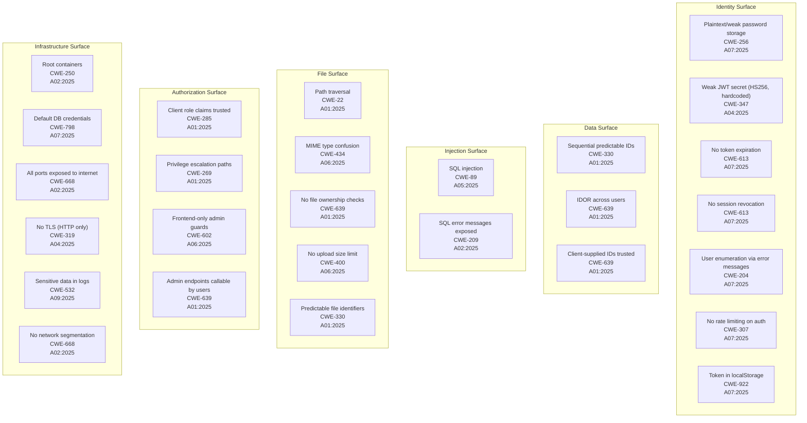
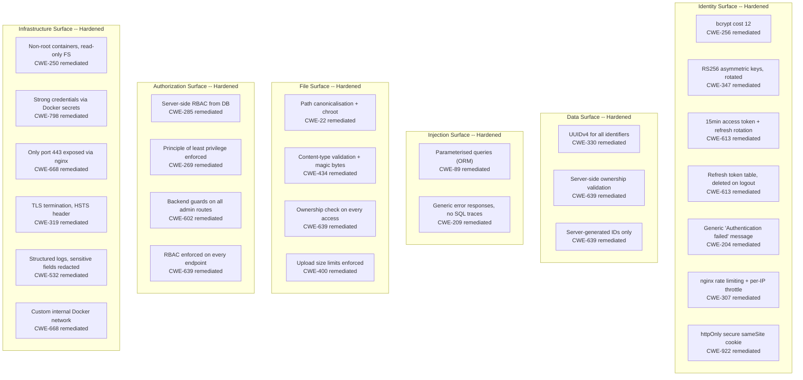

# Threat Model

Complete attack surface map for v1.0.0 (insecure MVP) with dual CWE + OWASP Top 10 classification. Each weakness is intentional per the project's insecure-by-design philosophy (ADR-006). The v2.0.0 remediation map shows the specific control applied for each weakness.

---

## v1.0.0 Attack Surface Map

Approximately 20 weaknesses across 6 attack surfaces. Every weakness exists by design and will be documented, exploited, and remediated through the v1.0.x pentest cycle.

---

## Weakness Reference Table

Full inventory of v1.0.0 weaknesses with classification, surface, and version traceability.

| # | Weakness | CWE | OWASP Top 10 | Surface | Introduced | Remediated |
|---|----------|-----|-------------|---------|------------|------------|
| 1 | Plaintext/weak password storage | CWE-256 | A07:2025 Identification and Authentication Failures | Identity | v0.1.1 | v2.0.0 |
| 2 | Weak JWT secret (HS256, hardcoded) | CWE-347 | A04:2025 Cryptographic Failures | Identity | v0.1.3 | v2.0.0 |
| 3 | No token expiration | CWE-613 | A07:2025 Identification and Authentication Failures | Identity | v0.1.3 | v2.0.0 |
| 4 | No session revocation | CWE-613 | A07:2025 Identification and Authentication Failures | Identity | v0.1.4 | v2.0.0 |
| 5 | User enumeration via distinct errors | CWE-204 | A07:2025 Identification and Authentication Failures | Identity | v0.1.2 | v2.0.0 |
| 6 | No rate limiting on auth endpoints | CWE-307 | A07:2025 Identification and Authentication Failures | Identity | v0.1.5 | v2.0.0 |
| 7 | Token stored in localStorage | CWE-922 | A07:2025 Identification and Authentication Failures | Identity | v0.1.1 | v2.0.0 |
| 8 | Sequential predictable user IDs | CWE-330 | A01:2025 Broken Access Control | Data | v0.1.0 | v2.0.0 |
| 9 | IDOR across users (ownership not checked) | CWE-639 | A01:2025 Broken Access Control | Data | v0.2.2 | v2.0.0 |
| 10 | Client-supplied IDs trusted | CWE-639 | A01:2025 Broken Access Control | Data | v0.2.2 | v2.0.0 |
| 11 | SQL injection | CWE-89 | A05:2025 Injection | Injection | v0.2.1 | v2.0.0 |
| 12 | SQL error messages exposed to client | CWE-209 | A02:2025 Security Misconfiguration | Injection | v0.2.4 | v2.0.0 |
| 13 | Path traversal in file access | CWE-22 | A01:2025 Broken Access Control | File | v0.3.5 | v2.0.0 |
| 14 | MIME type confusion on upload | CWE-434 | A06:2025 Insecure Design | File | v0.3.5 | v2.0.0 |
| 15 | No file ownership checks | CWE-639 | A01:2025 Broken Access Control | File | v0.3.2 | v2.0.0 |
| 16 | No upload size limit | CWE-400 | A06:2025 Insecure Design | File | v0.3.5 | v2.0.0 |
| 17 | Client role claims trusted by backend | CWE-285 | A01:2025 Broken Access Control | Authorization | v0.4.2 | v2.0.0 |
| 18 | Privilege escalation paths | CWE-269 | A01:2025 Broken Access Control | Authorization | v0.4.3 | v2.0.0 |
| 19 | Frontend-only admin guards | CWE-602 | A06:2025 Insecure Design | Authorization | v0.4.2 | v2.0.0 |
| 20 | Admin endpoints callable by regular users | CWE-639 | A01:2025 Broken Access Control | Authorization | v0.4.4 | v2.0.0 |
| 21 | Root containers | CWE-250 | A02:2025 Security Misconfiguration | Infrastructure | v0.5.0 | v2.0.0 |
| 22 | Default database credentials | CWE-798 | A07:2025 Identification and Authentication Failures | Infrastructure | v0.2.0 | v2.0.0 |
| 23 | All ports exposed to internet | CWE-668 | A02:2025 Security Misconfiguration | Infrastructure | v0.5.0 | v2.0.0 |
| 24 | No TLS (HTTP plaintext) | CWE-319 | A04:2025 Cryptographic Failures | Infrastructure | v0.5.0 | v2.0.0 |
| 25 | Sensitive data in logs | CWE-532 | A09:2025 Security Logging and Monitoring Failures | Infrastructure | v0.6.2 | v2.0.0 |
| 26 | No network segmentation | CWE-668 | A02:2025 Security Misconfiguration | Infrastructure | v0.5.2 | v2.0.0 |

---

## OWASP Top 10 Coverage

How the v1.0.0 attack surface maps to the OWASP Top 10 (2025):

| OWASP Category | Count | Weaknesses |
|----------------|-------|------------|
| A01:2025 Broken Access Control | 9 | Sequential IDs, IDOR, client IDs trusted, path traversal, no file ownership, client roles trusted, privilege escalation, FE-only guards, admin endpoints open |
| A04:2025 Cryptographic Failures | 3 | Weak JWT secret, no TLS, (password storage overlaps A07) |
| A05:2025 Injection | 1 | SQL injection |
| A06:2025 Insecure Design | 3 | MIME confusion, no upload size limit, frontend-only guards |
| A02:2025 Security Misconfiguration | 4 | SQL error leakage, root containers, all ports exposed, no network segmentation |
| A07:2025 Identification and Authentication Failures | 7 | Plaintext passwords, no expiry, no revocation, user enumeration, no rate limiting, localStorage tokens, default DB credentials |
| A09:2025 Security Logging and Monitoring Failures | 1 | Sensitive data in logs |

---

## v2.0.0 Remediation Map

Same 6 surfaces, each weakness replaced with the specific control applied. The delta between v1.0.0 and v2.0.0 is the security education.

---

## Remediation Detail Table

| # | v1.0.0 Weakness | v2.0.0 Control | Implementation |
|---|-----------------|---------------|----------------|
| 1 | Plaintext/weak passwords | bcrypt cost 12 | `bcrypt.hash(password, 12)` before INSERT |
| 2 | Weak JWT (HS256, hardcoded) | RS256 asymmetric keys | Private key signs, public key verifies, keys rotated |
| 3 | No token expiration | 15-minute access tokens | `jwt.sign({ sub }, key, { expiresIn: "15m" })` |
| 4 | No session revocation | Refresh token table | `refresh_tokens` table, deleted on logout, rotated on refresh |
| 5 | Distinct auth errors | Generic messages | All auth failures return "Authentication failed" |
| 6 | No rate limiting | nginx + app-level throttle | `limit_req_zone` in nginx, `@nestjs/throttler` in backend |
| 7 | localStorage tokens | httpOnly cookies | Refresh token in `Set-Cookie: httpOnly; secure; sameSite=strict` |
| 8 | Sequential IDs | UUIDv4 | `uuid_generate_v4()` in PostgreSQL, no sequential integers |
| 9 | IDOR (no ownership check) | Ownership validation | `WHERE id = $1 AND owner_id = $2` on every query |
| 10 | Client IDs trusted | Server-generated IDs | IDs generated server-side only, client values ignored |
| 11 | SQL injection | Parameterised queries | TypeORM with query parameters, no string concatenation |
| 12 | SQL errors exposed | Generic errors | Global exception filter strips internal details |
| 13 | Path traversal | Canonicalisation + chroot | `path.resolve()` + base directory validation |
| 14 | MIME confusion | Content-type + magic bytes | Validate MIME via file header, not client Content-Type |
| 15 | No file ownership | Ownership check | `files.owner_id = currentUser.id` on read/delete |
| 16 | No upload size limit | Multer limits | `limits: { fileSize: 10 * 1024 * 1024 }` (10 MB) |
| 17 | Client roles trusted | Server RBAC | Role from DB `users.role`, never from request body/token |
| 18 | Privilege escalation | Least privilege | Guards check `role >= required` on every route |
| 19 | FE-only admin guards | Backend guards | `@Roles('admin')` decorator + `RolesGuard` |
| 20 | Admin endpoints open | RBAC on all routes | Every admin route guarded, 403 for non-admin |
| 21 | Root containers | Non-root, read-only | `USER node` in Dockerfile, `read_only: true` in compose |
| 22 | Default DB credentials | Docker secrets | `POSTGRES_PASSWORD_FILE=/run/secrets/db_password` |
| 23 | All ports exposed | nginx only | Only `443:443` mapped; backend/DB on internal network |
| 24 | No TLS | TLS + HSTS | nginx TLS termination, `Strict-Transport-Security` header |
| 25 | Sensitive data in logs | Redacted structured logs | Pino/Winston with field-level redaction rules |
| 26 | No network segmentation | Custom Docker network | `networks: internal` with no external gateway for DB |
