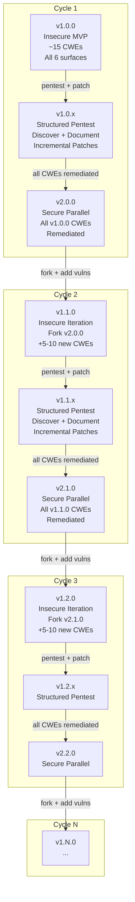
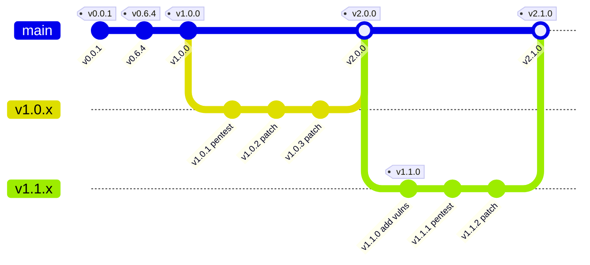

# Version Timeline

Development progression from foundation through insecure MVP, the perpetual insecure/secure expansion cycle, and cumulative security surface growth.

---

## Development Progression (v0.0.x through v1.0.0)

The build phase. Each minor version (v0.N.x) introduces a new architectural or security surface. Patch versions iterate within that surface.

```mermaid
timeline
  title KC-Project Build Phase
  section v0.0.x Foundation
    v0.0.1 : Repo skeleton, README, /docs
    v0.0.2 : Roadmap, scope, security philosophy
    v0.0.3 : Backend scaffold (NestJS)
    v0.0.4 : Frontend scaffold (Next.js App Router)
    v0.0.5 : Backend reachability test (/ping)
    v0.0.6 : Backend API shape (controllers, DTOs, stubs)
    v0.0.7 : Frontend-backend contract integration
    v0.0.8 : Tooling baseline (ESLint, Prettier, Swagger, codegen)
  section v0.1.x Identity
    v0.1.0 : User model introduced
    v0.1.1 : Registration endpoint
    v0.1.2 : Login endpoint
    v0.1.3 : Session concept (JWT)
    v0.1.4 : Logout and token misuse
    v0.1.5 : Authentication edge cases
  section v0.2.x Persistence
    v0.2.0 : Database introduction (PostgreSQL)
    v0.2.1 : Persisted authentication
    v0.2.2 : Identifier trust failures (IDOR)
    v0.2.3 : Enumeration surface
    v0.2.4 : Error and metadata leakage
    v0.2.5 : Persistence refactoring (migrations)
  section v0.3.x Files
    v0.3.0 : File upload
    v0.3.1 : File metadata
    v0.3.2 : File download (no access checks)
    v0.3.3 : File deletion (IDOR)
    v0.3.4 : Public file sharing
    v0.3.5 : File handling edge cases
  section v0.4.x Authorization
    v0.4.0 : Roles introduced
    v0.4.1 : Admin endpoints
    v0.4.2 : Mixed trust boundaries
    v0.4.3 : Privilege escalation paths
    v0.4.4 : Cross-user access
    v0.4.5 : RBAC complexity growth
  section v0.5.x Deployment
    v0.5.0 : Docker introduction
    v0.5.1 : Environment variables
    v0.5.2 : Service networking
    v0.5.3 : Volume and persistence
    v0.5.4 : Docker misconfigurations
  section v0.6.x Runtime
    v0.6.0 : VM deployment (Ubuntu)
    v0.6.1 : Network exposure
    v0.6.2 : Logging and debugging
    v0.6.3 : Configuration drift
    v0.6.4 : Operational fragility
  section v1.0.0
    v1.0.0 : Insecure MVP frozen (10-15 CWEs baseline)
```

---

## Perpetual Expansion Cycle

After v1.0.0, the project follows a repeating insecure/secure loop. Each cycle adds new vulnerability surfaces, pentests them, and produces a hardened counterpart. The next cycle forks the hardened version and introduces more weaknesses.

### Cycle Mechanics

| Phase | Version | Activity | Output |
|-------|---------|----------|--------|
| Build | v1.N.0 | Fork from v2.(N-1).0, introduce 5-10 new CWEs across new or existing surfaces | Insecure baseline with documented weaknesses |
| Test | v1.N.x | Structured penetration testing using real tools and methodologies | Pentest reports, exploit documentation, patch PRs |
| Harden | v2.N.0 | Apply all remediations, verify each fix, document the delta | Secure counterpart, remediation evidence |
| Repeat | v1.(N+1).0 | Fork v2.N.0, add next wave of vulnerabilities | Next insecure baseline |

### First cycle (v1.0.0) starts with ~15 CWEs from the roadmap

- v1.0.0 forks directly from v0.6.4 (last build phase version)
- No fork from a secure version -- this is the first cycle

### Subsequent cycles expand the surface

- v1.1.0 might add: XSS (CWE-79), CSRF (CWE-352), SSRF (CWE-918), deserialization (CWE-502), XXE (CWE-611)
- v1.2.0 might add: race conditions (CWE-362), cache poisoning (CWE-349), subdomain takeover, JWT algorithm confusion (CWE-327)
- The possibilities are unbounded -- this is a perpetual sandbox

---

## Security Surface Growth

Cumulative CWE count across expansion cycles. Each cycle adds a new wave of weaknesses on top of the previous secure baseline.

```mermaid
flowchart LR
  subgraph v100_surface ["v1.0.0 (~15 CWEs)"]
    S1_Identity["Identity\n7 CWEs"]
    S1_Data["Data\n3 CWEs"]
    S1_Injection["Injection\n2 CWEs"]
    S1_Files["File\n4 CWEs"]
    S1_Authz["Authorization\n4 CWEs"]
    S1_Infra["Infrastructure\n6 CWEs"]
  end

  subgraph v110_surface ["v1.1.0 (~25 CWEs, +10)"]
    S2_XSS["+ XSS (CWE-79)"]
    S2_CSRF["+ CSRF (CWE-352)"]
    S2_SSRF["+ SSRF (CWE-918)"]
    S2_Deser["+ Insecure Deserialization (CWE-502)"]
    S2_XXE["+ XXE (CWE-611)"]
    S2_More["+ 5 more..."]
  end

  subgraph v120_surface ["v1.2.0 (~35 CWEs, +10)"]
    S3_Race["+ Race Conditions (CWE-362)"]
    S3_Cache["+ Cache Poisoning (CWE-349)"]
    S3_AlgConfusion["+ JWT Alg Confusion (CWE-327)"]
    S3_More["+ 7 more..."]
  end

  v100_surface --> v110_surface --> v120_surface
```

### CWE Growth Summary

| Cycle | Version | New CWEs | Cumulative | Primary New Surfaces |
|-------|---------|----------|-----------|---------------------|
| 1 | v1.0.0 | ~15 | ~15 | Identity, Data, Injection, Files, Authorization, Infrastructure |
| 2 | v1.1.0 | ~10 | ~25 | Client-side (XSS, CSRF), Server-side request forgery, Deserialization |
| 3 | v1.2.0 | ~10 | ~35 | Concurrency, Caching, Cryptographic weaknesses |
| 4 | v1.3.0 | ~10 | ~45 | Supply chain, CI/CD, cloud misconfigurations |
| N | v1.N.0 | ~5-10 | Growing | New attack categories as technology evolves |

The v1.1.0+ CWE additions are speculative projections to illustrate the expansion model. Actual weaknesses will be chosen based on what is realistic for the application's technology stack and deployment context at the time.

---

## Version Semantics (Updated)

| Version Pattern | Meaning |
|----------------|---------|
| v0.0.x | Foundation: repo, scaffolding, tooling, contracts |
| v0.1.x | Identity and authentication surface |
| v0.2.x | Persistence and database surface |
| v0.3.x | File handling surface |
| v0.4.x | Authorization and administrative surface |
| v0.5.x | Containerisation and deployment surface |
| v0.6.x | Runtime, configuration, and observability surface |
| **v1.0.0** | **Insecure MVP -- frozen baseline (~15 CWEs)** |
| v1.0.x | Pentest + incremental securing of v1.0.0 |
| **v2.0.0** | **Secure parallel to v1.0.0 -- all CWEs remediated** |
| **v1.1.0** | **Insecure iteration -- fork v2.0.0 + ~10 new CWEs** |
| v1.1.x | Pentest + incremental securing of v1.1.0 |
| **v2.1.0** | **Secure parallel to v1.1.0** |
| v1.N.0 | Nth insecure iteration |
| v2.N.0 | Nth secure parallel |

---

## Branch Strategy for Expansion Cycles

Each cycle creates a clear branch structure:

