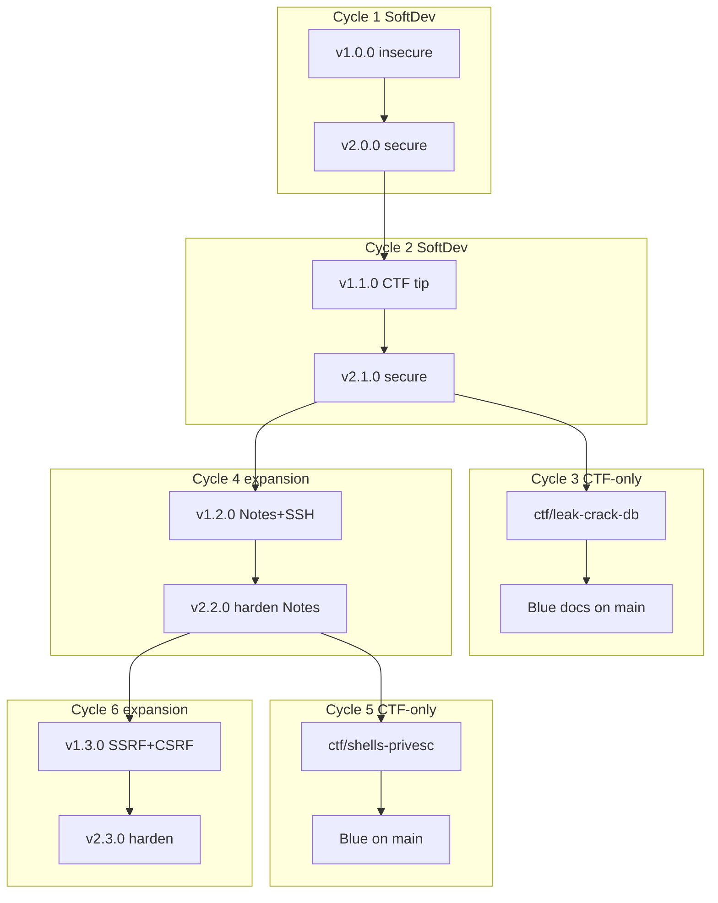

# Version Timeline

Development progression from foundation through insecure MVP, the perpetual insecure/secure expansion cycle, and cumulative security surface growth.

---

## Development Progression (v0.0.x through v1.0.0)

The build phase. Each minor version (v0.N.x) introduces a new architectural or security surface. Patch versions iterate within that surface.

```mermaid
timeline
  title KC-Project Build Phase
  section v0.0.x Foundation
    v0.0.1 : Repo skeleton, README, /docs
    v0.0.2 : Roadmap, scope, security philosophy
    v0.0.3 : Backend scaffold (NestJS)
    v0.0.4 : Frontend scaffold (Next.js App Router)
    v0.0.5 : Backend reachability test (/ping)
    v0.0.6 : Backend API shape (controllers, DTOs, stubs)
    v0.0.7 : Frontend-backend contract integration
    v0.0.8 : Tooling baseline (ESLint, Prettier, Swagger, codegen)
  section v0.1.x Identity
    v0.1.0 : User model introduced
    v0.1.1 : Registration endpoint
    v0.1.2 : Login endpoint
    v0.1.3 : Session concept (JWT)
    v0.1.4 : Logout and token misuse
    v0.1.5 : Authentication edge cases
  section v0.2.x Persistence
    v0.2.0 : Database introduction (PostgreSQL)
    v0.2.1 : Persisted authentication
    v0.2.2 : Identifier trust failures (IDOR)
    v0.2.3 : Enumeration surface
    v0.2.4 : Error and metadata leakage
    v0.2.5 : Persistence refactoring (migrations)
  section v0.3.x Files
    v0.3.0 : File upload
    v0.3.1 : File metadata
    v0.3.2 : File download (no access checks)
    v0.3.3 : File deletion (IDOR)
    v0.3.4 : Public file sharing
    v0.3.5 : File handling edge cases
  section v0.4.x Authorization
    v0.4.0 : Roles introduced
    v0.4.1 : Admin endpoints
    v0.4.2 : Mixed trust boundaries
    v0.4.3 : Ternary role system
    v0.4.4 : Privilege escalation paths
    v0.4.5 : RBAC complexity growth
  section v0.5.x Refinement
    v0.5.0 : Input validation (ValidationPipe)
    v0.5.1 : Frontend form alignment
    v0.5.2 : Pagination
    v0.5.3 : Error standardization
    v0.5.4 : Request logging
  section v0.6.x Admin Polish
    v0.6.0 : Persistent audit logs
    v0.6.1 : User search and filter
    v0.6.2 : System statistics
    v0.6.3 : Health endpoint
  section v0.7.x Docker
    v0.7.0 : Dockerfiles
    v0.7.1 : docker-compose.prod.yml
    v0.7.2 : VM provisioning
    v0.7.3 : Compose smoke tests
  section v0.8.x Lock
    v0.8.0 : API route freeze
    v0.8.1 : Pentest methodology
  section v0.9.x Freeze
    v0.9.5 : Release candidate
  section v0.9.x Product UX
    v0.9.0 : Product UI + /dev explorers (ADR-028)
    v0.9.5 : Demo seeds, 150 e2e, pentest-ready
  section v1.0.0
    v1.0.0 : Pentest-ready insecure MVP (59/38 CWEs, Docker :8080)
```

---

## Perpetual Expansion Cycle (actual policy)

After Cycle-1/2 SoftDev pairs, **two** versioning stories apply:

| Kind | Policy | Example |
|------|--------|---------|
| **CTF-only** | Misconfig current tip **without** product tag bump ([ADR-032](../decisions/ADR-032-post-v2.1.0-versioning.md)) | Cycle-3 `ctf/leak-crack-db` |
| **SoftDev security cycle** | New product surface → insecure tip on `main` → Red → Blue tag ([ADR-033](../decisions/ADR-033-cycle-4-softdev-version-pair.md)) | Cycle-4 `v1.2.0` → `v2.2.0` |

```mermaid
flowchart TD
  subgraph c1 [Cycle 1 SoftDev]
    v100[v1.0.0 insecure]
    v200[v2.0.0 secure]
  end
  subgraph c2 [Cycle 2 SoftDev]
    v110[v1.1.0 CTF tip]
    v210[v2.1.0 secure]
  end
  subgraph c3 [Cycle 3 CTF-only]
    ctf3[ctf/leak-crack-db]
    blue3[Blue docs on main]
  end
  subgraph c4 [Cycle 4 expansion]
    v120[v1.2.0 Notes+SSH]
    v220[v2.2.0 harden Notes]
  end
  subgraph c5 [Cycle 5 CTF-only]
    ctf5[ctf/shells-privesc]
    blue5[Blue on main]
  end
  subgraph c6 [Cycle 6 expansion]
    v130[v1.3.0 SSRF+CSRF]
    v230[v2.3.0 harden]
  end

  v100 --> v200 --> v110 --> v210
  v210 --> ctf3 --> blue3
  v210 --> v120 --> v220 --> ctf5 --> blue5
  v220 --> v130 --> v230
```

### Cycle-4 expansion (closed — insecure tip `v1.2.0`)

- Entrance: Notes API/UI; intentional XSS
- Depth: SSH overlay `lab` @ `:2222`; foothold only
- Flags F1–F3: [ground truth](../security/Cycle-4/Dev/v1.2.0-ground-truth.md)
- Path: [notes-ssh-path.md](notes-ssh-path.md)

### Cycle-5 CTF-only (closed)

- Shells + PrivEsc on `ctf/shells-privesc`; no product tag ([ADR-032](../decisions/ADR-032-post-v2.1.0-versioning.md))

### Cycle-6 product expansion (in design)

- Link Preview SSRF + CSRF → planned `v1.3.0` / `v2.3.0` ([ADR-034](../decisions/ADR-034-cycle-6-product-expansion-pair.md))

### Speculative “race/cache v1.2.0” ideas (obsolete)

Earlier drafts projected v1.2.0 as concurrency/cache CWEs. **Superseded by ADR-033** (Notes + SSH pair).

---

## Version Semantics (updated)

| Version Pattern | Meaning |
|----------------|---------|
| **v1.0.0** / **v2.0.0** | Cycle-1 pair |
| **v1.1.0** / **v2.1.0** | Cycle-2 pair |
| Cycle-3 | CTF-only (`ctf/leak-crack-db`) — no product bump |
| **v1.2.0** / **v2.2.0** | Cycle-4 — Notes XSS + SSH → harden Notes / no default SSH |
| Cycle-5 | CTF-only (`ctf/shells-privesc`) — no product bump |
| **v1.3.0** / **v2.3.0** | Cycle-6 — Link Preview SSRF + CSRF (planned) |

---

## Branch Strategy for feature lanes + archives

See root [README.md](../../README.md) Branching Strategy and [ADR-015](../decisions/ADR-015-branching-strategy.md). Feature lanes (`backend` / `frontend` / `dev`) reset from `main` each product-expansion cycle; `ctf/*` / `remediation/*` archives kept forever. Cycle docs land via PR branches (e.g. `docs/cycle-6-p0`), not direct pushes to `main`.
