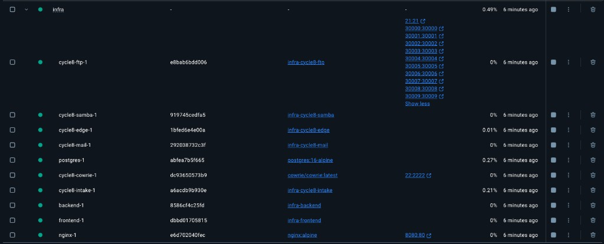
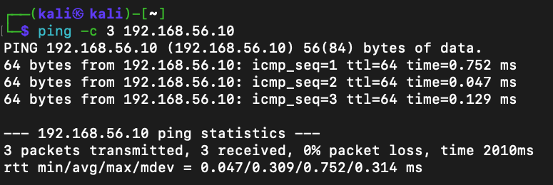
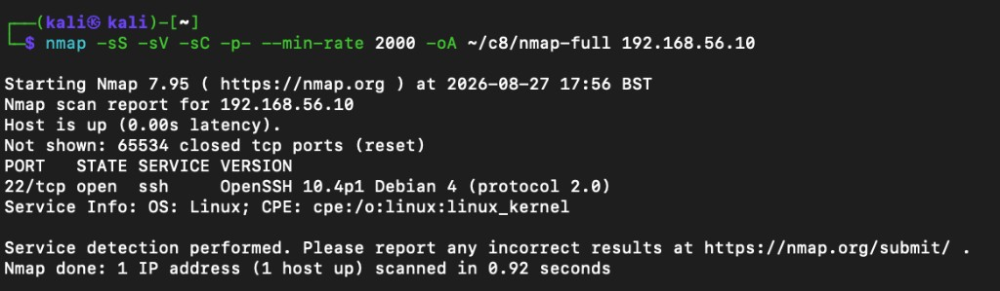
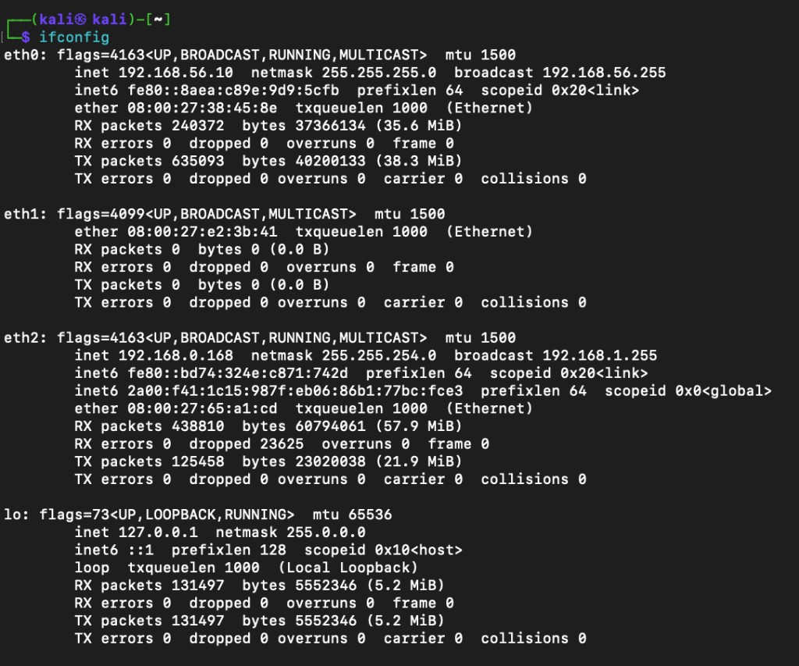

# Cycle-8 PenTest writeup — `v1.5.0` (Northwind Intake)

**Status:** In progress (Red open)  
**Archive:** `ctf/v1.5.0`  
**Style:** OSCP+ exam-report (standalone only — **no AD chapter**)  
**Template:** Portfolio `exams/oscp/report/skeleton.md`  
**Evidence:** [screenshots/](screenshots/)

---

# Cover

| Field | Value |
| ----- | ----- |
| Lab | KC-Project Cycle-8 / tip `v1.5.0` |
| Target | `Northwind` — `192.168.56.1` (Host-Only from Kali) |
| Engagement start | 2026-08-27 |
| Report date | (fill at freeze) |
| Flags | 5× `OS{` + 32 hex + `}` |

---

# 1. Introduction

Methodical internal penetration test of the Northwind employee portal / ops intake lab tip. Written so a competent reader can reproduce every step from this document and the linked screenshots.

---

# 2. Objective

Assess the Cycle-8 insecure tip (`v1.5.0` / `docker-compose.cycle8.yml`). Identify, exploit, escalate, and document findings with remediations. Recover five graded proofs. Scope is Docker + Kali Host-Only only (no Windows client / AD).

---

# 3. Requirements (self-check)

- [ ] High-level summary + recommendations (non-technical)
- [ ] Methodology walkthrough
- [ ] Each finding: explanation, severity, fix, steps, PoC, screenshots, proofs
- [x] AD attack chain — **N/A** (out of lab scope)
- [ ] Appendices: proof table; tool notes (sqlmap / John / Hydra / listener / etc. as used)

---

# 4. High-level summary

*(Fill after 5/5 — non-technical paragraph: what was owned and why.)*

Hosts owned:

**Standalone**

- Target 1 — `Northwind` (`192.168.56.1`) — *(path TBD)*

## 4.1 Recommendations

*(Fill after engagement — patch / config / cred / segment bullets for a non-technical reader.)*

---

# 5. Findings overview

| # | Host | Finding | Severity | Impact |
| - | ---- | ------- | -------- | ------ |
| 1 | | | | |
| 2 | | | | |
| 3 | | | | |
| 4 | | | | |
| 5 | | | | |

---

# 6. Methodologies

## 6.1 Information gathering

- Attacker: Kali Host-Only `eth0` `192.168.56.10`
- Target: Host-Only / Docker host `192.168.56.1` (hostname **Northwind** per http-title / nmap)
- Tip stack confirmed running in Docker Desktop before remote enum

**False start:** ping/nmap against `192.168.56.10` only hit Kali itself (OpenSSH on Debian). Corrected after `ifconfig` showed `.10` on `eth0`.

**Evidence**

| Shot | File |
|------|------|
| Docker tip stack |  |
| Early ping |  |
| nmap self (discard) |  |
| Kali Host-Only identity |  |

## 6.2 Service enumeration

Full TCP SYN + version + default scripts against the tip:

```bash
mkdir -p ~/c8
sudo nmap -sS -sV -sC -p- --min-rate 2000 -oA ~/c8/nmap-full 192.168.56.1
```

### Open ports (lab-relevant)

| IP | TCP | Service (nmap) | Notes |
| -- | --- | -------------- | ----- |
| 192.168.56.1 | 21 | vsftpd 3.0.5 | Anon login allowed; PASV advertised `127.0.0.1` (broken from Kali until PASV address fixed on host) |
| 192.168.56.1 | 22 | OpenSSH 9.2p1 Debian | SSH-looking; hostkeys recorded; do not assume graded anon SSH |
| 192.168.56.1 | 8080 | nginx 1.29.1 | Title: **Northwind Ops** |
| 192.168.56.1 | 30000–30009 | tcpwrapped | FTP PASV band (not separate apps) |

**Ignored (host noise):** 27036 (Steam), 53555, 59869.

**Evidence:**  · raw on Kali: `~/c8/nmap-full.*`

## 6.3 Penetration

*(Fill per finding as footholds land — exact commands, payloads, URLs.)*

## 6.4 Maintaining access

Minimal; document any listener / shell persistence used during the window.

## 6.5 House cleaning

Remove payloads / accounts / tools before freeze if any were left on tip.

---

# 7. Independent challenge — Target 1

## Target #1 — `Northwind` — `192.168.56.1`

### 7.1.1 Service enumeration

See §6.2. Next: HTTP app map + anon FTP content (PASV may need host fix).

| Surface | Status | Notes |
| ------- | ------ | ----- |
| HTTP :8080 | In progress | Browse / map `/api` |
| FTP :21 anon | Pending | List only; note what is *not* gifted |
| SSH :22 | Parked | Creds later; timebox early sprays |

### 7.1.2 Initial access — *(name TBD)*

| Field | Content |
| ----- | ------- |
| Vulnerability exploited | |
| Severity | |
| Vulnerability explanation | |
| Vulnerability fix | |
| Steps to reproduce | |
| Proof of concept | |
| Evidence | `screenshots/…` |

**Proof (user / F3-class)**

- Path:
- Contents: `OS{…}`
- Screenshot: interactive shell + `cat` + `ip a` / target addressing same frame

### 7.1.3 Privilege escalation — *(name TBD)*

| Field | Content |
| ----- | ------- |
| Vulnerability exploited | |
| Severity | |
| Vulnerability explanation | |
| Vulnerability fix | |
| Steps to reproduce | |
| Proof of concept | |
| Evidence | `screenshots/…` |

**Proof (root / F4-class)**

- Path:
- Contents: `OS{…}`
- Screenshot: interactive root shell + IP

### 7.1.4 Post-exploitation / pivot

Loot that mattered (hashes, users, internal hosts). Document dual-home / internal-only services when reached.

**Additional proofs (F1 / F2 / F5)** — one subsection each as recovered:

#### F1 — *(theme TBD)*

- Location / how obtained:
- Value: `OS{…}`
- Evidence:

#### F2 — *(theme TBD)*

- Location / how obtained:
- Value: `OS{…}`
- Evidence:

#### F5 — *(theme TBD)*

- Location / how obtained:
- Value: `OS{…}`
- Evidence:

---

# 8. Appendices

## 8.1 Proof table

| ID | Host | Path / context | Value | Screenshot |
| -- | ---- | -------------- | ----- | ---------- |
| F1 | | | | |
| F2 | | | | |
| F3 | | | | |
| F4 | | | | |
| F5 | | | | |

## 8.2 Tools used (fill as used)

| Tool | Purpose |
| ---- | ------- |
| nmap | Full TCP enum |
| | |

## 8.3 Screenshot index

See [screenshots/README.md](screenshots/README.md).
