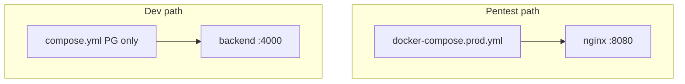

# Infrastructure

Deployment and infrastructure for **KC-Project** **v2.0.0** secure parallel + **v1.1.0 CTF** overlay.

Canonical deployment: [STRATEGY.md](../docs/roadmap/STRATEGY.md) Part 3 (v0.7.x+).

---

## Deploy paths

| Path | Compose file | Use case | Entry |
|------|--------------|----------|-------|
| **Secure (primary)** | `docker-compose.prod.yml` | Day-to-day, smoke/journey | `http://localhost:8080` |
| **CTF box (v1.1.0)** | `prod` + `docker-compose.ctf.yml` | Cycle-2 OSCP-style lab | `http://localhost:8080` + `:5433` PG |
| **TLS profile** | `prod` + `docker-compose.tls.yml` | HTTPS / HSTS | `https://localhost:8443` |
| **E2E Postgres** | `prod` + `docker-compose.e2e.yml` | Host Jest only | `:5433` |
| **Native dev** | `compose.yml` (DB only) | `npm run start:dev` | `:4000` API, `:3000` UI |


```mermaid
flowchart TB
    subgraph pentest [Pentest path]
        prodCompose[docker-compose.prod.yml]
        nginx[nginx :8080]
        prodCompose --> nginx
    end
    subgraph dev [Dev path]
        devCompose[compose.yml PG only]
        nativeBE[backend :4000]
        devCompose --> nativeBE
    end
```

**Warning:** Prod uses `pgdata_prod` / `kc_prod`. Dev uses `pgdata` / `kc_dev`. Mixing volumes causes `database "kc_prod" does not exist`.

---

## Quick start (pentest / production stack)

```bash
cp infra/.env.example infra/.env
docker compose -f infra/docker-compose.prod.yml up -d --build
./infra/smoke-test.sh
./infra/journey-test.sh
```

App: `http://localhost:8080` — API at `/api/*`.

### CTF box (v1.1.0)

```bash
cp infra/.env.example infra/.env
# Set DB_PASSWORD=KcCtfDbPr0of2026! (or export before compose) — see ground truth
docker compose -f infra/docker-compose.prod.yml -f infra/docker-compose.ctf.yml up -d --build
./infra/ctf-examiner.sh   # dry-run (requires stack up)
./infra/e2e-ctf-docker.sh  # CTF_MODE e2e (2 tests; uses :5433 postgres)
```

See [Cycle-2 box plan](../docs/security/Cycle-2/Dev/v1.1.0-box-plan.md). **Do not** deploy CTF overlay on production paths.

### TLS profile

```bash
chmod +x infra/scripts/gen-lab-certs.sh infra/tls-smoke.sh
./infra/scripts/gen-lab-certs.sh
docker compose -f infra/docker-compose.prod.yml -f infra/docker-compose.tls.yml up -d --build
./infra/tls-smoke.sh
```

App: `https://127.0.0.1:8443` (HTTP `:8080` redirects). Certs live in `infra/certs/` (gitignored).

---

## Quick start (native dev)

```bash
docker compose -f infra/compose.yml up -d
cd backend && npm run start:dev   # :4000
cd frontend && npm run dev        # :3000
```

---

## Environment (`.env.example`)

Copy to `infra/.env` before prod compose. Loaded via `env_file` in `docker-compose.prod.yml`.

| Variable | Default | Notes |
|----------|---------|-------|
| `DB_HOST` | `postgres` | Docker service name |
| `DB_PORT` | `5432` | Internal port |
| `DB_USER` / `DB_PASSWORD` | `postgres` | Intentional CWE-798 |
| `DB_NAME` | `kc_prod` | Prod database |
| `NEXT_PUBLIC_API_URL` | `/api` | Browser-relative API path |

---

## Verification scripts

```bash
chmod +x infra/*.sh
```

| Script | Prereq | Purpose |
|--------|--------|---------|
| `smoke-test.sh` | Full prod stack on `:8080` | Health → register → upload → list + demo login |
| `journey-test.sh` | Full prod stack | 3 roles, demo share token API+UI, mod pending, admin files, IDOR deny |
| `tls-smoke.sh` | Prod + `docker-compose.tls.yml` on `:8443` | HTTPS health, HSTS, HTTP→HTTPS redirect, Secure cookie |
| `scripts/gen-lab-certs.sh` | mkcert or openssl | Write `infra/certs/localhost*.pem` |
| `e2e-docker.sh` | Docker available | Backend e2e vs `kc_prod` via `docker-compose.e2e.yml` host `:5433` |
| `e2e-ctf-docker.sh` | Docker available | CTF-mode e2e (`test:e2e:ctf`, 2 tests) |
| `ctf-examiner.sh` | CTF stack on `:8080` | Full kill-chain dry-run (hydra → IDOR → forge → DB) |
| `vm-setup.sh` | Ubuntu + sudo | Install Docker, clone repo, prod stack, smoke + journey |

Env overrides: `BASE_URL` (default `http://localhost:8080/api`), `APP_URL` (default `http://localhost:8080`).

### Full verify gate

```bash
docker compose -f infra/docker-compose.prod.yml up -d --build
./infra/smoke-test.sh
./infra/journey-test.sh
./infra/e2e-docker.sh   # expect 150 passed
```

---

## Security testing

Pentest entry and artifacts: [docs/security/Cycle-1/README.md](../docs/security/Cycle-1/README.md)

Ground truth: [v1.0.0-ground-truth.md](../docs/security/Cycle-1/Dev/v1.0.0-ground-truth.md)

---

## Contents

| File | Purpose |
|------|---------|
| `compose.yml` | Dev PostgreSQL only (`kc_dev`, `:5432`) |
| `docker-compose.prod.yml` | Full stack: postgres, backend, frontend, nginx |
| `.env.example` | Prod env template → copy to `.env` |
| `nginx.conf` | Reverse proxy `/api` → backend, `/` → frontend |
| `smoke-test.sh` | Minimal API smoke |
| `journey-test.sh` | Role + seed journey |
| `e2e-docker.sh` | Full e2e vs Docker postgres |
| `vm-setup.sh` | Ubuntu VM bootstrap |

---

## Migrations

TypeORM migrations run on backend start (`migrationsRun: true`).

```bash
cd backend && npm run migration:run
```

See [ADR-022](../docs/decisions/ADR-022-typeorm-migrations.md).
