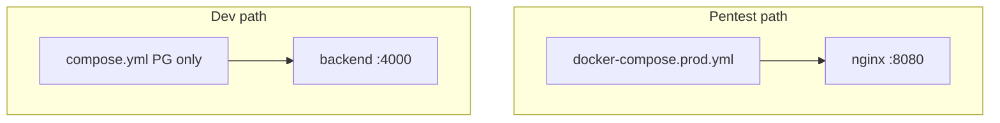

# Infrastructure

Deployment and infrastructure for **KC-Project** **v2.1.0** (secure parallel).  
Historical insecure baseline: tag `v1.0.0` / [Cycle-1 PenTest](../docs/security/Cycle-1/PenTest/v1.0.0-writeup.md).  
Cycle-2 CTF box (frozen): branch/tag `v1.1.0` — **never** use CTF compose overlays on this secure path.

Canonical deployment: [STRATEGY.md](../docs/roadmap/STRATEGY.md) Part 3 (v0.7.x+).

---

## Dual deploy paths

| Path | Compose file | Use case | Entry |
|------|--------------|----------|-------|
| **Secure / lab (primary)** | `docker-compose.prod.yml` | Day-to-day, journeys, smoke (**loopback HTTP OK**) | `http://localhost:8080` |
| **TLS profile** | `prod` + `docker-compose.tls.yml` | **Required for LAN / recruiter secure demos**; HTTPS / HSTS / Secure cookies | `https://localhost:8443` |
| **Native dev** | `compose.yml` (DB only) | `npm run start:dev` on host | `:4000` API, `:3000` UI |

**LAN / off-loopback:** Do not advertise cleartext `:8080` on a reachable NIC as “secure.” Use the TLS overlay (or terminate TLS elsewhere). Loopback HTTP remains an accepted residual (R-01).


```mermaid
flowchart TB
    subgraph pentest [Pentest path]
        prodCompose[docker-compose.prod.yml]
        nginx[nginx :8080]
        prodCompose --> nginx
    end
    subgraph dev [Dev path]
        devCompose[compose.yml PG only]
        nativeBE[backend :4000]
        devCompose --> nativeBE
    end
```

**Warning:** Prod uses `pgdata_prod` / `kc_prod`. Dev uses `pgdata` / `kc_dev`. Mixing volumes causes `database "kc_prod" does not exist`.

---

## Quick start (pentest / production stack)

```bash
cp infra/.env.example infra/.env
docker compose -f infra/docker-compose.prod.yml up -d --build
./infra/smoke-test.sh
./infra/journey-test.sh
```

App: `http://localhost:8080` — API at `/api/*`.

### TLS profile

```bash
chmod +x infra/scripts/gen-lab-certs.sh infra/tls-smoke.sh
./infra/scripts/gen-lab-certs.sh
docker compose -f infra/docker-compose.prod.yml -f infra/docker-compose.tls.yml up -d --build
./infra/tls-smoke.sh
```

App: `https://127.0.0.1:8443` (HTTP `:8080` redirects). Certs live in `infra/certs/` (gitignored).

---

## Quick start (native dev)

```bash
docker compose -f infra/compose.yml up -d
cd backend && npm run start:dev   # :4000
cd frontend && npm run dev        # :3000
```

---

## Environment (`.env.example`)

Copy to `infra/.env` before prod compose. Loaded via `env_file` in `docker-compose.prod.yml`.

| Variable | Default | Notes |
|----------|---------|-------|
| `DB_HOST` | `postgres` | Docker service name |
| `DB_PORT` | `5432` | Internal port |
| `DB_ADMIN_USER` / `DB_ADMIN_PASSWORD` | `postgres` / strong | Superuser for init + migrations only |
| `DB_USER` / `DB_PASSWORD` | `kc_app` / strong | Runtime DML role (C2-F07 least-priv) |
| `DB_NAME` | `kc_prod` | Prod database |
| `NEXT_PUBLIC_API_URL` | `/api` | Browser-relative API path |

Upgrading from v2.0.0 single-user DB: set the admin/app split above, then recreate `pgdata_prod` once (`docker compose ... down -v`) **or** let backend `migrate-and-grant` create `kc_app` on an existing volume.

---

## Operator note — access JWT vs refresh cookie (C2-F06)

- **Access JWT** (Bearer): ~15 minutes (`JWT_EXPIRES_IN`). Shell `$TOKEN` goes stale → **401** (not necessarily a failed exploit).
- **Refresh**: httpOnly cookie (`kc_refresh`); SPA silent-refresh via `/api/auth/refresh`. Re-login or refresh when probing after TTL.

---

## Verification scripts

```bash
chmod +x infra/*.sh infra/postgres/init/*.sh
```

| Script | Prereq | Purpose |
|--------|--------|---------|
| `assert-pg-unpublished.sh` | compose file | Prod compose must not publish `:5433` (C2-F03) |
| `smoke-test.sh` | Full prod stack on `:8080` | PG unpublished assert + health → register → upload → list + demo login |
| `journey-test.sh` | Full prod stack | 3 roles, demo share token API+UI, mod pending, admin files, IDOR deny |
| `tls-smoke.sh` | Prod + `docker-compose.tls.yml` on `:8443` | HTTPS health, HSTS, HTTP→HTTPS redirect, Secure cookie |
| `scripts/gen-lab-certs.sh` | mkcert or openssl | Write `infra/certs/localhost*.pem` |
| `e2e-docker.sh` | Docker available | Backend e2e vs `kc_prod` via `docker-compose.e2e.yml` host `:5433` (admin user) |
| `vm-setup.sh` | Ubuntu + sudo | Install Docker, clone repo, prod stack, smoke + journey |

Env overrides: `BASE_URL` (default `http://localhost:8080/api`), `APP_URL` (default `http://localhost:8080`).

### Full verify gate

```bash
docker compose -f infra/docker-compose.prod.yml up -d --build
./infra/smoke-test.sh
./infra/journey-test.sh
./infra/e2e-docker.sh
./infra/scripts/gen-lab-certs.sh
docker compose -f infra/docker-compose.prod.yml -f infra/docker-compose.tls.yml up -d --build
./infra/tls-smoke.sh
```

---

## Security testing

Cycle-2 Blue Team: [docs/security/Cycle-2/Remediation/](../docs/security/Cycle-2/Remediation/).  
Cycle-1 (closed): [docs/security/Cycle-1/README.md](../docs/security/Cycle-1/README.md).

---

## Contents

| File | Purpose |
|------|---------|
| `compose.yml` | Dev PostgreSQL only (`kc_dev`, `:5432`) |
| `docker-compose.prod.yml` | Full stack: postgres, backend, frontend, nginx |
| `postgres/init/` | First-boot `kc_app` role (least-priv) |
| `.env.example` | Prod env template → copy to `.env` |
| `nginx.conf` | Reverse proxy `/api` → backend, `/` → frontend |
| `smoke-test.sh` | Minimal API smoke |
| `journey-test.sh` | Role + seed journey |
| `e2e-docker.sh` | Full e2e vs Docker postgres |
| `vm-setup.sh` | Ubuntu VM bootstrap |

---

## Migrations

Backend entrypoint runs `migrate-and-grant` as **DB admin**, then Nest starts as **`kc_app`** with `MIGRATIONS_RUN=false`.

```bash
cd backend && npm run migration:run   # local CLI (admin creds)
```

See [ADR-022](../docs/decisions/ADR-022-typeorm-migrations.md).
