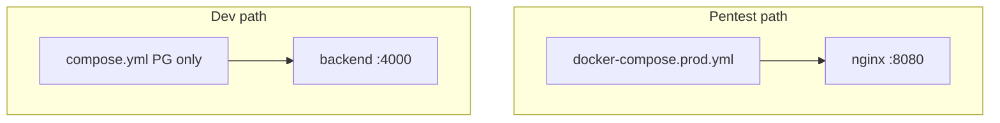

# Infrastructure

Deployment and infrastructure for **KC-Project**.

**Tip policy:** tip (`main` / current SoftDev) holds **evergreen** compose + gates + Blue/unpublished asserts + **one live plant overlay** (today: Cycle-8). Closed-cycle plant overlays and examiners live on **`ctf/v1.x.0` / tags** — checkout the box, then use its compose files (do not expect prior overlays on tip).

**Current tip plant box:** Cycle-8 — `docker-compose.cycle8.yml` + `infra/cycle8/` + `nginx-cycle8.conf` (ADR-036 / ADR-037).  
**Hardened baseline before C8 Blue:** Ops path confinement + prior Blue asserts (Cycle-6/7).  
**Optional tip noise:** `docker-compose.lab-host.yml` — SSH `:2222` only (no `:8787`).

Canonical: [STRATEGY.md](../docs/roadmap/STRATEGY.md) · [ADR-036](../docs/decisions/ADR-036-cycle-8-intake-tool-chain-pair.md).

---

## Dual deploy paths (tip)

| Path | Compose file | Use case | Entry |
|------|--------------|----------|-------|
| **Secure / lab (primary)** | `docker-compose.prod.yml` | Day-to-day, journeys, smoke (**loopback HTTP OK**) | `http://localhost:8080` |
| **TLS profile** | `prod` + `docker-compose.tls.yml` | **Required for LAN / recruiter secure demos** | `https://localhost:8443` |
| **Cycle-8 plant overlay (live tip box)** | `prod` + `docker-compose.cycle8.yml` | Insecure tip / Red until Blue closes | `:8080` + FTP `:21` + Cowrie `:22` |
| **Lab-host noise (optional)** | `prod` + `docker-compose.lab-host.yml` | Hardened SSH-only sidecar — **no** kc-agent | SSH `:2222` |
| **Native dev** | `compose.yml` (DB only) | `npm run start:dev` on host | `:4000` API, `:3000` UI |

**Prior Red boxes:** checkout tag / `ctf/*` first — overlays ship **with that checkout** (e.g. `v1.4.0` → `docker-compose.cycle7.yml`; `v1.2.0` → `docker-compose.ssh.yml`). See [USAGE.md](../USAGE.md).

**C4-F03 / C5 / C7 / C8 policy:** Prod compose alone must not publish plant ports — `./infra/assert-ssh-unpublished.sh`, `assert-cycle7-unpublished.sh`, `assert-cycle8-unpublished.sh`.

**LAN / off-loopback:** Do not advertise cleartext `:8080` on a reachable NIC as “secure.” Use the TLS overlay. Loopback HTTP remains an accepted residual (R-01).


```mermaid
flowchart TB
    subgraph pentest [Pentest path]
        prodCompose[docker-compose.prod.yml]
        nginx[nginx :8080]
        prodCompose --> nginx
    end
    subgraph dev [Dev path]
        devCompose[compose.yml PG only]
        nativeBE[backend :4000]
        devCompose --> nativeBE
    end
```

**Warning:** Prod uses `pgdata_prod` / `kc_prod`. Dev uses `pgdata` / `kc_dev`. Mixing volumes causes `database "kc_prod" does not exist`.

---

## Quick start (pentest / production stack)

```bash
cp infra/.env.example infra/.env
docker compose -f infra/docker-compose.prod.yml up -d --build
./infra/smoke-test.sh
./infra/journey-test.sh
```

App: `http://localhost:8080` — API at `/api/*`.

### Cycle-8 overlay (live tip box)

```bash
docker compose -f infra/docker-compose.prod.yml -f infra/docker-compose.cycle8.yml up -d --build
./infra/assert-cycle8-unpublished.sh   # against prod compose file alone
./infra/cycle8-examiner.sh
# Optional: CYCLE8_FTP_PASV_ADDRESS=<box-ip> for Host-Only / LAN FTP PASV
```

### TLS profile

```bash
chmod +x infra/scripts/gen-lab-certs.sh infra/tls-smoke.sh
./infra/scripts/gen-lab-certs.sh
docker compose -f infra/docker-compose.prod.yml -f infra/docker-compose.tls.yml up -d --build
./infra/tls-smoke.sh
```

App: `https://127.0.0.1:8443` (HTTP `:8080` redirects). Certs live in `infra/certs/` (gitignored).

---

## Quick start (native dev)

```bash
docker compose -f infra/compose.yml up -d
cd backend && npm run start:dev   # :4000
cd frontend && npm run dev        # :3000
```

---

## Environment (`.env.example`)

Copy to `infra/.env` before prod compose. Loaded via `env_file` in `docker-compose.prod.yml`.

| Variable | Default | Notes |
|----------|---------|-------|
| `DB_HOST` | `postgres` | Docker service name |
| `DB_PORT` | `5432` | Internal port |
| `DB_ADMIN_USER` / `DB_ADMIN_PASSWORD` | `postgres` / strong | Superuser for init + migrations only |
| `DB_USER` / `DB_PASSWORD` | `kc_app` / strong | Runtime DML role (C2-F07 least-priv) |
| `DB_NAME` | `kc_prod` | Prod database |
| `NEXT_PUBLIC_API_URL` | `/api` | Browser-relative API path |
| `CYCLE8_FTP_PASV_ADDRESS` | (optional) | Host IP for FTP PASV on Cycle-8 overlay |
| `INTAKE_DB_NAME` | `kc_intake` | Intake microservice DB |

---

## Operator note — access JWT vs refresh cookie (C2-F06)

- **Access JWT** (Bearer): ~15 minutes (`JWT_EXPIRES_IN`). Shell `$TOKEN` goes stale → **401** (not necessarily a failed exploit).
- **Refresh**: httpOnly cookie (`kc_refresh`); SPA silent-refresh via `/api/auth/refresh`. Re-login or refresh when probing after TTL.

---

## Verification scripts (tip)

```bash
chmod +x infra/*.sh infra/postgres/init/*.sh
```

| Script | Prereq | Purpose |
|--------|--------|---------|
| `assert-pg-unpublished.sh` | compose file | Prod compose must not publish `:5433` (C2-F03) |
| `assert-ssh-unpublished.sh` | compose file | Prod compose must not publish `:2222` |
| `assert-cycle7-unpublished.sh` | compose file | Prod must not publish retired C7 ports/services |
| `assert-cycle8-unpublished.sh` | compose file | Prod must not publish C8 `:21` / `:22` / `cycle8-*` |
| `cycle6-blue-assert.sh` | Full prod tip | Preview SSRF + bookmark CSRF closed (via smoke) |
| `cycle7-blue-assert.sh` | Full prod tip | Ops path confinement; no F1 plant (via smoke) |
| `cycle8-examiner.sh` | Prod + `docker-compose.cycle8.yml` | F1–F5 plant dry-run (live tip box) |
| `smoke-test.sh` | Full prod stack on `:8080` | Unpublished asserts + health → register → upload + C6/C7 Blue |
| `journey-test.sh` | Full prod stack | 3 roles, demo share, IDOR deny |
| `tls-smoke.sh` | Prod + TLS overlay | HTTPS / HSTS / Secure cookie |
| `e2e-docker.sh` | Docker | Backend e2e via `docker-compose.e2e.yml` |
| `vm-setup.sh` | Ubuntu + sudo | Bootstrap VM + smoke/journey |

### Full verify gate (prod alone)

```bash
docker compose -f infra/docker-compose.prod.yml up -d --build
./infra/smoke-test.sh
./infra/journey-test.sh
./infra/e2e-docker.sh
./infra/scripts/gen-lab-certs.sh
docker compose -f infra/docker-compose.prod.yml -f infra/docker-compose.tls.yml up -d --build
./infra/tls-smoke.sh
```

### Replay prior boxes

Checkout the tag / `ctf/*` branch first — plant compose + examiner files are **on that revision**, not on tip after retirement.

```bash
git checkout v1.4.0   # Cycle-7 example
docker compose -f infra/docker-compose.prod.yml -f infra/docker-compose.cycle7.yml up -d --build
./infra/cycle7-examiner.sh
```

---

## Tip contents

| File | Purpose |
|------|---------|
| `compose.yml` | Dev PostgreSQL only (`kc_dev`, `:5432`) |
| `docker-compose.prod.yml` | Full stack: postgres, backend, frontend, nginx |
| `docker-compose.cycle8.yml` | **Live** plant overlay (Cowrie/FTP/edge/Samba/mail/Intake) |
| `docker-compose.tls.yml` / `nginx-tls.conf` | TLS profile |
| `docker-compose.lab-host.yml` | Optional SSH noise |
| `docker-compose.e2e.yml` | e2e Postgres publish |
| `nginx.conf` / `nginx-cycle8.conf` | Default edge / C8 Intake+www |
| `cycle8/` | Overlay service images/config |
| `assert-*-unpublished.sh` | Prod-alone port/service locks |
| `cycle*-blue-assert.sh` | Prior Blue regression |
| `cycle8-examiner.sh` | Live box dry-run |
| `smoke-test.sh` / `journey-test.sh` / `e2e-docker.sh` / `tls-smoke.sh` / `vm-setup.sh` | Gates |
| `postgres/init/` | First-boot `kc_app` role |
| `.env.example` | Prod env template → `.env` |

**Blue close (later):** delete tip copies of the live plant overlay (`cycle8*` compose/dir/nginx/examiner + Intake plants as designed); keep unpublished + Blue asserts; replay via `ctf/v1.5.0`.

---

## Migrations

Backend entrypoint runs `migrate-and-grant` as **DB admin**, then Nest starts as **`kc_app`** with `MIGRATIONS_RUN=false`.

```bash
cd backend && npm run migration:run   # local CLI (admin creds)
```

See [ADR-022](../docs/decisions/ADR-022-typeorm-migrations.md).
